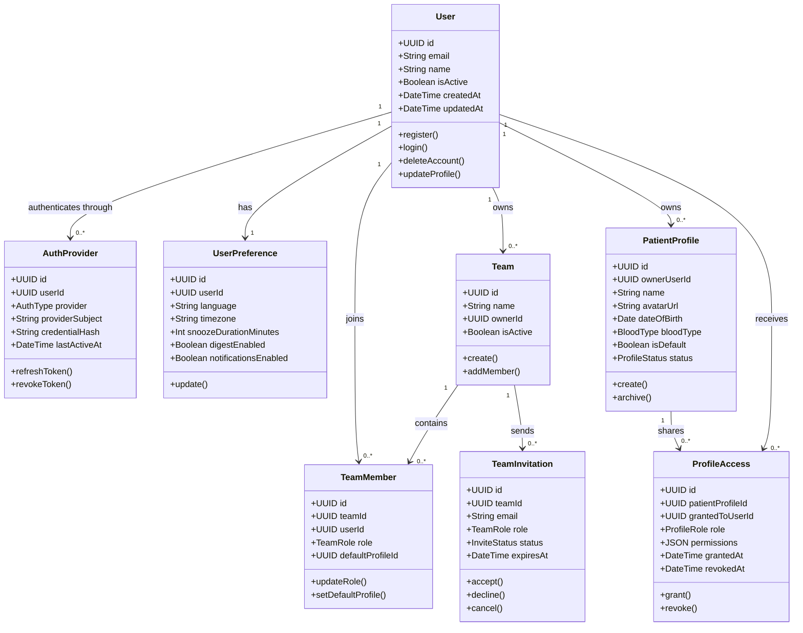
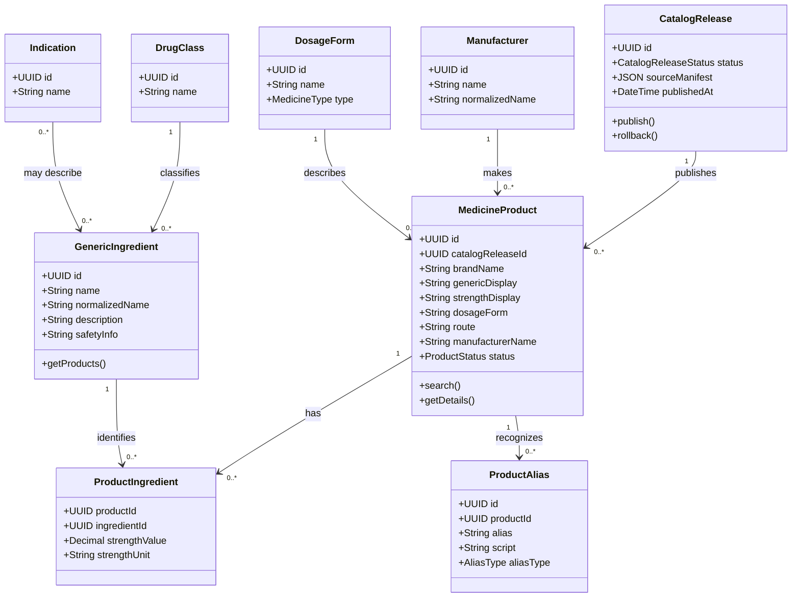

# Nirog Subsystem Architecture

This is the grouped backend design derived from the supplied **User Management**, **Medicine Catalog**, and **Reminder, Notification, and ML Jobs** UML diagrams. The main design choice is to organise by **subsystem ownership**, not by screens or individual tables. Each subsystem owns one vocabulary, one set of write rules, and one family of tables. Other subsystems connect through explicit commands, read models, and domain events.

> A bounded context keeps one internally consistent model and makes the relationships between distinct models explicit.[1] Nirog starts as a **modular monolith**: these are logical boundaries inside one FastAPI deployment and PostgreSQL cluster. They must be respected in code and table ownership now, so the expensive ML pipeline or catalog curation service can be extracted later without rewriting the domain model.

## 1. Subsystem map

```mermaid
flowchart LR
    subgraph UM[1. User Management]
        Identity[User and Auth Provider]
        Profiles[Patient Profile and Access]
        Teams[Team and Invitation]
        Preferences[User Preferences and Devices]
    end

    subgraph MC[2. Medicine Catalog]
        Products[Medicine Products]
        Ingredients[Generics and Ingredients]
        Reference[Manufacturer, Form, Class, Indication]
        Releases[Catalog and Index Releases]
    end

    subgraph PM[3. Prescription and ML Evidence]
        Documents[Prescription Documents]
        Scans[OCR Scan Jobs]
        Evidence[Lines, Fields, Candidate Matches]
        Reviews[Medication Reviews]
    end

    subgraph RM[4. Medication Regimen]
        Regimens[Medication Regimens]
        Versions[Regimen Versions]
        Schedules[Schedule Rules and Planned Doses]
        Inventory[Inventory and Refill Rules]
    end

    subgraph AO[5. Adherence and Notifications]
        Reminders[Reminder Delivery]
        Logs[Dose Logs]
        Alerts[Notifications and Refill Alerts]
        Stats[Adherence Projections]
    end

    subgraph GX[Cross-Cutting Platform]
        Sync[Device Sync and Change Feed]
        Audit[Audit and Provenance]
        Policy[Authorization and Consent]
    end

    UM -->|profile scope and permissions| PM
    UM -->|profile scope and permissions| RM
    UM -->|device settings and preferences| AO
    MC -->|approved product identity and match index| PM
    PM -->|confirmed medication review| RM
    RM -->|schedule changed| AO
    AO -->|dose taken or refill recorded| RM
    AO -->|adherence projection| RM
    UM --> GX
    PM --> GX
    RM --> GX
    AO --> GX
```

## 2. Boundary rules

| Subsystem | Owns | Does not own | Primary integration direction |
|---|---|---|---|
| **User Management** | Accounts, authentication providers, preferences, devices, patient profiles, teams, invitations, profile access, consent. | Medicines, scan outputs, regimens, dose logs. | Grants profile-scoped access to every health-data subsystem. |
| **Medicine Catalog** | Shared medicine reference data, product aliases, manufacturers, ingredients, dosage forms, catalog sources, releases, search index. | A patient’s medicine course, stock count, reminder time, or dose history. | Supplies read-only product identity and match candidates. |
| **Prescription and ML Evidence** | Original prescription document, page assets, scan jobs, OCR lines, structured fields, candidate matches, user review decision. | An active schedule or a shared catalog mutation. | Sends only a confirmed review command to the regimen subsystem. |
| **Medication Regimen** | Profile-specific medication course, instruction versions, schedule rules, planned doses, inventory movements, refill rules. | User accounts, catalog publication, raw images, notification delivery. | Publishes schedule/inventory changes to adherence operations. |
| **Adherence and Notifications** | Reminder delivery attempts, notification lifecycle, user-reported dose logs, refill alerts, adherence projections. | Prescription interpretation or regimen instruction editing. | Receives schedule events and sends dose/refill outcomes back to the regimen read model. |
| **Cross-cutting Platform** | Authorization evaluation, consent, audit, provenance, device sync cursor, command idempotency. | Business-specific write rules. | Enforces policy and captures operational history around all commands. |

Microsoft’s guidance similarly recommends that each independent subsystem own its domain data and logic; cross-boundary access should occur through explicit APIs or asynchronous messaging rather than direct table access.[2]

## 3. First deployment shape

The MVP does **not** need six deployable microservices. It needs six code modules with enforced ownership. Run one FastAPI API, one PostgreSQL cluster, Redis, object storage, and a worker pool. Use database table prefixes or PostgreSQL schemas such as `identity.*`, `catalog.*`, `prescription.*`, `regimen.*`, `adherence.*`, and `platform.*`.

Within a single HTTP command, a module can use a transaction over its own tables. When a command changes another subsystem, the owning module writes an **outbox event** in the same transaction. A worker delivers that event to the receiving module. This keeps the system reliable today and gives a clean migration path if the ML or catalog parts are later extracted.

| Deployment unit now | Internal modules | Likely extraction trigger |
|---|---|---|
| Core API | User Management, Medication Regimen, Adherence/Notifications, Platform. | Usually remains together until separate team ownership or independent scaling requires a split. |
| Catalog API/read service | Medicine Catalog. | Extract when frequent imports/index rebuilds, curation teams, or public catalog search require independent lifecycle. |
| ML worker service | Prescription/ML Evidence execution adapter. | Extract immediately if GPU inference, external model provider isolation, or heavy queue throughput is introduced. |

## 4. User Management subsystem

The user-management diagram supplied by the team is the foundation for multi-profile and multi-caregiver use. The crucial distinction is between a **User**—an authenticated application account—and a **PatientProfile**—the medication-management context whose data is accessed. A user may own several profiles, and an invited team member may access one profile without becoming the profile owner.

### User Management tables

| Table | Owner | Essential fields | Invariant |
|---|---|---|---|
| `identity.users` | User Management | `id`, `email`, `name`, `status`, `created_at` | Email is unique among active accounts. |
| `identity.auth_providers` | User Management | `id`, `user_id`, `provider`, `provider_subject`, `credential_hash`, `last_active_at` | A provider identity maps to one user. Never store raw third-party tokens in health tables. |
| `identity.user_preferences` | User Management | `user_id`, `language`, `timezone`, notification/snooze settings | Exactly one active preference record per user. |
| `identity.patient_profiles` | User Management | `id`, `owner_user_id`, `name`, optional `date_of_birth`, `blood_type`, `status` | A profile belongs to one owner even when shared. |
| `identity.teams`, `identity.team_members`, `identity.team_invitations` | User Management | team identity, memberships, invitation lifecycle | Team membership does not by itself grant patient health-data access. |
| `identity.profile_access` | User Management | `patient_profile_id`, `granted_to_user_id`, role, permission set, revocation fields | Effective permission must be checked server-side for every profile-scoped resource. |

## 5. Medicine Catalog subsystem

The catalog is shared reference data. It contains the structured identity of a medicine product, not the individual patient’s usage. The supplied catalog entities—generic, manufacturer, dosage type, drug class, indication, and medicine catalog—fit cleanly here. `MedicineProduct` is the canonical name for the catalog’s patient-selectable product record.

### Catalog tables

| Table family | Owner | Why it is separate from a patient regimen |
|---|---|---|
| `catalog.catalog_releases`, `catalog.catalog_sources`, `catalog.match_index_releases` | Medicine Catalog | Makes product facts and OCR match behavior reproducible. |
| `catalog.medicine_products`, `catalog.manufacturers`, `catalog.dosage_forms` | Medicine Catalog | Represents a product/presentation available in the reference catalog. |
| `catalog.generic_ingredients`, `catalog.product_ingredients`, `catalog.drug_classes`, `catalog.indications` | Medicine Catalog | Represents pharmacological reference relationships rather than a patient’s instructions. |
| `catalog.product_aliases` | Medicine Catalog | Stores approved spelling, transliteration, and brand aliases for matching. |

## 6. Prescription and ML Evidence subsystem

This subsystem adapts the supplied `OcrJob` and `ExtractionJob` idea into a durable evidence pipeline. A scan job does not create a medicine in a patient profile. It produces evidence and candidate matches. A user review either selects a catalog product, creates a private unresolved medication entry, or rejects the extraction.

| Entity | Owner | Core responsibility |
|---|---|---|
| `prescription_documents`, `document_pages`, `media_assets` | Prescription/ML Evidence | Preserve the original multi-page prescription and controlled asset access. |
| `ocr_scans`, `ml_stage_runs` | Prescription/ML Evidence | Manage queued/running/ready/failed job lifecycle and release manifests. |
| `ocr_lines`, `extracted_medication_lines`, `field_candidates` | Prescription/ML Evidence | Preserve raw/normalized text and source-region evidence. |
| `medicine_match_candidates` | Prescription/ML Evidence | Store catalog candidates and score evidence for review. |
| `medication_reviews` | Prescription/ML Evidence | Store the user’s accept/edit/unresolved/reject decision before a regimen command. |

## 7. Medication Regimen subsystem

The user’s `Medicine` entity belongs here **after** it has been interpreted as a profile-specific course. To prevent one mutable record from mixing prescription evidence, catalog facts, and health history, Nirog uses `MedicationRegimen` as the aggregate root and `RegimenVersion` for versioned instructions.

| Entity | Owner | Core responsibility |
|---|---|---|
| `regimen.medication_regimens` | Medication Regimen | Profile-specific current state: active, paused, ended, or superseded. |
| `regimen.regimen_versions` | Medication Regimen | Immutable instruction versions: dose, unit, route, timing, dates, change reason. |
| `regimen.schedule_rules`, `regimen.planned_doses` | Medication Regimen | Canonical schedule meaning and projected administrations. |
| `regimen.inventory_movements`, `regimen.refill_rules` | Medication Regimen | Advisory supply estimation and refill thresholds using base units. |
| `regimen.unresolved_medications` | Medication Regimen | Private manual/unmatched item; never added to shared search without curation. |

## 8. Adherence and Notifications subsystem

This group preserves the supplied `Reminder`, `DoseLog`, `Notification`, `RefillAlert`, `RefillHistory`, and `AdherenceStats` classes. It owns delivery telemetry and user-reported adherence events. It does not decide what medication the user should take.

| Entity | Owner | Core responsibility |
|---|---|---|
| `adherence.reminder_deliveries`, `adherence.notifications` | Adherence/Notifications | Records local/push reminder delivery, acknowledgement, snooze, and expiry state. |
| `adherence.dose_logs` | Adherence/Notifications | Append-only taken/skipped/missed/late events tied to a planned dose and regimen version. |
| `adherence.refill_alerts`, `adherence.refill_history` | Adherence/Notifications | Produces an advisory alert from inventory policy and records refill facts. |
| `adherence.adherence_stats` | Adherence/Notifications | Periodic or on-demand projection of dose event data; never source-of-truth for a dose. |

## 9. References

[1] [Martin Fowler, *Bounded Context*](https://martinfowler.com/bliki/BoundedContext.html)

[2] [Microsoft Learn, *Data sovereignty per microservice*](https://learn.microsoft.com/en-us/dotnet/architecture/microservices/architect-microservice-container-applications/data-sovereignty-per-microservice)
