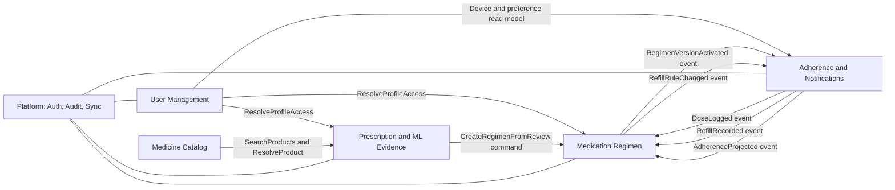
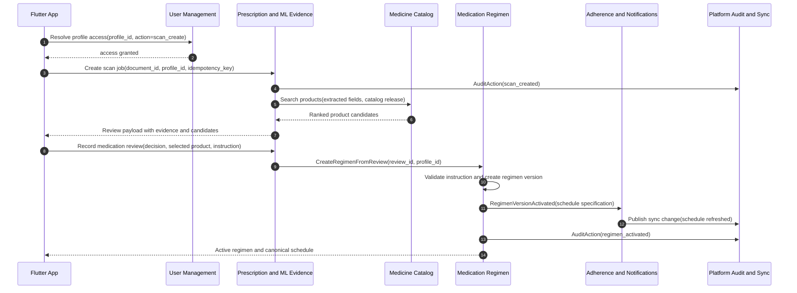
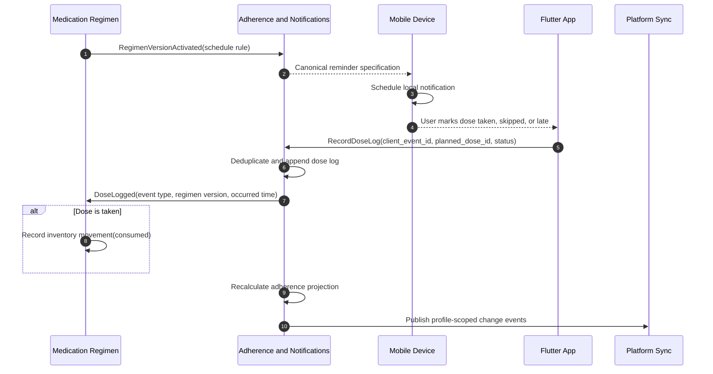

# Nirog Subsystem Interactions

This document defines how the Nirog subsystems connect without bypassing data ownership. A module may read another module’s approved projection, but it does not update that module’s tables directly. Cross-subsystem writes happen through a command handled by the owning module. Asynchronous consequences are published as outbox events.

## 1. Interaction contract map

## 2. Commands and events

| Producer | Consumer | Contract | Type | Required data |
|---|---|---|---|---|
| Mobile client through API | User Management | `CreatePatientProfile` | Command | Actor ID, display data, owner ID. |
| Mobile client through API | Prescription/ML Evidence | `CreateScanJob` | Command | Profile ID, document ID, idempotency key. |
| Prescription/ML Evidence | Medicine Catalog | `SearchProducts` | Query | Normalized name/strength/form candidates and active catalog release. |
| Mobile client through API | Prescription/ML Evidence | `RecordMedicationReview` | Command | Evidence version, decision, selected product or edited fields. |
| Prescription/ML Evidence | Medication Regimen | `CreateRegimenFromReview` | Command | Profile ID, review ID, selected product/unresolved item, confirmed instruction. |
| Medication Regimen | Adherence/Notifications | `RegimenVersionActivated` | Event | Regimen/version IDs, profile ID, schedule specification, timezone. |
| Adherence/Notifications | Medication Regimen | `DoseLogged` | Event | Planned-dose ID, regimen version ID, event type, occurred time, client event ID. |
| Mobile client through API | Adherence/Notifications | `RecordRefill` | Command | Regimen ID, quantity added, unit, occurred time. |
| Adherence/Notifications | Mobile client through Sync | `NotificationStateChanged` | Change event | Notification ID, delivery/acknowledgement/snooze state. |
| Every subsystem | Platform | `AuditAction` | Event | Actor, profile scope, action, entity, outcome, request trace. |

## 3. Prescription-to-regimen interaction

## 4. Reminder-to-adherence interaction

## 5. Rules that keep subsystems decoupled

| Rule | Why it matters |
|---|---|
| The catalog never stores a patient’s dose, stock, reminder time, or adherence percentage. | Catalog data is shared; medication-management data is sensitive and profile-private. |
| Prescription/ML output never writes directly to a regimen. | A review decision must link evidence to the user-confirmed instruction. |
| Reminder delivery is not a dose event. | An operating-system notification may be delivered or dismissed without medication consumption. |
| Team membership is not profile access. | A member needs an explicit permission grant before viewing a patient profile. |
| Event payloads carry IDs and version/release references, not copied mutable entities. | Receiving subsystems can retrieve the correct data from the owner or preserve an immutable event snapshot. |
| Synchronous queries are limited to authorization and low-latency reference lookup. | Long-running OCR, index rebuilds, notification processing, and projections run asynchronously. |
