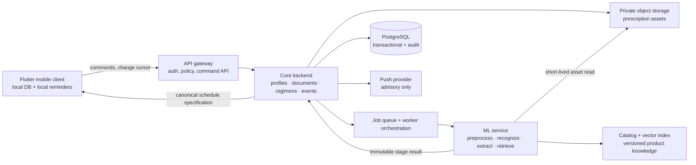

# System Context and Responsibility Boundaries

**Status:** Canonical baseline • **Architecture:** Modular FastAPI backend with independently deployable ML worker.

## Boundary rules

The mobile application owns local notification execution and its pending offline command queue. The server owns accepted-regimen versions, authorization policy, catalog releases, durable evidence, and the ordered change feed. A local device may create an event offline, but it does not independently resolve a medication-critical conflict.

The ML service receives an opaque `scan_job_id`, a narrow job manifest, and a short-lived capability to read exactly the submitted asset. It does not receive an account email, user JWT, caregiver relationships, or unrestricted database credentials. The core backend decides whether an ML result is safe to expose, how it is persisted, and whether a schedule can activate.

The catalog/search boundary has its own release identifier. An OCR result may be cached by image/model/preprocessing evidence, while medicine matching must be recomputed when product data, aliases, index artifacts, or matching policy changes.

## Data classifications

| Class | Examples | Access and handling |
|---|---|---|
| Restricted health evidence | Prescription image, raw OCR, handwritten patient/doctor text, source crops. | Least-privilege access; no general logs; short signed URLs; retention policy; high-value audit. |
| Sensitive personal records | Profile, regimen, dose event, caregiver grant, consent. | Policy-scoped API reads; encryption in transit/at rest; export/deletion lifecycle. |
| Controlled shared reference data | Approved catalog facts, aliases, index release, abbreviation tables. | Curator roles, versioned release, provenance, rollback. |
| Operational metadata | Stage timings, error codes, cache hit, redacted metrics. | No raw text or asset URLs; role-limited operations visibility. |

## Interoperability direction

The internal model is inspired by FHIR’s distinction between a medication order/request, a report of medication being taken, and the actual administration event. Nirog does not need to implement a FHIR server in the MVP, but keeping these concepts distinct prevents migration-breaking overloading of a single `Medicine` entity and enables a later adapter.[1]

## Reference

[1] [HL7 FHIR, *MedicationRequest*](https://hl7.org/fhir/medicationrequest.html)
