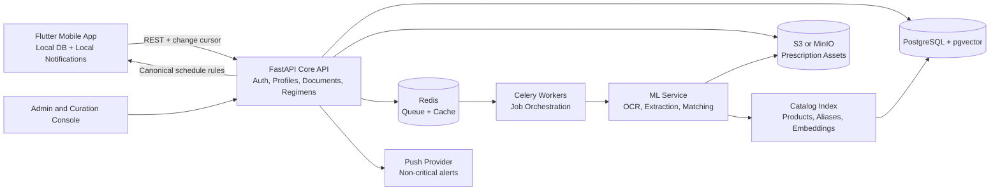
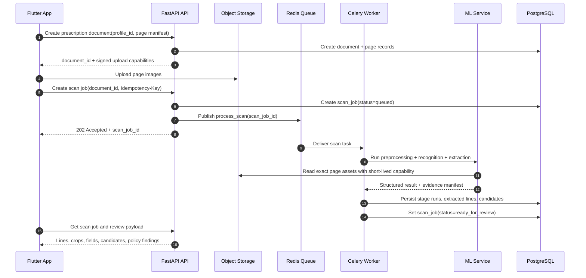
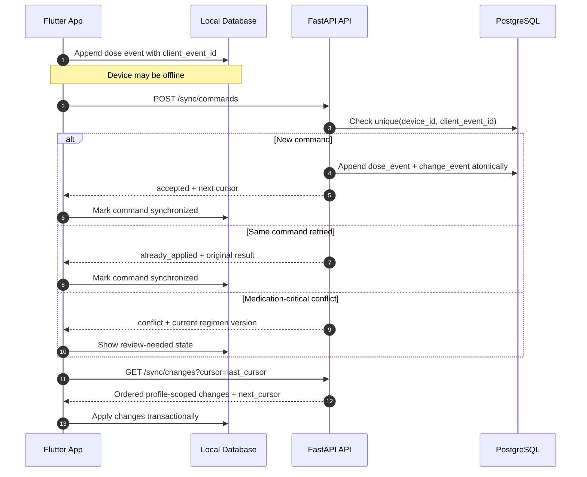
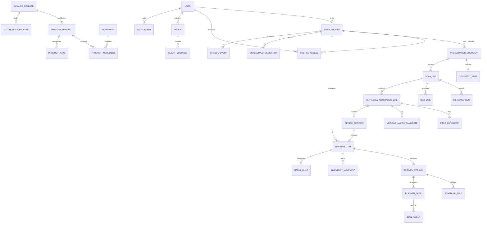
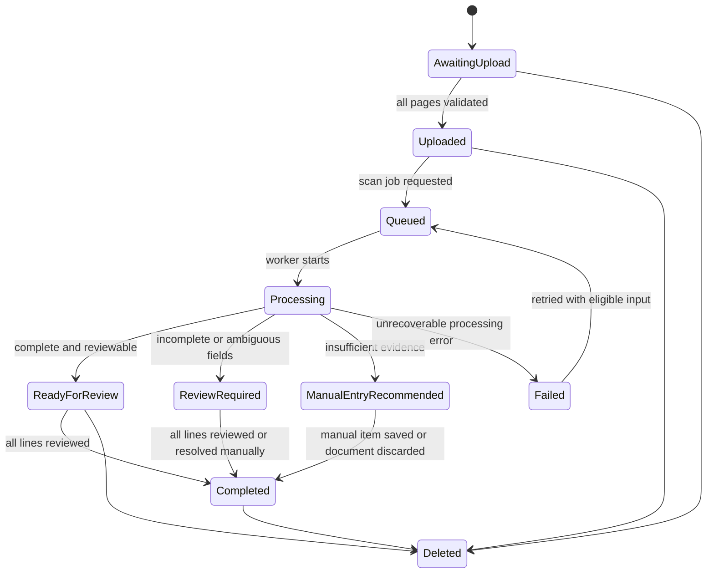
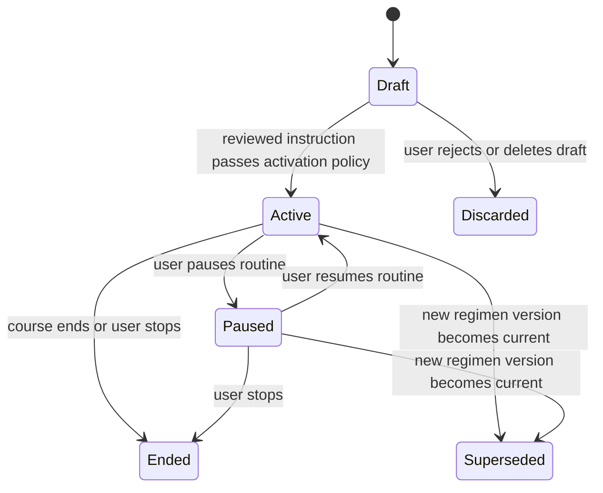

# Nirog Backend Blueprint

> **Purpose:** This is the implementation blueprint for the Nirog backend that connects the Flutter mobile application to prescription-image processing, medicine resolution, medication scheduling, adherence tracking, refill support, and controlled knowledge-base growth.

> **Product boundary:** Nirog is a medication-management platform. It digitizes a user-provided prescription and helps the user manage a confirmed medication routine. It does not diagnose, prescribe, calculate a clinical dose, substitute medicines, or provide clinical advice.

## 1. Executive architecture decision

Nirog should begin as a **modular FastAPI backend** with a separately deployable **ML processing service**. The backend owns identity, profiles, prescription evidence, user-confirmed regimens, reminders, dose events, catalog governance, API policy, and auditability. The ML service owns image preprocessing, handwritten recognition, structured extraction, candidate retrieval, and scoring. This separation lets the transactional API remain reliable and inexpensive while GPU-heavy or model-dependent work scales independently.

The core data pattern is:

**Prescription document → ML evidence → user review → medication regimen → schedule → dose events → adherence and refill insights.**

Each arrow is explicit in the database. This allows the system to explain where a medicine came from, rerun ML without corrupting patient data, preserve user edits, and evolve the catalog or models safely over time.

The design is inspired by the medication lifecycle distinctions used by HL7 FHIR: a medication request/order, a medication being taken, and a medication administration are different concepts and must not share one overloaded table.[1] [2]

## 2. Core backend principles

| Principle | Backend meaning |
|---|---|
| **Evidence-first** | The original prescription image and every model result are retained as traceable evidence according to a defined retention policy. |
| **Review-first** | ML can prepare a result and preselect a match, but only a confirmed review creates an active patient regimen. |
| **Catalog-first identity** | A patient regimen points to a versioned Bangladesh medicine product or to a private unresolved item, never to raw OCR text alone. |
| **Offline-capable** | The mobile client records commands locally; the backend accepts each command exactly once and returns ordered changes through a cursor. |
| **Versioned critical data** | Medication instructions, model artifacts, catalog releases, and confidence policies are versioned. |
| **Least-privilege health data** | Profile scope, explicit sharing grants, signed asset access, audit events, and field-level response minimization protect prescription data. |
| **Operationally observable** | Every scan, ML stage, model release, catalog release, notification action, and sync command has a traceable operational state. |

## 3. High-level system architecture



### 3.1 Service responsibilities

| Component | Primary responsibility | Must not own |
|---|---|---|
| Flutter application | Capture, local persistence, local reminder delivery, offline command queue, review UI. | Shared catalog curation, final authorization decisions, permanent ML history. |
| FastAPI core API | User/profile policy, document lifecycle, review, regimens, events, sync, catalog release usage, audit. | GPU inference and unbounded long-running OCR work. |
| Worker and queue | Reliable asynchronous execution, retries, stage chaining, dead-letter routing. | Patient-facing authorization rules. |
| ML service | Preprocessing, recognition, extraction, candidate retrieval and reranking. | User identity, account roles, broad database access, schedule activation. |
| PostgreSQL | Transactional source of truth, release metadata, policy data, search metadata, audit references. | Original large image binaries. |
| Object storage | Encrypted original and derived prescription assets. | Public permanent URLs. |
| Vector/index layer | Catalog search and semantic retrieval scoped to an index release. | Patient-specific regimens or private raw OCR text. |

FastAPI’s own guidance differentiates small post-response work from heavy multi-process computation; the latter is better handled with a task queue such as Celery. Celery workers consume discrete tasks through a broker and can scale across processes or machines.[3] [4]

## 4. Grouped backend subsystems

The backend is organised first by **subsystem ownership** and then by internal modules. This is more useful than one long list of tables because it makes the relationship between User Management, Medicine Catalog, OCR/ML work, patient regimens, and adherence operations explicit. Every table has one owning subsystem; another subsystem reaches it through a command, query contract, or domain event rather than direct repository access.

| Subsystem | Internal modules | Owns | Primary responsibility |
|---|---|---|---|
| **User Management** | `identity`, `profiles`, `teams`, `preferences` | Accounts, authentication providers, patient profiles, profile access, teams, invitations, devices, consent. | Resolve who the actor is and which patient profile data they may access. |
| **Medicine Catalog** | `medicine_catalog`, `curation`, `indexing` | Products, generics, ingredients, manufacturers, dosage forms, aliases, sources, releases, search index. | Supply released reference product identity and controlled medicine matching. |
| **Prescription and ML Evidence** | `documents`, `scan_orchestration`, `ml_evidence` | Prescription documents/pages, scan jobs, ML stages, OCR lines, field candidates, match candidates, review decisions. | Turn a source document into reviewable evidence without silently changing a regimen. |
| **Medication Regimen** | `regimens`, `inventory`, `scheduling` | Profile-private medication courses, versioned instructions, schedule rules, planned doses, inventory movements, refill rules. | Maintain the user-confirmed medication routine and its supply model. |
| **Adherence and Notifications** | `adherence`, `notifications`, `refill_alerts` | Dose logs, notification lifecycle, reminder delivery, adherence projections, refill alerts and refill history. | Deliver reminder specifications and record what the user reports happened. |
| **Cross-Cutting Platform** | `sync`, `governance`, `audit`, `provenance` | Idempotent client commands, change feed, audit events, policy/model releases, evaluation runs, purge jobs. | Enforce consistency, authorization context, observability, and lifecycle controls around all subsystems. |

> **Canonical grouping:** the detailed diagrams, schema ownership matrix, commands, and events are maintained in [Subsystem Architecture](./architecture/subsystem-architecture.mdx), [Subsystem Interactions](./architecture/subsystem-interactions.mdx), and [Subsystem Schema Ownership](./schemas/subsystem-schema-ownership.mdx). These pages are intentionally Notion-ready and can be copied with their Mermaid diagrams intact.

## 5. Primary user and backend workflows

### 5.1 Prescription scan and review workflow

The user first selects the intended profile. The client creates a prescription document, uploads one or more pages with short-lived upload capabilities, and requests an asynchronous scan job. The API returns quickly with a job ID. The worker then runs preprocessing, recognition, structured extraction, catalog retrieval, reranking, and policy evaluation. The mobile client polls the job or receives a progress event. It displays the original image/crop, extracted fields, and product candidates. The user accepts, edits, saves an unresolved medication, or rejects each line.



### 5.2 Review to active regimen workflow

Review is a backend command, not merely a frontend state. The command carries the displayed document version and evidence version. The server validates that the actor can operate on the selected profile, validates required schedule fields, creates a durable review decision, and creates a new regimen version only when all activation requirements are satisfied.

```mermaid
sequenceDiagram
    autonumber
    participant App as Flutter App
    participant API as FastAPI API
    participant Policy as Regimen Policy
    participant DB as PostgreSQL
    participant Device as Local Notification Engine

    App->>API: Submit review decision(line_id, selected product, edited instruction)
    API->>DB: Load line, document, evidence version, profile scope
    API->>Policy: Validate product, dose, unit, timing, route, authority
    alt All activation rules pass
        Policy-->>API: eligible
        API->>DB: Insert review_decision
        API->>DB: Create regimen_item + regimen_version + schedule_specification
        API-->>App: Active regimen + canonical schedule specification
        App->>Device: Schedule local reminders
        App->>API: Report schedule registration state
    else A rule requires user input
        Policy-->>API: blocked with field findings
        API->>DB: Insert review_decision(status=draft_or_blocked)
        API-->>App: Review findings; no active schedule
    end
```

### 5.3 Offline dose event synchronization

The application logs dose actions locally first. Every mutation has a device-scoped `client_event_id`. A retry with the same ID returns the original resolution. The server publishes profile-scoped changes in sequence order, allowing another device or caregiver client to sync without receiving unrelated records.



## 6. ML pipeline contract

The ML pipeline is a chain of independently recorded stages. Its output is a review payload; it does not create a medication regimen directly.

| Stage | Input | Output | Persisted artifact |
|---|---|---|---|
| 1. Intake validation | Page manifest and stored asset. | MIME, pixel, size, orientation, quality checks. | `document_page.validation_result` |
| 2. Preprocessing | Original page plus preprocessing release. | Normalized image/crops and transform manifest. | `ml_stage_run` + derived asset reference |
| 3. Recognition | Preprocessed image and vision-model release. | Verbatim lines, regions, language/script indicators. | `ocr_line` + raw provider output reference |
| 4. Organization | OCR lines plus abbreviation release. | Clinical sections, medication-line groupings, numeral normalization. | Structured organizer output |
| 5. Structured extraction | Source lines/regions and extraction schema. | Medicine, quantity, unit, timing, duration, route, instruction candidates. | `extracted_medication_line` + `field_candidate` |
| 6. Retrieval and ranking | Extracted name and catalog/index release. | Compatible product candidates with ranked evidence. | `medicine_match_candidate` |
| 7. Review policy | Evidence and confidence-policy release. | `ready_for_review`, `review_required`, or `manual_entry_recommended`. | Policy result and findings |

### 6.1 ML service input

The worker calls the ML service with an opaque job manifest. It should not send an end-user JWT, full account identity, caregiver permissions, or unrelated profile data.

```json
{
  "scan_job_id": "uuid",
  "document_id": "uuid",
  "page_assets": [
    {
      "page_id": "uuid",
      "read_url": "short-lived capability URL",
      "sha256": "content fingerprint",
      "page_number": 1
    }
  ],
  "execution": {
    "preprocessor_release": "preprocess-2026-08-01",
    "vision_model_release": "vision-model-release-id",
    "extraction_schema_version": "1.0.0",
    "abbreviation_release": "bd-abbr-2026-08",
    "catalog_release_id": "uuid",
    "match_index_release_id": "uuid",
    "matching_policy_release_id": "uuid"
  }
}
```

### 6.2 ML service output

```json
{
  "scan_job_id": "uuid",
  "status": "completed",
  "quality": {
    "image_quality": "acceptable",
    "warnings": []
  },
  "lines": [
    {
      "line_id": "uuid",
      "page_number": 1,
      "region": { "x": 0.12, "y": 0.41, "width": 0.66, "height": 0.08 },
      "verbatim_text": "source text exactly as recognized",
      "language_hint": "mixed"
    }
  ],
  "medications": [
    {
      "source_line_ids": ["uuid"],
      "fields": {
        "medicine_name": { "raw": "example", "normalized": "example", "validation": "valid" },
        "dose_quantity": { "raw": "1", "normalized": 1, "validation": "valid" },
        "dose_unit": { "raw": "tab", "normalized": "tablet", "validation": "valid" },
        "frequency": { "raw": "BD", "normalized": "twice_daily", "validation": "requires_review" }
      },
      "candidates": [
        {
          "catalog_product_id": "uuid",
          "rank": 1,
          "compatibility": ["name", "strength", "dosage_form"],
          "score_features": { "semantic": 0.92, "fuzzy": 0.88, "rerank": 0.91 }
        }
      ]
    }
  ],
  "execution_manifest": {
    "model_release": "id",
    "prompt_release": "id",
    "index_release": "id",
    "processing_ms": 0
  }
}
```

### 6.3 Confidence policy

The implementation should calculate and store separate signals for recognition quality, field validation, product-match evidence, candidate margin, and schedule eligibility. The UI can show a simple status, but the backend keeps the full evidence. The policy output is not a clinical judgment; it only decides how much review is necessary before the user can create a personal schedule.

| Policy outcome | Meaning | Mobile UI behavior |
|---|---|---|
| `ready_for_review` | The result is sufficiently complete to present with a candidate preselection. | Show crop, structured fields, product candidates, and confirm action. |
| `review_required` | One or more medication-critical fields are partial or ambiguous. | Highlight fields requiring edit; disable active-schedule creation until resolved. |
| `manual_entry_recommended` | Image/recognition/matching evidence is insufficient. | Offer manual entry while allowing the user to retain or discard the source image. |
| `failed` | Technical failure or invalid input. | Show retry/support action with a stable error code. |

## 7. Core data model

### 7.1 Entity relationship diagram



### 7.2 Identity and profile tables

| Table | Essential columns | Notes |
|---|---|---|
| `users` | `id`, `email`, `password_hash`, `status`, `created_at`, `deleted_at` | Account identity only. |
| `user_profiles` | `id`, `owner_user_id`, `display_name`, `relationship_type`, `date_of_birth`, `status` | A person or dependent medication-management context. |
| `profile_access` | `id`, `profile_id`, `user_id`, `role`, `permissions`, `granted_at`, `revoked_at` | Explicit owner/caregiver sharing. |
| `consent_records` | `id`, `profile_id`, `purpose`, `scope`, `state`, `version`, `granted_by`, `effective_at` | Separate consent for sharing and optional research use. |
| `devices` | `id`, `user_id`, `installation_id`, `platform`, `push_token`, `timezone`, `notification_state` | Provides a sync and notification endpoint. |

### 7.3 Prescription and ML evidence tables

| Table | Essential columns | Notes |
|---|---|---|
| `prescription_documents` | `id`, `profile_id`, `status`, `document_version`, `created_by`, `retention_class`, `created_at` | Parent object for a multi-page prescription. |
| `document_pages` | `id`, `document_id`, `page_number`, `original_asset_id`, `sha256`, `validation_state` | Original page remains immutable. |
| `media_assets` | `id`, `storage_key`, `media_type`, `byte_size`, `encryption_key_id`, `deletion_state` | Storage keys never appear as public permanent URLs. |
| `scan_jobs` | `id`, `document_id`, `status`, `current_stage`, `request_idempotency_key`, `created_at`, `completed_at` | Materialized job lifecycle for the client. |
| `ml_stage_runs` | `id`, `scan_job_id`, `stage`, `attempt`, `input_fingerprint`, `execution_manifest`, `status`, `result_reference` | Append-only history of every pipeline execution. |
| `ocr_lines` | `id`, `scan_job_id`, `page_id`, `region`, `verbatim_text`, `language_hint` | OCR source evidence with coordinate reference. |
| `extracted_medication_lines` | `id`, `scan_job_id`, `source_line_ids`, `review_state`, `policy_outcome` | One reviewable medication interpretation. |
| `field_candidates` | `id`, `extracted_line_id`, `field_name`, `raw_value`, `normalized_value`, `validation_state`, `evidence` | Keeps raw and normalized forms. |
| `medicine_match_candidates` | `id`, `extracted_line_id`, `catalog_product_id`, `rank`, `score_features`, `compatibility`, `policy_outcome` | Candidate identity evidence. |
| `review_decisions` | `id`, `extracted_line_id`, `actor_user_id`, `decision`, `selected_product_id`, `edited_instruction`, `evidence_version`, `created_at` | Durable user decision; edits create a new decision rather than overwriting the original. |

### 7.4 Medicine catalog tables

| Table | Essential columns | Notes |
|---|---|---|
| `catalog_releases` | `id`, `status`, `source_manifest`, `published_at`, `rollback_of` | Every searchable catalog fact has a release. |
| `catalog_sources` | `id`, `publisher`, `license`, `source_url`, `source_version`, `checksum`, `imported_at` | Source provenance and licensing record. |
| `medicine_products` | `id`, `catalog_release_id`, `brand_name`, `generic_display`, `manufacturer_id`, `dosage_form`, `strength_display`, `route`, `market`, `product_status` | A Bangladesh product/presentation. |
| `manufacturers` | `id`, `name`, `normalized_name`, `country` | Controlled manufacturer facts. |
| `ingredients` | `id`, `normalized_name`, `coding_system`, `coding_value`, `display_name` | Generic/active ingredient record. |
| `product_ingredients` | `product_id`, `ingredient_id`, `strength_value`, `strength_unit`, `ingredient_order` | Supports combination products. |
| `product_aliases` | `id`, `product_id`, `alias`, `script`, `alias_type`, `source_case_id`, `published_release_id` | Brand aliases, transliterations, approved misspellings. |
| `match_index_releases` | `id`, `catalog_release_id`, `embedding_model`, `index_config`, `checksum`, `status` | Reproducible semantic matching. |
| `unresolved_medications` | `id`, `profile_id`, `display_name`, `source_line_id`, `status`, `visibility` | Private manual/unmatched item; not shared search data. |

### 7.5 Regimen, scheduling, and adherence tables

| Table | Essential columns | Notes |
|---|---|---|
| `regimen_items` | `id`, `profile_id`, `catalog_product_id`, `unresolved_medication_id`, `current_version`, `status`, `source_review_decision_id` | A patient’s medication course. Exactly one medication reference is populated. |
| `regimen_versions` | `id`, `regimen_item_id`, `version_number`, `dosage_instruction`, `effective_from`, `effective_to`, `change_reason`, `created_by` | Medication-critical edits are versioned. |
| `schedule_rules` | `id`, `regimen_version_id`, `timezone`, `rule_kind`, `rule_payload`, `active` | Canonical schedule rule sent to the mobile client. |
| `planned_doses` | `id`, `regimen_version_id`, `scheduled_at`, `local_label`, `state_projection` | Generated or projected doses for adherence. |
| `dose_events` | `id`, `planned_dose_id`, `regimen_version_id`, `event_type`, `occurred_at`, `reporter_type`, `client_event_id`, `note` | Append-only user/system events. |
| `notification_events` | `id`, `device_id`, `planned_dose_id`, `event_type`, `occurred_at`, `metadata` | Notification telemetry only; it is not a dose event. |
| `inventory_movements` | `id`, `regimen_item_id`, `movement_type`, `quantity`, `base_unit`, `occurred_at`, `source`, `confidence` | Supply changes for advisory refill estimation. |
| `refill_rules` | `id`, `regimen_item_id`, `threshold_quantity`, `base_unit`, `alert_state`, `acknowledged_at` | Refills are advisory and depend on inventory confidence. |

### 7.6 Platform and governance tables

| Table | Essential columns | Notes |
|---|---|---|
| `model_releases` | `id`, `component`, `provider`, `revision`, `checksum`, `capability_profile`, `approval_state` | Separate primary vision, fallback OCR, embeddings, and reranker. |
| `prompt_releases` | `id`, `component`, `template`, `schema_version`, `checksum`, `approval_state` | Prompt changes are release-managed artifacts. |
| `policy_releases` | `id`, `policy_type`, `configuration`, `calibration_report`, `approval_state` | Matching/review policy release. |
| `evaluation_runs` | `id`, `artifact_set`, `dataset_release`, `metrics`, `segment_metrics`, `approved_by` | Reproducible quality report. |
| `client_commands` | `id`, `device_id`, `client_event_id`, `command_type`, `request_digest`, `resolution`, `created_at` | Exactly-once offline command record. |
| `change_events` | `id`, `sequence`, `profile_id`, `event_type`, `payload`, `created_at` | Ordered profile-scoped sync stream. |
| `audit_events` | `id`, `actor_id`, `action`, `entity_type`, `entity_id`, `outcome`, `request_context`, `occurred_at` | Append-only security and access history. |
| `provenance_records` | `id`, `target_type`, `target_id`, `source_refs`, `agent_refs`, `activity`, `occurred_at` | Explains how a derived record was created. |
| `purge_jobs` | `id`, `subject_type`, `subject_id`, `request_id`, `state`, `completed_at`, `exception_reason` | Tracks deletion through assets, derivatives, caches, and permitted exceptions. |

## 8. Dosage instruction schema

Avoid reducing frequency to a simple `times_per_day` integer. A real medication instruction needs timing semantics that can represent fixed local times, intervals, days of week, PRN use, food relation, course duration, and free-text evidence.

```json
{
  "dose_quantity": 1,
  "dose_unit": "tablet",
  "route": "oral",
  "timing": {
    "kind": "times_of_day",
    "local_times": ["08:00", "20:00"]
  },
  "meal_relation": "after_food",
  "start_at": "2026-08-18T08:00:00+06:00",
  "end_at": "2026-08-23T20:00:00+06:00",
  "maximum_daily_quantity": null,
  "free_text_instruction": "Retained as confirmed from prescription review"
}
```

### 8.1 Supported timing kinds

| `timing.kind` | Fields | Example |
|---|---|---|
| `times_of_day` | `local_times[]` | 08:00 and 20:00. |
| `interval` | `every_hours` | Every 8 hours. |
| `weekly` | `days_of_week[]`, `local_time` | Every Monday and Thursday at 09:00. |
| `prn` | `condition_text`, optional `maximum_daily_quantity` | As needed, subject to user-confirmed instruction. |
| `manual` | `display_instruction` | Not safely machine-representable; user chooses reminder behavior manually. |

## 9. API design

### 9.1 API conventions

The API uses JSON over HTTPS, bearer authentication, UUID or ULID identifiers, and RFC 9457-style problem responses. All mutation endpoints require an `Idempotency-Key` header. Resources are profile-scoped by server-side authorization rather than a client-supplied `user_id` filter.

```text
Authorization: Bearer <access_token>
Idempotency-Key: 0d7b35bb-2bb7-4daa-920a-3f84696f4c10
Content-Type: application/json
```

### 9.2 Endpoint inventory

| Method | Endpoint | Purpose |
|---|---|---|
| `GET` | `/v1/profiles` | List profiles the current actor may access. |
| `POST` | `/v1/profiles/{profile_id}/prescription-documents` | Create a document and page upload capabilities. |
| `POST` | `/v1/prescription-documents/{document_id}/scan-jobs` | Queue asynchronous ML processing. |
| `GET` | `/v1/scan-jobs/{scan_job_id}` | Read job status, progress, and review payload. |
| `POST` | `/v1/scan-jobs/{scan_job_id}/review-decisions` | Submit user review for extracted medication lines. |
| `GET` | `/v1/medicine-catalog/search?q=` | Search current approved catalog for manual selection or correction. |
| `GET` | `/v1/profiles/{profile_id}/regimen-items` | Read active, paused, or historical regimen items. |
| `POST` | `/v1/regimen-items/{regimen_item_id}/versions` | Create a versioned medication instruction update. |
| `POST` | `/v1/profiles/{profile_id}/dose-events` | Append a user-reported dose event. |
| `POST` | `/v1/sync/commands` | Submit a batch of offline device commands. |
| `GET` | `/v1/sync/changes?cursor=` | Read ordered changes for the authenticated user’s visible profiles. |
| `GET` | `/v1/admin/curation-cases` | Read curation queue for authorized administrators. |
| `POST` | `/v1/admin/catalog-releases` | Publish a reviewed catalog release. |

### 9.3 Prescription document creation request

```json
{
  "client_document_id": "fd09a0b7-a243-4da8-8dd0-3bc75bc4e996",
  "pages": [
    {
      "page_number": 1,
      "content_type": "image/jpeg",
      "byte_size": 1483992,
      "sha256": "hex-encoded-sha256"
    }
  ]
}
```

### 9.4 Review decision request

```json
{
  "document_version": 1,
  "decisions": [
    {
      "line_id": "uuid",
      "evidence_version": "uuid",
      "decision": "accept_match",
      "selected_product_id": "uuid",
      "edited_dosage_instruction": {
        "dose_quantity": 1,
        "dose_unit": "tablet",
        "route": "oral",
        "timing": { "kind": "times_of_day", "local_times": ["08:00", "20:00"] },
        "meal_relation": "after_food"
      },
      "activate_regimen": true
    }
  ]
}
```

### 9.5 Offline command request

```json
{
  "device_id": "uuid",
  "commands": [
    {
      "client_event_id": "uuid",
      "profile_id": "uuid",
      "type": "dose_event",
      "entity_id": "planned-dose-uuid",
      "base_version": 1,
      "occurred_at": "2026-08-18T20:05:00+06:00",
      "payload": {
        "event_type": "taken",
        "note": null
      }
    }
  ]
}
```

### 9.6 Standard problem response

```json
{
  "type": "https://api.nirog.app/problems/regimen-review-required",
  "title": "Medication instruction needs review",
  "status": 422,
  "code": "REGIMEN_FIELD_AMBIGUOUS",
  "detail": "The frequency field must be confirmed before a schedule can be activated.",
  "fields": {
    "frequency": "requires_review"
  },
  "trace_id": "uuid"
}
```

## 10. State machines

### 10.1 Prescription document and scan job



### 10.2 Regimen item



## 11. Security and privacy design

Prescription images and extracted medication records are sensitive health information. The backend must make authorization and lifecycle controls first-class features rather than middleware afterthoughts.

| Control area | Implementation requirement |
|---|---|
| Authentication | Short-lived access token, refresh-token rotation, device binding, secure mobile storage, revoked-session handling. |
| Authorization | Central policy check for every profile, document, scan, image, review, regimen, dose event, share grant, and admin action. |
| Object access | Short-lived signed read/write capabilities bound to one asset, purpose, and expiry. Never place permanent object URLs in API responses. |
| Upload safety | Enforce type sniffing, size limits, pixel limits, image-decoder safety, EXIF stripping, malware scanning, and rate limits. |
| Encryption | TLS in transit, encrypted database volumes, encrypted object storage, controlled key rotation. |
| Audit | Append-only event record for access, export, share, review, curation, policy change, and account-deletion actions. |
| Logging | Redact raw prescription text, images, tokens, signed URLs, and medication data from default application logs. |
| Retention | Separate policy for original images, derived OCR, review records, audit events, backups, and optional research data. |
| Deletion | Deletion request creates a tracked purge job across database records, objects, derivatives, cache, and allowed retained audit metadata. |

OWASP identifies object-level authorization as a specific API risk: every endpoint operating on a client-provided record identifier must check whether the authenticated principal can perform the requested action on that record.[5]

## 12. Observability and release governance

### 12.1 Operational metrics

| Area | Metrics |
|---|---|
| API | Request rate, P50/P95/P99 latency, error rate, authorization denials, idempotency replays. |
| Scan pipeline | Queue depth, stage duration, retry count, dead-letter count, failure code distribution, cost per scan. |
| ML quality | Review-required rate, manual-entry rate, user correction rate by field, candidate acceptance rank, catalog-unresolved rate. |
| Product behavior | Active regimens, reminder schedule registration health, dose-event completion, refill acknowledgement. |
| Sync | Pending command age, conflict count, duplicate command rate, change-feed lag. |
| Security | Asset access anomalies, policy denials, admin actions, export/deletion events, token/session anomalies. |

### 12.2 Versioned release artifacts

Every ML or catalog decision must include a release reference. The minimum release set is:

| Artifact | Examples |
|---|---|
| Model release | Vision model, fallback recognizer, embedding model, reranker. |
| Prompt release | Transcription prompt, extraction prompt, output schema. |
| Preprocessing release | Deskew, crop, contrast, resize and quality rules. |
| Abbreviation release | Bangladesh medical shorthand and numeral normalization rules. |
| Catalog release | Products, ingredients, manufacturers, forms, source provenance. |
| Index release | Embeddings, index parameters, normalized text configuration. |
| Policy release | Candidate treatment, review requirement, activation conditions. |
| Evaluation run | Labeled dataset release, overall metrics, segmented metrics, approval. |

NIST’s AI RMF uses the lifecycle functions **Govern, Map, Measure, and Manage**; this is a useful structure for Nirog’s model, policy, data, and monitoring controls.[6]

## 13. Suggested implementation roadmap

### Phase 1 — Foundation

Implement authentication, profiles, profile access, devices, catalog import skeleton, manual regimen creation, schedule rules, local reminder contract, dose-event ledger, audit middleware, and change-feed basics. The app should already provide useful medication management without OCR.

### Phase 2 — Prescription evidence and asynchronous jobs

Implement document/page upload, storage capabilities, scan job lifecycle, Celery/Redis queue, worker retry/dead-letter handling, stage manifests, and review payload endpoint. Use a mock ML adapter only internally until the real model service contract is stable.

### Phase 3 — ML service and medicine resolution

Implement preprocessing, OCR adapter, structured extraction schema, catalog search, embedding index, candidate matching, policy result, and mobile review flow. Build a labeled, consented evaluation set before choosing confidence or automation thresholds.

### Phase 4 — Review-to-regimen and offline sync

Implement review decisions, versioned regimen activation, canonical schedule specification, device registration telemetry, exactly-once offline commands, change cursors, and medication-critical conflict resolution.

### Phase 5 — Curation, inventory, and hardening

Implement catalog releases, alias curation cases, index rebuild workflow, inventory movements, refill rules, deletion jobs, dashboards, release approvals, incident controls, and load/security tests.

## 14. Recommended FastAPI project layout

```text
backend/
  app/
    api/
      v1/
        routes_auth.py
        routes_profiles.py
        routes_documents.py
        routes_scans.py
        routes_catalog.py
        routes_regimens.py
        routes_adherence.py
        routes_sync.py
        routes_admin.py
    domains/
      identity/
      profiles/
      documents/
      scan_orchestration/
      ml_evidence/
      medicine_catalog/
      regimens/
      adherence/
      inventory/
      sync/
      curation/
      governance/
    infrastructure/
      database/
      object_storage/
      queue/
      notifications/
      observability/
      policy/
    workers/
      celery_app.py
      tasks_scan.py
      tasks_catalog.py
      tasks_purge.py
    ml_contracts/
      models.py
      client.py
      schemas.py
    tests/
      unit/
      integration/
      contract/
      security/
```

## 15. Acceptance criteria for the backend core

| Capability | Minimum acceptance criterion |
|---|---|
| Profile isolation | A user cannot access any profile, document, image, regimen, or dose event without explicit policy permission. |
| Document intake | A multi-page prescription can be uploaded, validated, retained, and deleted through a documented lifecycle. |
| Scan lifecycle | A scan job can be queued, retried, observed, and surfaced to the client without blocking the API request. |
| Evidence traceability | Every reviewable extraction links to source text/region and model/catalog/policy release identifiers. |
| Regimen creation | A reviewed line can create a versioned regimen and device schedule specification only after required fields are valid. |
| Offline correctness | A replayed `client_event_id` does not duplicate a dose event; a stale medication change returns a meaningful conflict. |
| Catalog use | Search results identify catalog release and product status; inactive products remain resolvable historically. |
| Curation | A shared alias/product change has source provenance, reviewer decision, release identity, and rollback path. |
| Audit and deletion | Protected actions are auditable and a deletion request is traceable through an end-state purge job. |
| Release safety | Model/catalog/policy updates reference an evaluation run and can be rolled back. |

## 16. Merged application class model

The following model merges the original Nirog application classes into the backend blueprint. It preserves the original user-facing concepts while introducing the three backend distinctions required by the prescription workflow:

1. **`MedicineProduct` versus `MedicationRegimen`:** a catalog product is shared reference data, while a regimen is a profile-specific medication course.
2. **`PrescriptionDocument`, `OCRScan`, and `MedicationReview`:** the original image, the ML processing run, and the user decision are different records with different lifecycles.
3. **`RegimenVersion`:** medication-critical changes create a new instruction version instead of editing historical dose records.

> For a dedicated, copy-ready version of this diagram and the related ML/catalog class model, use [Application Class Model](./schemas/application-class-model.mdx).

```mermaid
classDiagram
    class User {
        +UUID id
        +String email
        +String passwordHash
        +String name
        +String avatarUrl
        +Date dob
        +UserRole role
        +UserStatus status
        +DateTime createdAt
        +register()
        +login()
        +resetPassword()
        +deleteAccount()
        +updateProfile()
    }

    class UserPreferences {
        +UUID id
        +String theme
        +String language
        +String timezone
        +Int snoozeDurationMinutes
        +Boolean digestEnabled
        +Boolean notificationsEnabled
        +update()
    }

    class UserProfile {
        +UUID id
        +UUID ownerUserId
        +String name
        +String relationship
        +Boolean isDefault
        +ProfileStatus status
        +switchTo()
        +update()
    }

    class ProfileAccess {
        +UUID id
        +UUID profileId
        +UUID userId
        +ProfileRole role
        +JSON permissions
        +DateTime grantedAt
        +DateTime revokedAt
        +grant()
        +revoke()
    }

    class PrescriptionDocument {
        +UUID id
        +UUID profileId
        +DocumentStatus status
        +Int documentVersion
        +submitPages()
        +delete()
    }

    class OCRScan {
        +UUID id
        +UUID documentId
        +ScanStatus status
        +String currentStage
        +String modelReleaseId
        +String policyReleaseId
        +DateTime scannedAt
        +enqueue()
        +extractFields()
        +getProgress()
        +retry()
    }

    class MedicationReview {
        +UUID id
        +UUID scanId
        +UUID profileId
        +ReviewDecision decision
        +UUID selectedProductId
        +JSON editedInstruction
        +String evidenceVersion
        +DateTime reviewedAt
        +acceptMatch()
        +saveUnresolved()
        +reject()
    }

    class MedicineProduct {
        +UUID id
        +String brandName
        +String genericDisplay
        +String strengthDisplay
        +String dosageForm
        +String route
        +String manufacturerName
        +ProductStatus status
        +UUID catalogReleaseId
        +search()
        +getDetails()
    }

    class MedicationRegimen {
        +UUID id
        +UUID profileId
        +UUID medicineProductId
        +UUID unresolvedMedicationId
        +RegimenStatus status
        +Int currentVersion
        +addMedicine()
        +editMedicine()
        +pause()
        +resume()
        +end()
    }

    class RegimenVersion {
        +UUID id
        +UUID regimenId
        +Int versionNumber
        +JSON dosageInstruction
        +DateTime startDate
        +DateTime endDate
        +String changeReason
        +createVersion()
        +activate()
    }

    class Reminder {
        +UUID id
        +UUID regimenVersionId
        +ScheduleType scheduleType
        +JSON timingRule
        +Boolean isEnabled
        +Int snoozeMinutes
        +DateTime nextTrigger
        +generate()
        +enable()
        +disable()
        +snooze()
    }

    class DoseLog {
        +UUID id
        +UUID regimenVersionId
        +UUID plannedDoseId
        +DateTime scheduledTime
        +DateTime actualTime
        +DoseStatus status
        +DoseReporter reporterType
        +Boolean isRetroactive
        +String clientEventId
        +logDose()
        +editLog()
    }

    class RefillAlert {
        +UUID id
        +UUID regimenId
        +Decimal thresholdQuantity
        +String baseUnit
        +DateTime alertSentAt
        +Boolean isAcknowledged
        +checkThreshold()
        +sendAlert()
        +acknowledge()
    }

    class RefillHistory {
        +UUID id
        +UUID regimenId
        +DateTime refillDate
        +Decimal quantityAdded
        +Decimal stockBefore
        +Decimal stockAfter
        +String baseUnit
        +record()
    }

    class Notification {
        +UUID id
        +UUID reminderId
        +NotificationType type
        +String title
        +String body
        +DateTime scheduledAt
        +DateTime sentAt
        +Boolean acknowledged
        +send()
        +acknowledge()
    }

    class AdherenceStats {
        +UUID id
        +UUID profileId
        +Date periodStart
        +Date periodEnd
        +Float dailyPercentage
        +Float weeklyPercentage
        +Float monthlyPercentage
        +Int takenCount
        +Int missedCount
        +Int skippedCount
        +calculate()
    }

    User "1" --> "1" UserPreferences : has
    User "1" --> "1..*" UserProfile : owns
    User "1" --> "0..*" ProfileAccess : receives
    UserProfile "1" --> "0..*" ProfileAccess : shares
    UserProfile "1" --> "0..*" PrescriptionDocument : contains
    PrescriptionDocument "1" --> "0..*" OCRScan : processes
    OCRScan "1" --> "0..*" MedicationReview : produces review options
    UserProfile "1" --> "0..*" MedicationReview : confirms
    MedicationReview "0..1" --> "1" MedicationRegimen : creates
    UserProfile "1" --> "0..*" MedicationRegimen : manages
    MedicineProduct "1" --> "0..*" MedicationRegimen : identifies
    MedicationRegimen "1" --> "1..*" RegimenVersion : versions
    RegimenVersion "1" --> "0..*" Reminder : schedules
    RegimenVersion "1" --> "0..*" DoseLog : tracks
    MedicationRegimen "1" --> "0..1" RefillAlert : monitors
    MedicationRegimen "1" --> "0..*" RefillHistory : logs
    Reminder "1" --> "0..*" Notification : triggers
    RefillAlert "1" --> "0..*" Notification : triggers
    DoseLog "1" --> "0..*" Notification : triggers
    UserProfile "1" --> "0..*" AdherenceStats : generates
```



### 16.1 Class merge notes

| Original concept | Merged backend concept | Purpose |
|---|---|---|
| `User` and `UserPreferences` | Retained unchanged in responsibility. | Account identity and personal UI/notification choices remain account-level records. |
| `UserProfile` | `UserProfile` plus `ProfileAccess`. | A profile is a patient/dependent context; profile access makes caregiver sharing explicit and revocable. |
| `Medicine` | `MedicineProduct`, `MedicationRegimen`, and `RegimenVersion`. | Separates catalog facts from a personal course and its medication-instruction history. |
| `OCRScan` | `PrescriptionDocument`, `OCRScan`, and `MedicationReview`. | Separates original source evidence, ML work, and the user’s accepted interpretation. |
| `Reminder`, `DoseLog`, `RefillAlert`, `RefillHistory`, `Notification`, `AdherenceStats` | Retained with profile/regimen/version references. | Keeps the original adherence loop while making it safe for edits, offline sync, and multi-profile operation. |

### 16.2 Implementation rules for this model

1. `MedicineProduct` is shared catalog data, while `MedicationRegimen` is profile-private. A shared product record must never contain user stock, start date, dose logs, or reminder preferences.
2. `MedicationRegimen` uses exactly one medication reference: either `medicineProductId` or `unresolvedMedicationId`. The latter supports a profile-private manual entry until it can be resolved.
3. Editing a medication-critical instruction creates a `RegimenVersion`; existing `DoseLog` records stay attached to the original historical version.
4. `DoseLog` distinguishes user-reported `taken`/`skipped` from system-inferred `missed`. A `Notification` records a reminder event and does not prove that medication was consumed.
5. `OCRScan` does not create a regimen alone. A `MedicationReview` stores the user’s decision and is the source link for a new regimen.
6. `RefillAlert` and `RefillHistory` operate on product-specific base units such as tablet, capsule, millilitre, puff, or unit; an unqualified `stockCount` is not sufficient.

## 17. References

[1] [HL7 FHIR, *MedicationRequest*](https://hl7.org/fhir/medicationrequest.html)

[2] [HL7 FHIR, *MedicationAdministration*](https://hl7.org/fhir/medicationadministration.html)

[3] [FastAPI, *Background Tasks*](https://fastapi.tiangolo.com/tutorial/background-tasks/)

[4] [Celery, *Introduction*](https://docs.celeryq.dev/en/stable/getting-started/introduction.html)

[5] [OWASP, *API1:2023 Broken Object Level Authorization*](https://owasp.org/API-Security/editions/2023/en/0xa1-broken-object-level-authorization/)

[6] [NIST, *AI Risk Management Framework*](https://www.nist.gov/itl/ai-risk-management-framework)

[7] [World Health Organization, *Ethics and governance of artificial intelligence for health*](https://www.who.int/publications/i/item/9789240029200)

[8] [IMDRF, *Good machine learning practice for medical device development: Guiding principles*](https://www.imdrf.org/documents/good-machine-learning-practice-medical-device-development-guiding-principles)
