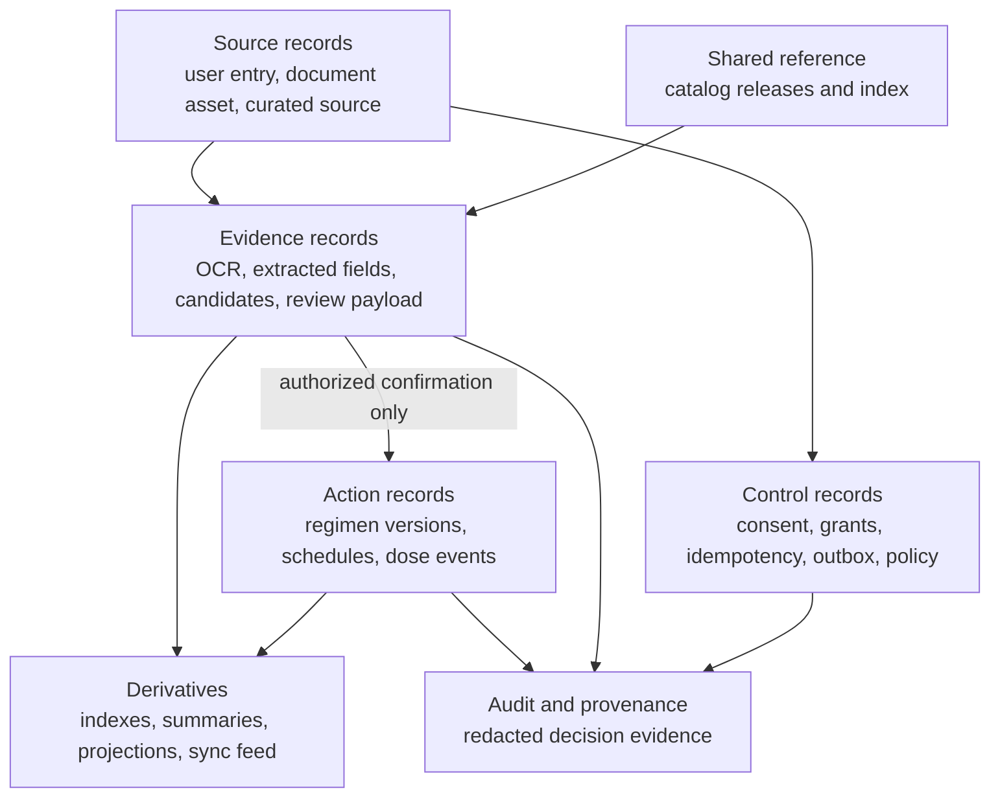

# Data Management Charter and Principles

## 1. Scope

Nirog manages sensitive account information, profile-scoped medication context, prescription images, ML-derived evidence, user-confirmed regimens, adherence events, shared medicine reference data, and operational control records. These are not interchangeable records. Their value, risk, owner, retention rule, and acceptable use differ.

This charter defines how the backend team should make data decisions before adding a table, object-store prefix, queue payload, analytics field, cache, ML feature, or external integration. It supports safe implementation; it is not a substitute for jurisdiction-specific legal review or a statement that Nirog is an electronic health-record system.

## 2. Governing principles

| Principle | Engineering meaning | Acceptance evidence |
|---|---|---|
| **Purpose before persistence** | A field is collected only for a declared feature, policy, safety, support, or operational purpose. “Potentially useful later” is not a purpose. | Data dictionary includes purpose, owner, classification, and retention trigger. |
| **Owner before access** | One module owns validation, mutation, lifecycle, and migration of an authoritative record. Other modules use commands, events, or approved read models. | No foreign module writes an owned table directly. |
| **Evidence before automation** | A scan, OCR line, model candidate, or confidence score is evidence. It cannot become medication action without current authorization and explicit confirmation. | ML worker database roles cannot write regimen/adherence tables. |
| **Lineage before reuse** | Any rebuildable result records the source version/fingerprint and execution or release inputs needed to explain it. | Derived records link to source, input fingerprint, policy/release, and producer version. |
| **Minimum necessary exposure** | A client, worker, provider, log, queue, or dashboard receives only the data needed for its purpose. | Payload allowlists, narrow asset grants, redaction tests, and adapter contracts. |
| **Current policy before sensitive use** | Authorization, profile access, consent, cancellation, retention hold, and release compatibility are re-evaluated at the use boundary. | Revocation/cancellation race tests pass for API and worker paths. |
| **Recoverability before deletion** | Purge, overwrite, retention, and migration actions include hold, audit, backup/restore, reconciliation, and rollback behavior. | Restore drill and purge evidence are documented for each data class. |
| **Derived data is disposable** | Indexes, schedules, summaries, cache entries, and sync projections may be rebuilt from authoritative records and manifests. | Rebuild job and version marker exist; no unique clinical fact lives only in a projection. |

## 3. Data governance roles

Governance is a practical operating responsibility distributed across the architecture team. It should not create a centralized approval bottleneck for ordinary code changes.

| Role | Accountable decisions | Example artifacts |
|---|---|---|
| **Data product owner** | Semantics, quality rules, permissible writes, lifecycle, and compatibility for a module-owned data product. | Regimen version rules; catalog release schema; evidence stage contract. |
| **Data steward** | Source review, correction workflow, duplicate/quality triage, and data-release readiness. | Catalog curation case; source import acceptance record. |
| **Platform custodian** | Encryption, backup, RLS posture, audit transport, retention execution, access evidence, and recovery mechanics. | Key/secret rotation runbook; restore drill; purge job record. |
| **ML data owner** | Training/evaluation admissibility, manifest lineage, prompt/model policy, feedback boundaries, and release evaluation. | Evaluation manifest; model policy release; correction-use decision. |
| **Security/privacy reviewer** | Sensitive data classification, high-risk data flow, new provider/data recipient, access or retention-policy changes. | Adapter egress allowlist; policy review decision. |
| **Operations owner** | Capacity, SLOs, replay/reconciliation safety, incident data handling, and change gating. | Queue age alert; backfill plan; incident timeline. |

## 4. Data decision record

Every new persistent data product should answer the following before the migration is approved.

| Question | Required answer |
|---|---|
| What user or operational outcome needs this record? | State the feature or safety decision it supports. |
| Which module owns it? | Name one module and repository/application service. |
| Is it source, action, reference, control, audit, or rebuildable derivative? | Choose the record category and authoritative location. |
| What is the subject scope? | Account, profile, shared catalog, internal control plane, or no personal scope. |
| Who/what may read and write it? | Define API/worker/role/capability path and any provider exposure. |
| Which facts make it reproducible? | Specify source reference, version, fingerprint, release, policy, or execution manifest. |
| How long is it retained and why? | State the lifecycle trigger, hold condition, purge behavior, and backup interaction. |
| Can it be rebuilt? | If yes, define source and rebuild process. If no, define audit/backup protection. |
| What failure behavior is safe? | State idempotency, concurrency, validation, error redaction, and recovery approach. |

## 5. Data product categories

The diagram is intentionally directional. The controlled direction from evidence to action is not a database foreign key; it is an authorized command with a review payload/version check. This ensures a later ML retry, provider callback, or index rebuild cannot create or mutate a regimen.

## 6. Quality dimensions

Nirog evaluates each product through dimensions that match medication-management risk.

| Dimension | Question | Example measure |
|---|---|---|
| **Completeness** | Are required fields and evidence references present? | Scan stage includes asset manifest and input fingerprint. |
| **Validity** | Do type, range, format, and domain rules hold? | Dose quantity/unit/route values satisfy schema and reference rules. |
| **Consistency** | Do versions and cross-record invariants agree? | Schedule projection reflects newest active regimen version. |
| **Timeliness** | Is a result usable within its policy window? | Notification intent is not delivered after expiry. |
| **Uniqueness/idempotency** | Is an operation represented once despite retries? | One consumer effect per `(consumer_name, event_id)`. |
| **Traceability** | Can the outcome be connected to source, agent, policy, and release? | Review confirmation resolves source evidence and policy/catalog release. |
| **Privacy fitness** | Is use/exposure minimized and authorized? | Provider adapter receives a restricted artifact reference rather than account profile detail. |

## 7. Required governance gates

The following changes require a written data decision record and focused review: a new restricted data class; a new external recipient/provider; a new ML data-use purpose; a schema crossing module boundaries; a change to retention/purge; a data export; a backfill over profile records; an update that changes historical interpretation; or any use of profile-private corrections to influence shared catalog data.

The remaining documents turn this charter into implementable data products, table families, state transitions, and operational checks.
