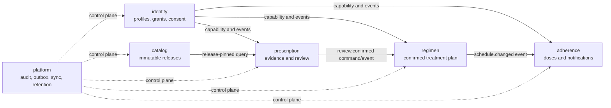

# Data Domains and Ownership

## 1. Ownership model

Nirog uses PostgreSQL logical schemas to make ownership visible in code, migrations, permissions, and operational work. A schema is not merely a naming convention: it is the boundary for authoritative writes, data contracts, and responsibility for lifecycle decisions.

| Domain/schema | Data products | Authoritative records | Rebuildable products | Write boundary |
|---|---|---|---|---|
| `identity` | accounts, profiles, preferences, grants, consent, device installations | account status, profile relation, grant/consent versions | current capability cache | Identity application service only |
| `catalog` | sources, curation cases, medicine products, aliases, releases, index manifests | approved source/review and published release artifacts | search/read indexes | Catalog application service only |
| `prescription` | documents, assets, scan jobs, stage runs, field candidates, review payloads | asset manifest, stage execution manifest, reviewed evidence | thumbnails, OCR search projection, embeddings | Prescription/ML Evidence service only |
| `regimen` | medication plans, regimen versions/items, schedule policy, inventory/refill state | user-confirmed regimen and inventory transitions | future schedule projection | Regimen application service only |
| `adherence` | planned dose occurrence, dose event, notification/delivery state, adherence period state | explicit user dose action and notification state | adherence summary, reminder queue projection | Adherence application service only |
| `platform` | idempotency, outbox, consumer ledger, audit, sync change feed, retention, feature/policy config | delivery/control/audit records | dashboards, materialized operation metrics | Platform service only |

## 2. Permitted dependencies

The dotted platform links mean that `platform` owns cross-cutting mechanisms, not other modules’ medical/business decisions. A retention worker invokes an owning module’s controlled purge service; it does not issue arbitrary deletes against all schemas.

## 3. Ownership rules

| Rule | Example |
|---|---|
| A module is the only writer of its business tables. | An ML worker persists a stage result through the Prescription service; it cannot update `regimen.regimen_items`. |
| Cross-domain intent travels through a command or versioned event. | A confirmed review carries an evidence reference to the Regimen service; it does not copy OCR rows into regimen tables. |
| Cross-domain read models are explicit and authorized. | A profile timeline may join reviewed evidence, active regimen, and dose state in a read repository that applies profile capability. |
| Foreign IDs are references, not permission. | `profile_id` narrows ownership; every use still evaluates capability and RLS. |
| A shared reference release is not profile medical history. | Catalog correction publishes a successor release; it does not rewrite prior review candidate provenance. |
| A derived projection does not become a source of truth. | A stale reminder projection is rebuilt from the active regimen version and schedule policy. |

## 4. Data contract types

Nirog should name data contracts by purpose. Generic `metadata JSONB` fields may supplement an owned structure, but they must not obscure clinically relevant fields, authorization scope, or policy versions.

| Contract type | Example | Minimum fields |
|---|---|---|
| **Command record** | `regimen_item.change_requested` | actor/profile capability context, idempotency key, base version, validated payload, correlation ID |
| **Domain record** | `regimen.regimen_versions` | aggregate ID, version, state, author, effective dates, source/confirmation reference, timestamps |
| **Evidence record** | `prescription.field_candidates` | source region/span, raw observation, normalized value, validation finding, stage run, confidence dimensions |
| **Reference release** | `catalog.catalog_releases` | release ID, state, source/case provenance, immutable manifest/checksum, published date |
| **Control record** | `platform.consumer_ledger` | event ID, owner/consumer, status, lease, attempt budget, safe diagnostic, correlation ID |
| **Audit record** | `platform.audit_events` | actor type/reference, profile scope, action, target, policy decision, correlation, redacted context |
| **Projection record** | `adherence.planned_dose_occurrences` | source aggregate/version, projection version, state, validity window, rebuild marker |

## 5. Cross-domain data requests

The following patterns keep dependencies intentional.

| Need | Allowed pattern | Prohibited shortcut |
|---|---|---|
| Determine profile access | Identity policy dependency/service returns a current capability. | Read `identity.profile_access` and assume an old row alone is sufficient. |
| Use medicine information during evidence matching | Read a declared catalog release/index through a Catalog query contract. | Modify catalog aliases from scan worker feedback. |
| Create a regimen after review | Regimen command validates evidence reference, actor capability, confirmation payload, and version. | Worker inserts regimen row after OCR confidence threshold. |
| Build a reminder | Consume `schedule.changed` and create a projection with source version. | Notification worker queries/mutates regimen tables ad hoc. |
| Produce mobile sync | Platform change feed records authorized resource/version reference. | Send raw table rows or restricted evidence through generic replication. |
| Purge evidence | Platform retention job calls Evidence purge command and records outcome. | Worker deletes object and database rows independently. |

## 6. Ownership review checklist

A pull request that creates a table, index, object prefix, or queue message should make clear: the schema owner; personal/profile scope; upstream source; downstream data contracts; rebuildability; retention class; migration owner; audit requirement; and any provider or mobile exposure. The default decision is local ownership and narrow references, not cross-module data copying.
