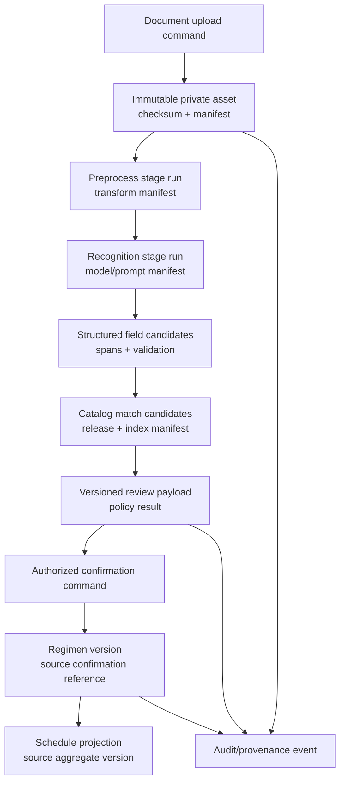

# Canonical Records, Versioning, and Lineage

## 1. Record taxonomy

Nirog should classify persistent records by what they prove and whether they can be regenerated. This prevents a convenience cache, worker log, or ML output from being treated as the clinical-management record.

| Record class | Canonical? | Update style | Example | Recovery source |
|---|---|---|---|---|
| **Identity/control** | Yes | versioned state transition | profile grant, consent decision, feature policy | database backup + audit |
| **User-confirmed action** | Yes | append/version; no silent overwrite | regimen version, dose event, inventory adjustment | database backup + audit + source confirmation |
| **Restricted evidence** | Yes | append derived evidence; preserve original asset | document page, crop, OCR raw output reference, review payload | private object storage + manifest + backup |
| **Shared reference release** | Yes | immutable successor release | medicine product release, alias release, index manifest | source evidence + curation decision |
| **Operational control** | Yes for reliability | state machine + audit | outbox event, consumer ledger, retention job | database backup + reconciliation |
| **Projection/summary** | No | replace/rebuild | planned-dose occurrence, adherence summary, sync payload | authoritative aggregate/event history |
| **Cache/index** | No | invalidate/rebuild | catalog search index, embedding vector cache | release manifest and source data |
| **Telemetry/log** | No clinical authority | append/minimized/retained by policy | redacted trace, latency histogram | operational retention only |

## 2. Identity, version, and correlation conventions

Every record family uses opaque UUIDs, timestamps in UTC, and explicit versioning where concurrency or historical explanation matters. No API or worker relies on a mutable natural-name match as identity.

| Concern | Convention |
|---|---|
| Primary identity | UUID generated by the application or database policy; never expose sequential IDs. |
| Business aggregate version | Monotonic integer on mutable aggregates; commands provide `base_version`/`If-Match` and stale writes return a conflict. |
| Immutable revision | New row/version for regimen, consent, catalog release, review payload, policy, and model artifacts where historic interpretation matters. |
| Request correlation | API command/request ID, correlation ID, causation ID, event ID, and worker attempt are linked but have distinct meanings. |
| Time | `timestamptz` for recorded event times; business-local timezone stored separately where schedule semantics require it. |
| Content integrity | SHA-256 or equivalent content fingerprint for restricted assets, source imports, releases, and meaningful derived inputs. |
| External identity | Provider request IDs and deterministic idempotency keys are separate from Nirog internal IDs. |

## 3. Nirog lineage graph

The graph does not require all scans to produce a regimen. A failed/ambiguous scan can end at `manual_entry_recommended`; its allowed retention depends on the applicable evidence policy. A manual regimen entry may reference no evidence record, but it still produces command/audit provenance.

## 4. Core lineage table families

The names below are implementation-ready proposals, not a second incompatible ER model. They refine the existing schema ownership model with the fields needed for data explanation and recovery.

| Table family | Owner | Key fields | Invariants |
|---|---|---|---|
| `prescription.documents` | Evidence | `id`, `profile_id`, `status`, `created_by`, `source_kind`, `retention_class`, `created_at` | Document is profile-scoped; a cancelled/purged status blocks new stage use. |
| `prescription.asset_manifests` | Evidence | `id`, `document_id`, `object_key`, `content_hash`, `media_type`, `byte_size`, `scan_status`, `created_at` | Private object key only; completed manifest checksum validates object. |
| `prescription.scan_jobs` | Evidence | `id`, `document_id`, `requested_by`, `state`, `request_idempotency_key`, `policy_version`, `created_at` | One request key cannot create distinct scan jobs for same scope/payload. |
| `prescription.stage_runs` | Evidence | `id`, `scan_job_id`, `stage`, `attempt`, `input_fingerprint`, `status`, `manifest_json`, `started_at`, `completed_at` | A changed material input produces a new lineage; immutable completed manifest. |
| `prescription.review_payloads` | Evidence | `id`, `scan_job_id`, `evidence_revision`, `catalog_release_id`, `policy_release_id`, `state`, `expires_at` | Confirmation validates current payload state and referenced releases. |
| `regimen.regimen_versions` | Regimen | `id`, `profile_id`, `regimen_id`, `version`, `state`, `confirmed_by`, `confirmation_reference`, `effective_at` | Version unique per regimen; no ML service role writes this table. |
| `platform.provenance_links` | Platform | `id`, `target_kind/id/version`, `source_kind/id/version`, `activity_kind`, `agent_kind/id`, `recorded_at` | Append-only link; references sufficient to explain creation/revision without storing raw payload again. |

## 5. Provenance versus audit

Provenance and audit must not be collapsed. Provenance explains **how a result came to exist**—source entity, activity, agent, release, and version. Audit explains **who attempted or performed an access or action** and the applicable policy decision. HL7 makes the same conceptual distinction: provenance tracks creation/revision/deletion/signing context, whereas audit tracks events such as access/query/create/update as they occur.[1]

| Need | Record type | Example |
|---|---|---|
| Explain why a candidate appeared | Provenance | OCR stage run, parser version, catalog/index release, matching policy version. |
| Explain how a regimen version was created | Provenance + audit | confirmation payload/version and actor/policy decision. |
| Investigate caregiver access attempt | Audit | actor, requested profile/resource, capability result, correlation ID, redacted client context. |
| Rebuild future doses | Projection lineage | regimen version and schedule policy version used by projector. |
| Reconcile lost provider response | Operational provenance | external-effect intent, idempotency key, provider request ID, reconciler activity. |

## 6. Rebuild contracts

Every derivative must declare its rebuild contract.

| Derivative | Rebuild inputs | Rebuild trigger | Safety condition |
|---|---|---|---|
| Schedule projection | active regimen version, timezone, schedule policy | regimen/schedule event or reconciliation | replace future occurrences only; preserve explicit dose events. |
| Adherence statistics | canonical dose events and period policy | dose event or scheduled compaction | display `as_of`; never overwrite raw dose event. |
| Catalog search index | immutable catalog release, index config/model | release build/recovery | index is activated only after validation against release manifest. |
| Evidence embedding/index | permitted asset/evidence result, model/preprocess release | approved stage/rebuild | never changes review/regimen outcome without a new review payload. |
| Mobile change feed projection | authorized resource version/event | committed domain/outbox event | no restricted binary/raw OCR data in payload. |

## 7. Lineage acceptance tests

The implementation should prove that a reviewed regimen can be traced to its confirmation and source evidence; a catalog candidate can be traced to an immutable release; a mobile view can be traced to an authorized resource version; and a worker/provider action can be traced to an event/intent without exposing restricted content. A source asset checksum mismatch, cancellation, consent revocation, retired release, or superseded aggregate version must stop or supersede an in-flight derivative rather than silently update it.

## References

[1] [HL7 FHIR R5 Provenance](https://www.hl7.org/fhir/provenance.html)
