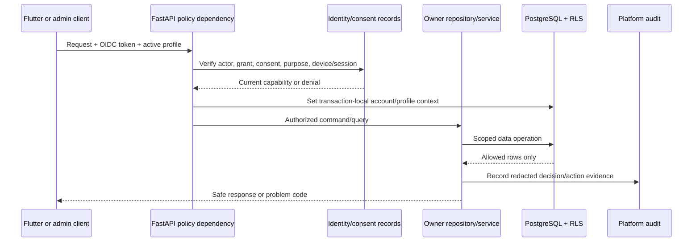

# Access, Consent, and Privacy Data Controls

## 1. Policy is evaluated data

Nirog does not model access as a permanent boolean on a user row. Access to a profile-scoped resource depends on the current account identity, active profile, relationship/grant, consent/purpose condition, requested action, target resource, time window, and applicable policy version. The decision is evaluated server-side and becomes a short-lived request/worker capability, not a broad database credential.

## 2. Data classifications and handling

| Class | Examples | Storage and access rule | Prohibited use |
|---|---|---|---|
| **Account identity** | email, OIDC issuer/subject, display name, account state | `identity.*`; encrypted storage/backup; redacted logs; access limited to account/identity functions | Do not pass to ML provider when a profile/evidence reference is sufficient. |
| **Profile health context** | regimen, dose history, medication notes, refill state, adherence events | profile-scoped schema records; server capability + repository filter + RLS defense; audited sensitive operations | Do not aggregate into product analytics without approved minimization/de-identification. |
| **Restricted evidence** | prescription image, crop, raw OCR output, free text, provider raw response | private object storage; short-lived purpose-bound grant; manifest/reference in DB; strict retention | Do not include in logs, queues, generic sync feeds, or public URLs. |
| **Shared reference** | curated product, ingredients, form, alias, catalog release | `catalog.*`; release provenance and integrity validation; no profile identity | Do not learn/modify from unreviewed private correction. |
| **Control/audit data** | grants, consent, idempotency hash, audit action, correlation, retention job | controlled platform/identity records; append/versioned treatment | Do not store raw token, password, model prompt, or full health payload. |
| **De-identified aggregate** | operational latency, queue age, correction-rate aggregate | minimization, aggregation threshold, access control, documented purpose | Do not re-identify or join with account/profile datasets without governance review. |

## 3. Consent record design

Consent is not a generic `notifications_enabled` setting. The product should distinguish consent or permission relevant to data handling from ordinary UI preferences.

| Record | Suggested fields | Meaning |
|---|---|---|
| `identity.consents` | `id`, `profile_id`, `purpose`, `decision`, `scope`, `policy_version`, `effective_at`, `expires_at`, `revoked_at`, `source_reference`, `recorded_by` | Versioned record of a permitted/denied purpose and applicable boundary. |
| `identity.profile_access` | `id`, `profile_id`, `grantee_account_id`, `relationship`, `permissions`, `state`, `effective_at`, `expires_at`, `revoked_at`, `granted_by` | Caregiver/delegate relation, separate from identity and consent purpose. |
| `identity.devices` | `id`, `account_id`, `installation_id`, `platform`, `push_token_reference`, `state`, `last_seen_at`, `revoked_at` | Registered device/push endpoint; token value is protected and rotated separately. |
| `identity.policy_decisions` (optional read/audit projection) | `correlation_id`, `policy_version`, `action`, `outcome`, `reason_code`, `recorded_at` | Redacted evidence of policy behavior, not a replacement for immutable audit event. |

FHIR Consent describes healthcare choices that permit or deny specified recipients/actions for particular purposes and periods. Nirog may map future exchange/partner integration to that concept, but its internal policy engine remains the enforcement point; a consent record alone does not grant database access.[1]

## 4. Revocation and expiry semantics

Revocation must be handled as a data state transition with operational consequences.

| Trigger | Immediate server behavior | Asynchronous behavior | Audit/provenance result |
|---|---|---|---|
| Caregiver grant revoked | New profile queries/commands deny. | Pending worker action rechecks grant before restricted read or user-visible output; cancels/supersedes if no longer allowed. | access change and affected purpose recorded. |
| Evidence processing consent withdrawn | New scan/job commands deny by policy. | Stage worker stops before input fetch/output commit; existing record follows retention/hold policy. | decision and policy version recorded without copying asset. |
| Device/token revoked | Push/sync grant invalidated; API requires fresh authorization. | Notification delivery cancels/retries only through current device state; no raw content in provider retry data. | device lifecycle and failed delivery class recorded. |
| Capability URL expires | Object access denies. | Worker requests a new service-authorized read only after current policy check. | no token value in audit/log. |
| Account deactivated | Actor context fails after token verification. | Jobs tied to user-initiated sensitive purpose re-evaluate/stop; legal/retention tasks follow defined exception path. | state transition and policy outcome recorded. |

## 5. Row-level security as defense in depth

For profile-scoped tables, RLS receives transaction-local account/profile context only after the API policy dependency has granted access. Repository filters and resource-level authorization remain mandatory because RLS does not express all relationship/purpose rules and roles with table ownership or `BYPASSRLS` can bypass it.[2]

The connection pool must reset transaction state on checkout/return. Tests should reuse a physical connection across distinct profile requests and prove that no previous context leaks. Migration/admin roles remain separate from normal API and worker roles.

## 6. Privacy-preserving observability and provider egress

Data protection fails when a restricted payload escapes through an error, trace, queue, support export, or provider SDK debug log. Every adapter defines a field allowlist, data classification, provider purpose, request key, timeout/retry contract, and redacted telemetry schema. Queue payloads contain identifiers, versions, and release references; a worker obtains restricted content through a scoped service path after re-checking authorization/purpose.

NIST frames privacy as a risk-management concern, which supports treating egress and observability as governed uses of data, not operational exceptions.[3]

## References

[1] [HL7 FHIR R5 Consent](https://hl7.org/fhir/R5/consent.html)

[2] [PostgreSQL Row Security Policies](https://www.postgresql.org/docs/current/ddl-rowsecurity.html)

[3] [NIST Privacy Framework](https://www.nist.gov/privacy-framework)
