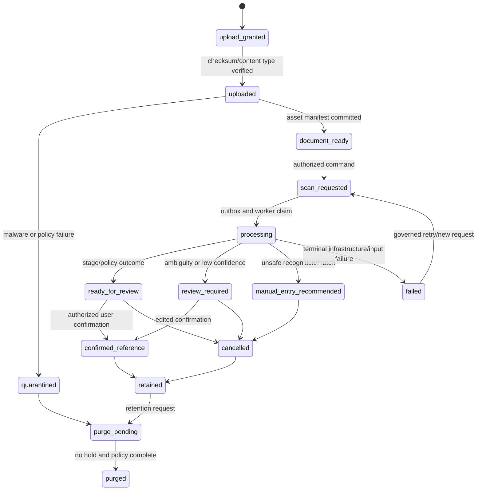

# Evidence and ML Data Lifecycle

## 1. Safety boundary

Prescription processing is a data-lifecycle workflow, not a direct medication-creation workflow. Its products are restricted source evidence, derived observations, matching candidates, review payloads, and quality/policy outcomes. The workflow may help a person enter or confirm a medication plan, but it never owns regimen, schedule, adherence, notification, or inventory state.

> **The original asset and its lineage must outlive a model run. A model result must never outlive its explanation.**

## 2. Evidence lifecycle

The state machine records whether evidence may be used for the next stage, not whether a person is “taking a medicine.” Only a subsequent Regimen command may consume a valid confirmation reference and create a regimen version.

## 3. Storage separation

| Data element | Authoritative location | Allowed representation elsewhere | Prohibited representation |
|---|---|---|---|
| Original document/page | private object store + `prescription.asset_manifests` | object key, checksum, media type, page count, restricted reference | public URL, queue bytes, client-visible storage key |
| Crop/preprocessed image | private derived object prefix + transform manifest | derived asset reference, transform/fingerprint | overwrite of original page |
| Raw provider output | restricted asset/reference with access policy | redacted error/category, parsed output reference | logs/traces/general JSONB telemetry |
| OCR line/region | evidence table with source spans/region reference | review-safe rendered excerpt where permitted | detached text copied into unrelated module table |
| Extracted field candidate | `prescription.field_candidates` | normalized candidate + validation flags in review payload | accepted regimen value without confirmation |
| Embedding/index representation | isolated restricted or catalog index namespace | input/release fingerprint, vector reference | cross-profile similarity exposure or generic analytics export |
| Provider usage/cost | stage manifest + redacted aggregate telemetry | model/provider/release, latency, token/cost bucket | raw prompt, raw medical content, account identity where unnecessary |

## 4. Evidence data model

| Table family | Key fields | Data-management rule |
|---|---|---|
| `prescription.documents` | `id`, `profile_id`, `status`, `source_kind`, `retention_class`, `created_at`, `cancelled_at` | A logical evidence container; status gates later access and processing. |
| `prescription.asset_manifests` | `id`, `document_id`, `object_key`, `content_hash`, `media_type`, `size`, `page_no`, `scan_state` | Object key is private; checksum is validated before processing/commit. |
| `prescription.asset_transforms` | `id`, `parent_asset_id`, `derived_asset_id`, `preprocessor_release`, `input_fingerprint`, `parameters_ref` | Original never overwritten; every derived asset points to parent and transform release. |
| `prescription.scan_jobs` | `id`, `document_id`, `state`, `requested_by`, `idempotency_key`, `expires_at`, `cancelled_at` | Client retry and model-stage retry are distinct; job expiry/cancel is authoritative. |
| `prescription.stage_runs` | `id`, `scan_job_id`, `stage`, `attempt`, `input_fingerprint`, `status`, `execution_manifest`, `raw_output_ref` | Completed manifest is immutable; changed model/prompt/catalog input creates new lineage. |
| `prescription.field_candidates` | `id`, `stage_run_id`, `field_kind`, `raw_span_ref`, `normalized_value`, `validation`, `signal_set` | Candidate is evidence, not clinical truth. |
| `prescription.match_candidates` | `id`, `stage_run_id`, `catalog_release_id`, `index_release_id`, `product_ref`, `score_features`, `rank` | Candidate is valid only with release compatibility context. |
| `prescription.review_payloads` | `id`, `scan_job_id`, `evidence_revision`, `policy_release_id`, `catalog_release_id`, `state`, `expires_at` | A stable, explainable review object; confirmation validates its version/state. |
| `prescription.confirmation_links` | `id`, `review_payload_id`, `regimen_version_id`, `confirmed_by`, `confirmed_at` | Provenance link only; it cannot substitute for regimen ownership/audit. |

## 5. Execution manifest requirements

Each completed or terminal stage run records its input and execution manifest. This includes stage, attempt, asset/parent result references, input fingerprint, worker version, model/provider/revision, prompt/template, preprocessing/processor/tokenizer, parsing schema, catalog/index/matching release, policy release, timestamps, outcome, redacted usage, and raw/parsed output references.

The `input_fingerprint` is calculated over every material input. A retry of the same stage after a changed crop algorithm, model, parsing schema, catalog release, or policy must be a new lineage. By contrast, a repeated mobile submit of the same scan request is handled through request idempotency and should not produce redundant jobs.

## 6. ML data-use boundaries

| Data use | Default decision | Required gate before widening use |
|---|---|---|
| Real-time processing for a user-requested scan | permitted only under current profile purpose/access and adapter data-minimization policy | provider contract, restricted egress allowlist, safe failure/manual entry path |
| Model/provider evaluation telemetry | allowed only as redacted/minimized operational data | metric definition, access control, retention, no raw evidence content |
| Profile-private correction improvement | may be considered only within that profile’s governed purpose | explicit policy, explainable scope, no shared catalog mutation |
| Shared catalog improvement | never automatic | curated case, source evidence, reviewer decision, release, index rebuild, rollback |
| Training/fine-tuning corpus | excluded by default from product execution flow | separate governance decision, consent/lawful basis review, minimization/de-identification plan, access/retention controls |

## 7. Failure, revocation, and purge behavior

A worker rechecks document state, cancellation, retention/purge state, and current purpose/access before restricted asset retrieval and before output commit. If a document is purged or consent is withdrawn while a stage is executing, the stage transitions to cancelled/superseded and cannot make a new review payload available. An object-store operation that completes after cancellation validates document state and upload nonce/checksum; it becomes quarantined or is deleted rather than attached to a cancelled document.

Provider timeouts after possible acceptance create `outcome_unknown`, preserve the deterministic request key, and schedule reconciliation. They do not produce a blind resend of potentially sensitive content. A stage result that is malformed, oversized, schema-incompatible, or outside policy routes to safe terminal/manual behavior with redacted diagnostics.

## 8. Evidence lineage acceptance tests

The backend should prove: original asset immutability; checksum mismatch detection; cancellation winning before output commit; no raw evidence in outbox/log/DLQ; model/config change creating new lineage; confirmation failing on expired/superseded review payload; catalog release retention for historic review explanation; provider uncertainty reconciliation; and no database role used by ML workers being able to write regimen/adherence state.
