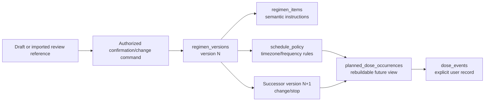
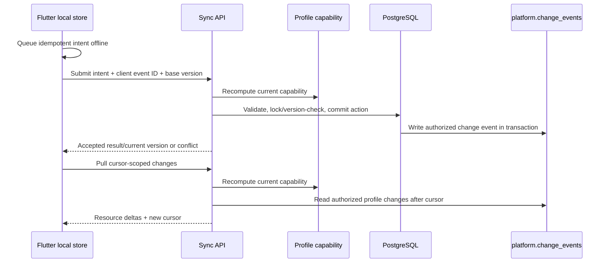

# Regimen, Adherence, and Mobile Synchronization Data

## 1. Canonical action records

The medication-management portion of Nirog is built from **user-confirmed and user-recorded actions**. It is not derived from OCR text or a reminder delivery result. The canonical records are versioned regimen definitions, explicit inventory/refill adjustments, planned occurrence state where appropriate, and append-oriented dose events.

| Data product | Owner | Canonical source | Update rule |
|---|---|---|---|
| Medication plan/regimen | `regimen` | authorized create/change/stop command | aggregate version increments; previous version remains explainable |
| Regimen item/instruction | `regimen` | confirmed user input or reviewed confirmation payload | semantically material change creates successor version/row state |
| Schedule policy | `regimen` | confirmed timing/frequency/timezone rule | projection source, not a reminder-provider payload |
| Planned dose occurrence | `adherence` projection | regimen version + schedule policy + timezone | future occurrences may rebuild; past explicit user events never rewritten |
| Dose event | `adherence` | user record/skip/miss/undo command | append/correct through governed event semantics; preserve occurrence/time/source |
| Inventory/refill adjustment | `regimen` | explicit update or confirmed refill event | optimistic versioning and audit; never decrement merely because notification was sent |
| Notification delivery state | `adherence` | delivery intent/provider outcome | operational/user-experience state; not proof of dose taking |

## 2. Regimen version model

Each aggregate has a monotonic `version`. A client change includes a base version, and an out-of-date change receives a `409` with current representation/version metadata rather than silently overwriting another edit. A source evidence/review reference may support a version’s provenance but does not give the Evidence module write authority over it.

## 3. Suggested table families

| Table family | Important fields | Invariants |
|---|---|---|
| `regimen.regimens` | `id`, `profile_id`, `state`, `current_version`, `created_by`, `created_at`, `stopped_at` | One profile scope; `current_version` resolves current active view. |
| `regimen.regimen_versions` | `id`, `regimen_id`, `version`, `state`, `effective_at`, `confirmed_by`, `confirmation_reference`, `base_version` | `(regimen_id, version)` unique; no untracked in-place semantic update. |
| `regimen.regimen_items` | `id`, `regimen_version_id`, `medicine_reference`, `dose`, `unit`, `route`, `instructions`, `start/end` | Item references catalog release/product only with pinned or resolved policy context. |
| `regimen.schedule_policies` | `id`, `regimen_item_id`, `timezone`, `frequency_rule`, `local_time_rule`, `policy_version` | A local time rule is interpreted with explicit timezone/DST policy. |
| `adherence.planned_dose_occurrences` | `id`, `profile_id`, `item_id`, `source_regimen_version`, `scheduled_at`, `state`, `projection_version` | Future rows rebuildable; retain source version to detect obsolescence. |
| `adherence.dose_events` | `id`, `profile_id`, `occurrence_id nullable`, `event_kind`, `recorded_at`, `effective_at`, `actor`, `client_event_id`, `supersedes_id` | Client event id unique per profile/device; correction links preserve history. |
| `regimen.inventory_events` | `id`, `item_id`, `event_kind`, `quantity_delta`, `reason`, `recorded_at`, `actor` | Append-oriented adjustment ledger; current count is projection or controlled aggregate. |
| `adherence.notification_intents` | `id`, `occurrence_id`, `device_id`, `state`, `expires_at`, `provider_effect_id` | Intent expiration prevents late/duplicate reminders; delivery is not dose evidence. |

## 4. Time, timezone, and recurrence rules

Medication schedules should store the profile’s current named IANA timezone and the local-time rule used to produce an occurrence. The resulting occurrence stores an absolute `scheduled_at` timestamp plus source timezone/policy version. When a timezone changes, prior occurrence history remains interpretable; future occurrence projection is rebuilt under the new effective schedule decision. Daylight-saving gaps/duplicates are handled by an explicit policy, not implicit client-library behavior.

| Situation | Required behavior |
|---|---|
| Client offline device clock differs from server | Store client-observed time separately from server receipt; validate acceptable skew; present correction path rather than overwrite. |
| DST local time does not exist | Apply a documented “next valid local time” or user-visible rule; record policy version. |
| DST local time repeats | Use a deterministic occurrence identifier/offset and prevent duplicate intent generation. |
| Regimen changes mid-day | Mark only future projections obsolete; associate any prior dose event with the occurrence/version known at record time. |
| User records retroactive dose | Preserve `recorded_at` and `effective_at`; mark retroactive without altering schedule source. |

## 5. Flutter offline and synchronization model

Flutter stores a protected local cache and an outbox of user intents. The server remains authoritative for policy, resource version, and conflict resolution. The client never replicates all profile tables or raw prescription evidence.

| Sync rule | Implementation behavior |
|---|---|
| Intent idempotency | Unique `(profile_id, device_installation_id, client_event_id)` or equivalent request key prevents repeated offline submission. |
| Mutation concurrency | Regimen/inventory commands use base version; dose events use client event identity plus correction links. |
| Data minimization | Change feed carries resource kind, ID, version, change kind, and authorized representation/reference—not raw restricted objects. |
| Cursor isolation | Cursor is profile/capability scoped and opaque. It cannot be reused to infer another profile’s changes. |
| Revocation | A revoked capability invalidates pull/push; client handles safe local sign-out/cache policy and obtains new authorized state. |
| Conflict UX | API returns stable problem code/current version and preserves unsent user intent for review, not automatic destructive replacement. |

## 6. Adherence data quality

Adherence percentage is a derived interpretation, not an immutable clinical fact. Its calculation records period policy, `as_of`, eligible occurrence set, event treatment rules, and source aggregate/projector version. New dose corrections can alter a current summary while leaving the underlying history auditable.

Notification analytics similarly distinguishes **intent created**, **provider accepted**, **device acknowledged**, and **user took dose**. These are separate event types, with separate ownership and different failure semantics.

## 7. Acceptance tests

Test offline duplicate submissions, stale regimen edits, future projection rebuild after schedule change, DST boundary generation, notification timeout/late delivery, retroactive dose correction, caregiver revocation between sync pages, and profile cursor isolation. The test suite must prove that a notification delivery cannot decrement inventory or mark a dose taken, and that no ML worker can append a regimen/adherence action.
