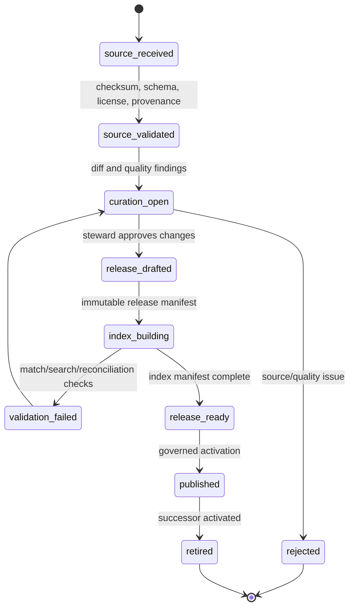

# Reference Catalog and Data Quality Management

## 1. Shared reference is a release-managed product

The medicine catalog is shared reference information, not a mutable copy of every profile’s medicine list. It contains curated products, ingredients, strengths, forms, routes, aliases, source provenance, and search/matching artifacts. A correction never silently rewrites a published release that may have influenced a historic review; it creates a curated successor release.

## 2. Catalog lifecycle

## 3. Catalog data products

| Product | Key fields | Management rule |
|---|---|---|
| Source register | source URI/license, received checksum, source version/date, importer, validation outcome | Do not import unknown provenance into a release. |
| Curation case | proposed change, evidence, reviewer, decision, reasons, affected entities | Shared corrections have human/accountable review. |
| Release | immutable ID, manifest checksum, predecessor, state, publish/retire timestamps | Published release content does not mutate. |
| Product/reference row | ingredients, strength, form, route, manufacturer/market context where available | Belongs to one release or immutable content identity. |
| Alias/normalization row | raw alias, normalized token, language/script, source/release, confidence/review state | Alias is not automatically promoted from private OCR feedback. |
| Index manifest | release ID, embedding/index config, build job/result checksum, validation evidence | Index is tied to one release and only activated after validation. |
| Match policy release | compatibility rules, score/reject thresholds, policy version, evaluation evidence | Candidate behavior is reproducible and independently versioned. |

## 4. Quality rules

| Quality class | Example check | Release behavior |
|---|---|---|
| Structural validity | required fields, types, duplicate external source IDs, normalized schema | block source/release if invalid. |
| Semantic consistency | strength/unit/form/route compatibility and ingredient normalization | route to curation; do not silently coerce critical values. |
| Referential completeness | product references valid ingredient/form entities and provenance source | block publication until resolved. |
| Change impact | product/alias removal or strength/form change affects active matching candidates | generate diff/impact report and release approval requirement. |
| Search/index fidelity | index manifest matches release checksum; known queries resolve expected result set | block index activation; prior release remains active. |
| Localization robustness | Bangla/English/mixed-script aliases and normalization maintain source form | evaluate as a release segment, not only generic string similarity. |

## 5. Private correction boundary

A user edit to an OCR candidate is meaningful evidence for the current profile and review, but it is not automatically a universally true medicine mapping. The route from private correction to shared reference requires a curation case, non-private source evidence, steward decision, new catalog release, index build, validation, and rollback path. This protects against the false assumption that an aggregate of unverified user selections is safe medical reference data.

## 6. Read and matching contracts

Evidence matching requests a declared `catalog_release_id`, `index_release_id`, and `matching_policy_release_id`. The result carries these identifiers and compatible candidate feature explanations. A later catalog release can improve new matching work, but it does not silently change the candidate/review explanation stored for an older scan.

| Query purpose | Allowed output | Not allowed |
|---|---|---|
| Search in manual entry | product/reference data from active release, release metadata | profile-private scan or adherence data. |
| Match extracted evidence | candidate references, compatibility features, release/policy IDs | direct regimen activation or mutation. |
| Admin curation | source evidence, diff/quality findings, audit trail | bulk unreviewed overwrite of published release. |
| Analytics | release-level aggregate quality/correction patterns under governed minimization | raw profile OCR text or identity linkage. |

## 7. Release recovery

An index failure blocks activation of the candidate release but never invalidates the prior active release. A published release found defective is retired through a successor or rollback pointer policy, not altered in place. Recovery preserves prior release manifests and validation results so historic matching and review decisions remain explainable.

