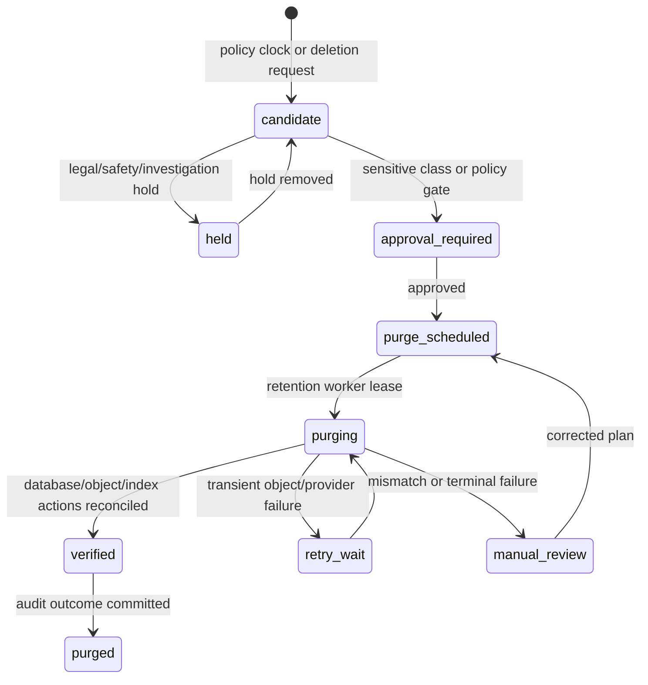

# Retention, Recovery, and Data Operability

## 1. Lifecycle policy model

Retention is a governed lifecycle decision, not an implicit consequence of storage cost. Each data product declares its purpose, sensitivity, retention trigger, normal duration, hold condition, purge method, backup interaction, and owner. The backend records policy version so a completed purge or retained exception can be explained later.

| Data class | Examples | Default lifecycle posture | Purge/recovery concern |
|---|---|---|---|
| Account identity | account identifiers, OIDC linkage, preferences | retain independently from health evidence according to account/legal/support policy | account deletion may pseudonymize or constrain records needed for security/audit. |
| Profile health action | regimens, dose events, inventory/refill adjustments | retain under product and applicable health-data policy; versioned history remains explainable | do not destroy atomic action history by rebuilding a summary. |
| Restricted evidence | prescription image, crop, raw OCR/provider output | shortest defensible period for stated user/service purpose; distinct raw/derived retention classes | coordinate database status, object deletion, backups, holds, and in-flight worker cancellation. |
| Shared catalog reference | source manifest, curation case, release, index manifest | release and provenance retained for historic explanation/rollback | retirement does not mutate a published release. |
| Platform controls/audit | outbox/ledger, audit, idempotency, consent/grant decisions, retention execution | retain long enough for reliability/security investigation, bounded/minimized by policy | avoid raw medical content while preserving necessary decision evidence. |
| Rebuildable projection/cache | schedules, stats, sync views, index/cache entries | short operational lifecycle; rebuild from authoritative source | invalidate safely after version/policy changes. |
| Logs/traces | redacted request/worker diagnostics | shortest useful operations window | content minimization and access controls are mandatory. |

## 2. Retention execution state machine

The state machine is intentionally durable in `platform.retention_jobs`. A scheduled deletion is not proof that a private object was deleted, and an object-store success is not proof that database/index references were reconciled. Completion is recorded only after the governed plan is verified.

## 3. Purge plan for restricted evidence

| Step | Required behavior | Evidence recorded |
|---|---|---|
| Select candidate | Retention policy evaluates record class, profile/account state, consent/purpose, age, active workflow, and hold state. | policy version, candidate reference, reason/trigger. |
| Fence new work | Set purge-pending/cancel state; prevent new asset grants and stage/job commits. | state transition, correlation ID. |
| Revoke derivative access | Invalidate review payload/download grants and remove/disable restricted indexes/caches. | derivative references and result. |
| Delete objects | Delete original and derivatives by manifest, with retry-safe object identifiers/checksums. | object result categories, no raw content. |
| Delete/minimize database data | Remove raw-output refs and sensitive derived rows as policy directs; preserve allowed audit/minimal tombstone. | row/action summary and policy result. |
| Reconcile | Re-list/verify manifest references, object state, queued jobs, and caches. | reconciliation timestamp/outcome. |
| Complete or escalate | Mark purged only after verification; route mismatch/hold/provider error to retry/manual review. | immutable retention/audit outcome. |

## 4. Backup and restore design

Nirog needs recoverable operational data without treating backups as an invisible exception to lifecycle policy. The backup design distinguishes database, restricted object storage, index/derived stores, and configuration/policy artifacts.

| Asset | Backup/recovery strategy | Restore rule |
|---|---|---|
| PostgreSQL authoritative records | encrypted point-in-time recovery plus tested logical/physical restore process | restore to isolated environment first; validate schema/migration/policy compatibility before service traffic. |
| Restricted objects | encrypted versioned/immutable backup where policy permits | restore objects by manifest; do not expose until profile/consent/purge state reconciles. |
| Catalog releases/manifests | durable immutable release/source storage | verify checksum; rebuild index from release manifest if needed. |
| Outbox/ledger/control records | included with database backup and reconciliation plan | after restore, reconcile external/provider intents before replaying delivery. |
| Derived indexes/projections | usually rebuildable, versioned config backed up | rebuild from restored authoritative data; do not blindly restore stale cache. |
| Secrets/keys/configuration | managed secret store and infrastructure configuration, with separate recovery procedures | restore least privilege and rotation posture before enabling workloads. |

NIST’s mobile health reference emphasizes access, audit, retention, backup, and recovery as part of protecting health information; Nirog treats restore drills and lost-device/revocation scenarios as data-operability tests, not only infrastructure tests.[1]

## 5. Recovery and reconciliation priorities

| Incident | First data question | Safe recovery behavior |
|---|---|---|
| Database point-in-time restore | Which committed events/external effects may be missing or duplicated? | reconcile outbox/provider intents/consumer ledger; no blind global retry. |
| Object-store partial failure | Which manifests report object success but DB/purge state differs? | verify by manifest checksum/key; keep resource unavailable until reconciled. |
| Broker outage/replay | Which events have committed business state but no completed consumer effect? | relay/replay from outbox with consumer ledger and aggregate version checks. |
| Catalog index corruption | Which release remains active and validated? | serve prior active index/release; rebuild candidate index from immutable manifest. |
| Mobile sync defect | Which profile/resource versions were omitted or duplicated? | repair change feed/cursor projection; do not rewrite canonical regimen/dose records. |
| Unwanted data exposure suspicion | Which recipient/artifact/time window is involved? | revoke grants/tokens, preserve minimal audit evidence, rotate scoped credentials, follow incident process. |

## 6. Operational data SLOs and alerts

Operational metrics are derived, minimized data products. They should identify data integrity risk before it becomes user harm.

| Signal | Alert condition | Owner action |
|---|---|---|
| Outbox age | oldest unpublished committed event exceeds target | inspect relay lease/broker; preserve order/idempotency. |
| Consumer lease age | claimed event exceeds processing budget | fence stale lease, reconcile external intent, retry or DLQ. |
| Evidence stage terminal rate | unsafe/failed result segment rises by script/device/provider release | pause release or route manual entry; retain evaluation evidence. |
| Catalog/index release mismatch | active index manifest differs from active release | stop candidate activation; restore/rebuild validated index. |
| Retention backlog | purge candidates age past policy SLA | inspect holds/object failures/worker capacity; do not bulk-delete bypassing lifecycle. |
| Backup/restore test age | drill or integrity verification beyond defined interval | schedule isolated restore exercise and record outcomes. |
| RLS/access denial anomaly | unexpected cross-profile denials/attempts or policy errors | investigate policy/dependency/context reset; preserve redacted audit trail. |

## 7. Operational acceptance checks

At least periodically, execute a restore drill from a production-like backup to an isolated environment; reconcile outbox/provider intent behavior; prove a purged asset cannot be fetched with stale capability; prove a retained release can rebuild an index; prove a revoked device cannot continue sync; and verify audit/operational data contains decision context but not raw prescription contents.

## References

[1] [NIST SP 1800-1: Securing Electronic Health Records on Mobile Devices](https://www.nccoe.nist.gov/publication/1800-1/VolE/)
