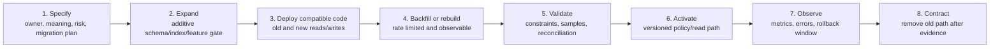

# Data Change and Migration Governance

## 1. Data changes are product changes

Schema alterations, backfills, policy edits, catalog corrections, model/prompt updates, retention changes, and index rebuilds can alter what a user sees or how a past result is interpreted. Nirog therefore treats data change as a versioned product operation with owner, compatibility period, validation, rollout, and recovery behavior.

| Change family | Typical example | Authority | Required controls |
|---|---|---|---|
| Schema expansion | add nullable lineage/release field | table-owning module | additive migration, backfill plan, compatibility window, rollback-safe code. |
| Schema contraction | remove deprecated column/table | table-owning module + operations | prove readers/writers removed, archival/retention decision, delayed destructive migration. |
| Data correction | correct catalog form/alias | Catalog steward/owner | curation case, provenance, successor release, impact assessment. |
| Policy/config | change match threshold, consent purpose rule, retention duration | policy owner + appropriate review | versioned artifact, effective time/scope, test/evaluation, rollback. |
| Model/prompt/preprocess | new provider/model/parser | ML owner | new execution lineage, representative evaluation, staged rollout, safe fallback. |
| Rebuild/backfill | regenerate schedules/index/summaries | owner + operations | source version, idempotent batches, pause/resume, progress, reconciliation. |
| Privacy/security | change RLS role, egress field allowlist, encryption/key behavior | platform/security owner | risk review, least-privilege verification, rollback, audit. |

## 2. Expand–migrate–contract procedure

The procedure is mandatory for a migration affecting data used by another module, a mobile client, an asynchronous worker, or a historical explanation. Code must tolerate both old and new representations during the compatibility window.

## 3. PostgreSQL migration sequencing

| Step | Database action | Application/worker action | Acceptance check |
|---|---|---|---|
| 1. Register | Assign migration ID, owning schema, purpose, risk class, rollback plan. | Add feature gate/metric names and data decision link. | Migration has owner, estimated lock/backfill impact, and no undocumented cross-domain write. |
| 2. Expand | Add nullable column/table/index/enum-compatible structure; avoid blocking rewrite where possible. | Deploy readers tolerant of null/old state; add dual write only when necessary. | Existing application version remains functional. |
| 3. Populate | Backfill in bounded keyset batches with checkpoint/progress table. | Worker/service uses idempotent updates and rate limits. | Counts/checksums/sample invariants reconcile; pause/resume tested. |
| 4. Validate | Add `NOT VALID` constraint or validation query where appropriate; inspect locks/replication. | Compare old/new read model in shadow/metric path. | No policy/lineage/authorization regression. |
| 5. Activate | Validate constraint/flip read path/enable release. | Emit explicit version/change event and monitor. | Client/worker compatibility and SLOs pass. |
| 6. Contract | Remove dual write/old reader only after window. | Purge deprecated data under policy, not impulse. | Historical explanation/recovery requirement still met. |

## 4. Backfill design

Backfills are asynchronous data products. They must not run as a single long transaction or hide progress in log output.

| Backfill field | Purpose |
|---|---|
| `backfill_id`, owner, migration/version | identifies accountable plan. |
| source query/version/checkpoint | allows deterministic resume and scope explanation. |
| batch cursor, processed/succeeded/skipped/failed counts | supports progress and bounded recovery. |
| idempotency predicate | makes repeated batch execution safe. |
| dry-run/sample validation result | detects logic before broad write. |
| rate/connection budget | protects API and workers. |
| reconciliation query/result | proves target count/invariant after completion. |
| rollback/compensation strategy | explains what can be reversed and what must be superseded. |

## 5. Data compatibility contracts

| Producer/consumer boundary | Compatibility rule |
|---|---|
| API ↔ Flutter | New fields are additive/optional before required; client interprets resource schema version; stale mutation returns conflict rather than guessing. |
| Domain module ↔ worker | Event envelope is versioned; consumer ignores unknown additive fields but blocks unsafe semantic version mismatch. |
| Evidence ↔ regimen | Confirmation reference includes payload/version/policy state; no consumer infers an action from an unversioned candidate. |
| Catalog ↔ matching/index | Match request/result declares catalog/index/policy release; active release changes do not rewrite historic result explanation. |
| Database ↔ RLS/policy | Migration preserves owner/application role separation and tests transaction context with pooled connections. |
| Retention ↔ backup | New class/retention rule states backup/restore/purge interaction before activation. |

## 6. Change evidence and rollback

Every governed change produces evidence proportionate to risk: migration checksum, deployment version, feature/policy release, backfill report, validation query result, release evaluation, rollback decision, and correlation with operational metrics. A rollback means different things for different data:

| Change | Safe rollback form |
|---|---|
| Additive schema | disable new path; retain field until later contract. |
| Incorrect backfill | compensating migration or mark/rebuild derivative; never silent history rewrite. |
| Catalog release | deactivate/retire release and restore prior validated release/index. |
| ML/policy release | route new requests to prior approved release; preserve manifest of affected run. |
| Regimen data error | governed corrective action/version with audit, not direct SQL update. |
| Retention rule mistake | pause execution/hold affected candidates; investigate restore feasibility without claiming backup erasure. |

## 7. Review triggers

Require focused architecture/security/data review for: a new data recipient; a new restricted field; an RLS/role change; profile data used in a model or analytic process; a change that alters historic display/meaning; a cross-module backfill; a destructive migration; a retention/purge policy edit; a release that changes medicine matching; or a mobile synchronization contract change.

## 8. Migration test matrix

Before production activation, test fresh schema creation; upgrade from each supported previous schema; retry/resume of interrupted backfill; old/new API and worker coexistence; RLS behavior after migration; restore into an isolated environment; catalog/index rebuild; and behavior when a retention/cancellation signal arrives during backfill. The result becomes part of the migration’s durable change record.
