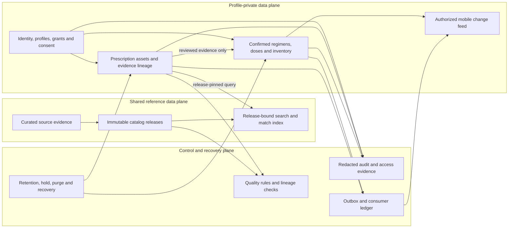

# Nirog Data Management Approach

## Purpose

This folder defines how Nirog creates, classifies, owns, protects, versions, derives, synchronizes, retains, and recovers data. It is a **data-management approach**, not a duplicate of the backend ER diagram or a single long database schema. The design starts from the medication-management safety boundary: uncertain prescription information is evidence; a medication regimen is a separate, user-confirmed clinical-management record.

Nirog uses one PostgreSQL cluster as the authoritative operational record, restricted object storage for evidence assets, a vector/index layer for release-bound matching, and an event/outbox path for derived or asynchronous work. The Flutter client holds an authorized synchronized view; it does not become a second clinical source of truth.

## Design posture

> **Each dataset has one accountable owner, one declared purpose, one classification, one authoritative location, and a documented lifecycle.** Derived data may be rebuilt; evidence and user-confirmed action must remain explainable.

The approach makes five distinctions that prevent data-management drift.

| Distinction | Nirog rule |
|---|---|
| **Source versus derivative** | Original prescription assets, user-entered confirmation, and released catalog artifacts are preserved. OCR text, embeddings, schedules, statistics, search indexes, and sync projections are rebuildable derivatives with lineage. |
| **Evidence versus action** | ML stage output can support review but cannot directly create regimen/adherence state. An authorized confirmation command creates a separately versioned action record. |
| **Profile-private versus shared reference** | Profile health/evidence data never becomes shared catalog data through passive learning. Shared reference changes require curation, provenance, release publication, and rollback. |
| **Operational record versus observability** | Domain state and audit evidence live in governed database records. Logs/traces remain minimized and redacted; they cannot be the only record of a medication action. |
| **Current truth versus historical explainability** | A current regimen or consent is evaluated from the current version. Prior review, catalog, model, and policy releases remain linkable so historic outcomes can be explained without rewriting history. |

## Data product taxonomy

The folder is organized by the responsibilities of Nirog’s data products, not by generic CRUD screens.

| Folder document | Data-management question answered | Primary owner |
|---|---|---|
| [`00-charter-and-principles.md`](./00-charter-and-principles.md) | What does trustworthy medication data mean, and which principles are non-negotiable? | Platform + backend |
| [`01-data-domains-and-ownership.md`](./01-data-domains-and-ownership.md) | Which module owns each data product, and how may another module use it? | All module owners |
| [`02-canonical-records-and-lineage.md`](./02-canonical-records-and-lineage.md) | What is authoritative, versioned, immutable, or rebuildable—and how is lineage recorded? | Backend + ML |
| [`03-access-consent-and-privacy.md`](./03-access-consent-and-privacy.md) | How are profile scope, caregiver grants, consent, device access, and data classes enforced? | Identity + platform |
| [`04-evidence-and-ml-data-lifecycle.md`](./04-evidence-and-ml-data-lifecycle.md) | How do restricted assets travel from ingest to reviewed evidence without becoming uncontrolled action? | Prescription/ML Evidence |
| [`05-regimen-adherence-and-mobile-sync.md`](./05-regimen-adherence-and-mobile-sync.md) | How are confirmed regimens, doses, schedules, inventory, and offline/mobile projections kept consistent? | Regimen + adherence |
| [`06-reference-catalog-and-data-quality.md`](./06-reference-catalog-and-data-quality.md) | How are shared medicine reference data, imports, curation, quality rules, and releases governed? | Catalog |
| [`07-retention-recovery-and-operability.md`](./07-retention-recovery-and-operability.md) | How are retention, deletion, legal holds, backup, recovery, reconciliation, and observability managed? | Platform + operations |
| [`08-data-change-and-migration-governance.md`](./08-data-change-and-migration-governance.md) | How do schemas, policy/config, data corrections, catalog releases, and backfills change safely? | Backend + operations |
| [`references.md`](./references.md) | Which external data-governance, privacy, provenance, and technical sources inform the approach? | Architecture |

## Nirog data plane

## Lifecycle control points

Every Nirog dataset moves through a controlled lifecycle. The detail differs by class, but the same questions are answered at each point.

| Lifecycle point | Required control |
|---|---|
| **Collect** | Record source, purpose, subject/profile scope, classification, checksum or source reference, and the command/actor that introduced data. |
| **Validate** | Enforce typed schema, constraints, ownership, authorization, idempotency, and content safety before an authoritative write. |
| **Store** | Persist source-of-truth data in the owner’s schema; store restricted binary/raw artifacts privately; avoid sensitive payload copies in broker/log/trace systems. |
| **Use and derive** | Re-check current capability/consent. Stamp derived records with source version/fingerprint and execution/release manifest. |
| **Share and sync** | Publish only versioned, profile-authorized projections. Cursor/sync tokens reference a server-owned change feed, not raw database rows. |
| **Retain and recover** | Apply class-specific policy, legal hold, retention clock, backup, restore drill, reconciliation, and cryptographic/object lifecycle behavior. |
| **Explain and audit** | Retain minimum redacted evidence of actor, policy decision, source/release, correlation, and state transition needed to investigate safely. |

## Principles informed by external guidance

NIST frames privacy as a risk-management concern rather than a storage-only concern; this approach therefore connects purpose, access, retention, and audit to every data class.[1] NIST’s mobile health guidance reinforces layered protection, auditing, recovery, and lost-device scenarios for mobile health information.[2] HL7 FHIR’s provenance model informs Nirog’s focus on source entities, activities, agents, and versioned lineage, while FHIR Consent informs the treatment of consent as a time-bound policy input rather than a profile checkbox.[3] [4]

## References

[1] [NIST Privacy Framework](https://www.nist.gov/privacy-framework)

[2] [NIST SP 1800-1: Securing Electronic Health Records on Mobile Devices](https://www.nccoe.nist.gov/publication/1800-1/VolE/)

[3] [HL7 FHIR R5 Provenance](https://www.hl7.org/fhir/provenance.html)

[4] [HL7 FHIR R5 Consent](https://hl7.org/fhir/R5/consent.html)
