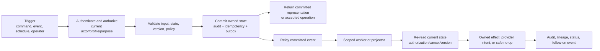

# Workflow Contract and State Vocabulary

## 1. Why workflow vocabulary matters

Nirog workflows cross API requests, PostgreSQL transactions, object storage, outbox events, workers, mobile synchronization, and provider adapters. Without a common vocabulary, one component may treat an operation as “complete” when another regards it as queued, delivered, or merely visible. This document defines the state language used by every detailed workflow in this root.

FHIR workflow guidance similarly emphasizes explicit state, relationships, allowed actions, dependencies, and conditions. Nirog does not require FHIR to execute its internal workflows, but uses the same practical distinction between **definitions**, **requests**, and **events**.[1]

| Workflow artifact | Meaning in Nirog | Example |
|---|---|---|
| **Definition** | Versioned rule/configuration that can govern an action but does not itself execute it. | schedule policy, review policy, catalog release, retention policy. |
| **Request/intent** | An actor asks for a governed action; it may be accepted, rejected, queued, cancelled, or superseded. | scan request, regimen change command, notification intent, purge request. |
| **Canonical action/event** | A durable record that an authorized domain action occurred. | regimen version created, dose recorded, caregiver grant revoked. |
| **Derived effect** | A rebuildable or deferred result caused by canonical state/event. | schedule occurrence, push delivery attempt, adherence summary, search index row. |
| **Evidence** | Observation/source material used to support a decision but not equivalent to an action. | OCR region, candidate match, provider result, review payload. |
| **Control record** | Reliable execution/policy mechanism. | idempotency record, outbox row, consumer ledger, provider intent, retention job. |

## 2. Universal workflow shape

The synchronous API transaction is intentionally narrow. It authenticates, resolves profile capability, validates a single domain command, applies owned state, writes audit/idempotency/outbox records, and returns. It does not wait for a model, provider, large import, reminder delivery, or projection rebuild.

## 3. State classes

State names should be type-specific but conform to shared meanings.

| State | Meaning | May retry? | Typical transition owner |
|---|---|---|---|
| `draft` | Created but not ready/actionable. | No automatic processing. | owning API/domain service |
| `accepted` | Command passed synchronous validation and committed. | Only replay by idempotency. | owning API/domain service |
| `queued` | Deferred work has a committed outbox/request reference. | Yes, through worker policy. | outbox/worker control plane |
| `processing` | Worker holds an active lease and is evaluating current state. | Lease expiry/retry path. | worker/consumer ledger |
| `ready_for_review` | Evidence is available for a human choice; no action is active. | New evidence lineage may supersede. | Evidence service |
| `confirmed` | An authorized actor accepted a versioned payload or action. | Correction becomes successor action. | owning action service |
| `completed` | The workflow's defined effect is committed/verified. | Duplicate delivery becomes no-op. | owning service/ledger |
| `cancelled` | A valid actor/system stopped future work. | Only a new request, not old payload replay. | owner/policy service |
| `superseded` | A newer aggregate/release/policy/version invalidates current work. | Start from current authoritative state. | consumer/projector/owner |
| `blocked` | Policy, safety, missing dependency, or current state prevents execution. | Only after the condition changes. | owner/policy service |
| `retry_wait` | Temporary eligible retry is scheduled with budget/backoff. | Yes, bounded. | worker retry policy |
| `terminal_failed` | Permanent or exhausted failure; safe user/operator handling exists. | Only governed recovery/DLQ action. | owner/operations |

## 4. Actor and scope vocabulary

| Actor | Identity mechanism | Scope | Cannot do |
|---|---|---|---|
| Profile owner | OIDC actor + current profile capability | own profile under current policy | bypass consent/retention/policy gates. |
| Caregiver/delegate | OIDC actor + active, permissioned profile grant | named profile/action/time window | infer ownership or retain access after revocation. |
| Curator/admin | privileged OIDC scope + separate policy | catalog/operations actions as granted | read unrestricted profile evidence by default. |
| API service | workload identity | module service boundary | use owner/migration database role. |
| Worker | workload identity + consumer type | one queue/function and module contract | write foreign business tables or trust stale payload. |
| Provider adapter | scoped secret/workload identity | explicit field allowlist/purpose | receive broad profile context or unrestricted assets. |
| Retention/recovery operator | controlled operational role | documented job/case scope | bypass hold/audit/reconciliation. |

## 5. Workflow control records

| Control | Why it exists | Completion condition |
|---|---|---|
| Idempotency record | Makes repeated client command return same result without repeated mutation. | response reference/status persisted for request hash/key. |
| Aggregate version | Prevents stale mutation overwriting a newer state. | new version committed; stale base version rejected. |
| Outbox event | Couples domain commit with later publication. | published state only after relay confirms broker handoff policy. |
| Consumer ledger | Makes at-least-once delivery safe. | completed/no-op/terminal state recorded after owned effect commit. |
| Provider intent | Resolves timeout-after-possible-acceptance. | deterministic key reconciled before resend. |
| Audit event | Records redacted action/policy outcome. | committed with action decision. |
| Provenance link | Explains source/activity/agent/release of a result. | source/version references immutable. |

## 6. Mandatory gates

Every detailed workflow must identify its applicable gates.

| Gate | Question |
|---|---|
| Authentication | Is the actor/token/session valid and active? |
| Profile authorization | May this actor perform this action for this profile/resource now? |
| Consent/purpose | Is the requested sensitive use/egress allowed and unrevoked? |
| Ownership | Is this module/service the valid writer for the target state? |
| Version/concurrency | Does the command/effect target the current aggregate/review/release version? |
| Evidence/review | Is evidence complete and does a user confirmation action exist where required? |
| Release compatibility | Is referenced catalog/index/policy/model configuration allowed for this step? |
| Retention/cancellation | Is source state still usable and not pending purge/cancelled/held? |
| Idempotency | Is this a first execution, replay, duplicate delivery, or stale work item? |

## 7. Workflow acceptance template

An implementation is not complete merely because the happy-path sequence runs. Each workflow must test accepted, duplicate, stale, denied, cancelled, superseded, temporary failure, permanent failure, and recovery paths; prove sensitive data does not enter unsafe logs/queue payloads; and show the audit/lineage records emitted by the final state.

## References

[1] [HL7 FHIR R5 Workflow Overview](https://hl7.org/fhir/workflow.html)
