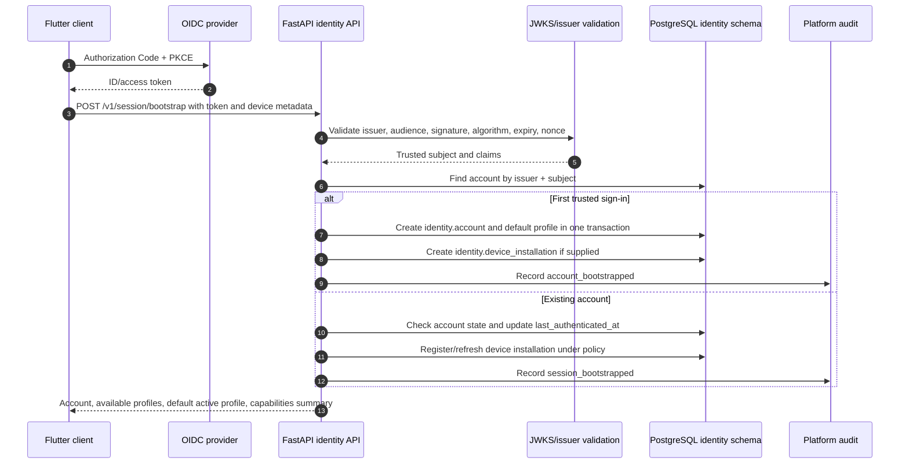
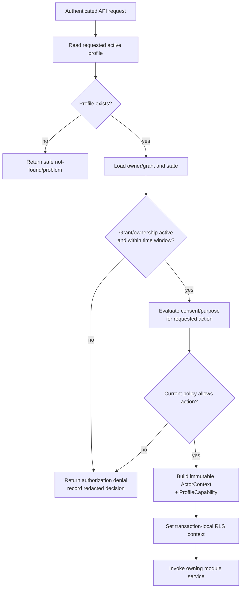

# Account, Session, and Active Profile Workflow

## 1. Purpose

This workflow establishes a local Nirog account from a trusted OIDC identity, then resolves the profile context required for every profile-scoped action. The provider authenticates the person; Nirog owns account status, profile relationships, local preferences, consent/grant records, device registration, audit, and application authorization.

## 2. Account bootstrap and returning session

## 3. Synchronous transaction boundary

| Step | Owner | Must occur synchronously? | Result |
|---|---|---|---|
| OIDC token verification | API/identity dependency | Yes | trusted issuer/subject or `401`. |
| Account lookup/state check | Identity service | Yes | active/deactivated/locked policy outcome. |
| First local account/profile creation | Identity service | Yes, atomic | local account/profile references. |
| Device installation registration | Identity service | Yes if device used for sync/push | narrow installation record or safe skip. |
| Audit event | Platform | Yes, same transaction where required | redacted authentication lifecycle evidence. |
| Security notifications/analytics | Platform worker | No | initiated from committed event if needed. |

The endpoint never treats the raw identity-provider token as an internal application session record or stores it in a general database field. It stores only the subject/issuer linkage and permitted session/device metadata needed by local policy. Token verification checks issuer, audience, signature, allowed algorithm, expiry, and applicable nonce/authorization-flow conditions.

## 4. Active-profile resolution

The mobile application may display or act for more than one profile. Therefore, account identity alone never authorizes a medication action. Every profile-scoped request includes an active profile reference or resolves a default profile. The server recomputes a current capability from ownership, `profile_access`, consent state, requested action, and resource relationship.

## 5. Account/session state

| State | Meaning | API behavior | Worker behavior |
|---|---|---|---|
| `active` | Account may authenticate and use granted capabilities. | Continue policy evaluation. | Worker must still check profile/purpose/source state. |
| `deactivated` | Account is disabled by user/admin/policy. | Reject new authenticated actions with safe code. | Stop/cancel user-purpose queued work unless an explicit retention/security exception applies. |
| `pending_verification` | Additional local verification requirement exists. | Limit to allowed bootstrap/recovery flows. | No profile health effects. |
| `locked` | Temporary security/risk state. | Deny/require recovery per policy. | Do not use prior capability as proof of current access. |
| `deleted_requested` | Account lifecycle change underway. | Limit action; surface status. | Route sensitive data to retention/deletion workflow, not ordinary user work. |

## 6. Device-installation workflow

Device records support push delivery, sync cursor scoping, user-visible device management, and rapid revocation. They do not make a device a clinical authority.

| Action | Required behavior |
|---|---|
| Register | Bind a generated installation ID to authenticated account, platform, app version, and protected push-token reference. |
| Refresh | Rotate push token/reference and `last_seen_at` only under current account/session policy. |
| Revoke | Mark installation revoked, invalidate push/sync grant, and emit a control event. |
| Lost/stolen report | Revoke installation immediately; future sync/push attempts deny; preserve minimal audit evidence. |
| Reinstall | Create a new installation identity; do not reuse stale device capability or cursor. |

## 7. Failure and recovery rules

| Condition | Safe outcome |
|---|---|
| Invalid/expired/wrong-audience token | `401` with generic problem code; never reveal token parsing detail. |
| Valid token but no active local account | controlled bootstrap or safe denial; no automatic reactivation after deactivation. |
| Duplicate bootstrap request | idempotent account/device result; no duplicate profile or audit ambiguity. |
| Device token provider rejection | keep account session valid; mark device token pending/invalid; do not fail unrelated medication read. |
| Database transaction failure | no partial account/profile/device/audit state; client can retry bootstrap with idempotency. |
| Profile header absent/invalid | resolve safe default only when policy allows; otherwise require explicit selection. |

## 8. Acceptance tests

Test first sign-in, repeat bootstrap, expired/wrong issuer token, deactivated account, default and explicit profile selection, caregiver profile denial, pooled database connection context reset, device revocation, and client retry following an ambiguous network response. Tests must verify that a successful identity-provider login cannot by itself bypass profile authorization.
