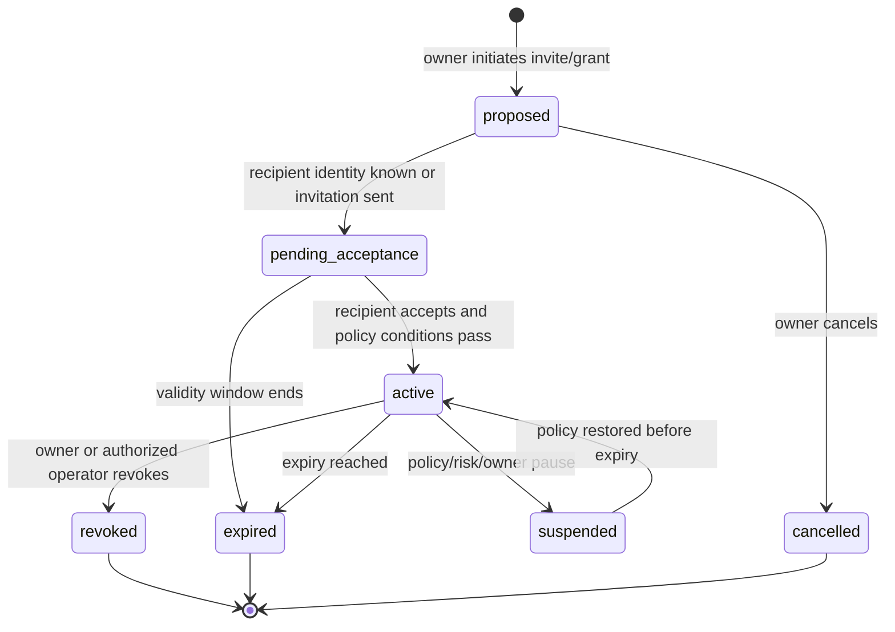
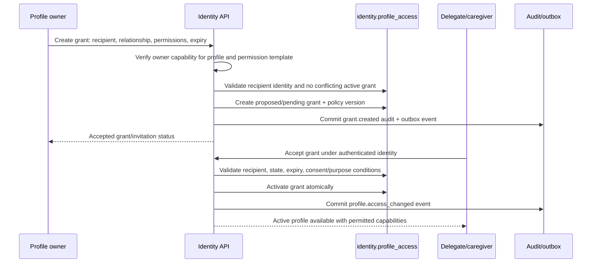

# Profile Sharing, Consent, and Revocation Workflow

## 1. Purpose

Nirog allows an account owner to share limited profile access with a caregiver or delegate without transferring account ownership. The workflow records a precise relationship, permission set, validity window, purpose/consent conditions, and revocation path. Access is evaluated at use time, not granted permanently through a copied profile record.

## 2. Grant lifecycle



## 3. Grant creation sequence



## 4. Permission design

Permissions describe permitted actions, not generic database access. They are evaluated with the current profile relationship and resource state.

| Permission family | Example allowed action | Explicitly not implied |
|---|---|---|
| Profile viewing | view authorized regimen/read model | download all restricted evidence or change ownership. |
| Regimen assistance | propose/edit a regimen draft under policy | automatically activate an ML-derived regimen. |
| Reminder assistance | acknowledge/snooze allowed notifications | record a dose as the profile owner unless policy explicitly permits. |
| Refill assistance | view/refill tracking and create permitted inventory event | change shared catalog information. |
| Evidence support | view selected review-safe evidence/payload | retrieve raw prescription asset/provider output by default. |
| Administration | manage other grants only when owner policy grants that authority | bypass consent, expiry, audit, or revocation. |

## 5. Consent as a workflow gate

Caregiver sharing and sensitive-purpose consent are separate. A grant may permit a relationship/action category, while the relevant consent/purpose policy controls whether restricted evidence is viewed, an external provider is used, notifications reveal content, or a particular data processing flow proceeds.

| Gate point | Check |
|---|---|
| Grant creation | Owner may share profile; requested permission template is valid. |
| Grant acceptance | Recipient identity matches invite; grant unexpired/unrevoked; any explicit consent conditions hold. |
| Every profile request | Current grant state, time window, requested permission, resource relationship, and purpose. |
| Worker restricted read | Current grant/consent/source status if a user-visible sensitive effect is produced. |
| Notification rendering | Device/profile capability and notification privacy setting; do not embed unnecessary medication detail. |
| Export/support request | Separate elevated purpose/approval; ordinary caregiver grant is insufficient. |

## 6. Revocation and in-flight work

```mermaid
sequenceDiagram
  participant Owner as Owner/operator
  participant API as Identity API
  participant DB as PostgreSQL
  participant Outbox as Outbox
  participant Worker as Scoped worker
  participant Client as Delegate device

  Owner->>API: Revoke profile grant
  API->>DB: Set grant state revoked + effective timestamp
  API->>DB: Commit audit and access_changed outbox event
  API-->>Owner: Revocation committed
  Outbox->>Worker: Deliver access_changed event
  Worker->>DB: Re-read pending job/source/grant state
  alt Job needs revoked capability
    Worker->>DB: Mark cancelled/superseded; prevent output/delivery
  else Background control work does not depend on grant
    Worker->>DB: Continue only under permitted service policy
  end
  Client->>API: Next profile request/sync
  API-->>Client: Deny capability and require profile removal
```

Revocation takes effect for all **new** reads/writes immediately after the commit. It also invalidates future sensitive work dependent on that capability. A worker does not trust that an event was queued while the grant was active; it re-reads current authorization and source state before restricted input retrieval and before user-visible output commit.

## 7. Audit and privacy rules

The audit record captures the actor, profile, grant ID, requested/changed permission set, policy version, state transition, correlation ID, and redacted reason category. It does not include raw prescription content or full notification payload. Historic audit evidence is retained according to policy even after a grant is revoked; it proves a past state transition but never recreates access.

## 8. Failure and test cases

| Condition | Required outcome |
|---|---|
| Recipient accepts expired/revoked invite | safe denial, no activation, audit reason. |
| Owner revokes during delegate mutation | command rechecks capability in transaction; mutation denies or uses controlled conflict outcome. |
| Worker begins before revocation but reads asset after | recheck denies/cancels before restricted access. |
| Duplicate revoke | idempotent successful state representation; no duplicate side effects. |
| Grant permission template changes | retain grant policy version; re-evaluate only by explicit migration/policy decision. |
| Delegated device remains logged in | account session may remain valid, but profile capability and sync access deny. |

The workflow must be tested with owner, delegate, expired grant, revoked grant, changed consent, and pooled-RLS connection scenarios.

