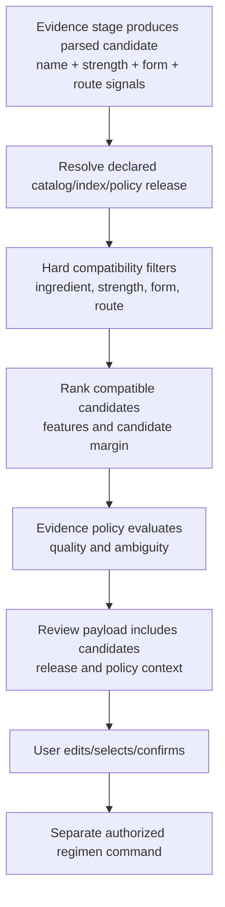

# Reference Selection and Match Context Workflow

## 1. Purpose

This workflow supports two different needs: a person may search and select a medicine reference manually, or the Evidence module may ask Catalog for ranked compatible candidates. Both use release-bound reference data. Neither operation directly changes a regimen.

## 2. Manual search and selection

```mermaid
sequenceDiagram
  participant App as Flutter client
  participant API as Catalog query API
  participant Policy as Profile capability
  participant Catalog as Catalog read model
  participant Index as Release-bound search index

  App->>API: Search terms, locale, active release optional
  API->>Policy: Validate authenticated profile capability
  API->>Catalog: Resolve allowed active catalog release
  Catalog->>Index: Search release/index with normalized query
  Index-->>Catalog: Product references + match metadata
  Catalog-->>API: Safe reference list + release ID
  API-->>App: Search results, release version, pagination cursor
  App->>API: Select product reference for draft/manual entry
  API-->>App: Reference representation only; no regimen mutation
```

Manual selection is a UI/reference action. It becomes part of a medication plan only when an authorized Regimen command validates the selected reference, user-entered dosage/schedule, active profile capability, and aggregate version.

## 3. Evidence matching request



The matching service returns evidence context rather than a directive. An exact text similarity is insufficient when strength, route, form, or ingredient conflict. Low margin, contradictory, or incomplete signals route to `review_required` or `manual_entry_recommended`.

## 4. Match contract

| Input | Required field | Why |
|---|---|---|
| Evidence reference | stage run/review input reference and input fingerprint | proves what observation generated query. |
| Catalog release | immutable `catalog_release_id` | makes reference facts explainable. |
| Index release | `index_release_id`/manifest version | connects vector/search result to build artifact. |
| Matching policy | `matching_policy_release_id` | records filters, threshold, and ranking behavior. |
| Signal set | parsed name, strengths/units, form, route, raw span references | allows compatible filtering and review explanation. |

| Output | Required field | Why |
|---|---|---|
| Candidate | product reference and release context | not an unmanaged copy of catalog row. |
| Explanation | compatible/incompatible feature flags and rank/margin | supports human review without exposing hidden model assumption as fact. |
| Outcome | candidate list, review requirement, manual-entry recommendation, or blocked | guides UX but does not activate treatment. |
| Provenance | evidence stage, release/index/policy IDs, timestamp | enables audit/reproduction. |

## 5. Invalid/stale context behavior

| Condition | Outcome |
|---|---|
| Catalog release retired after review payload created | existing payload remains historically explainable; confirmation follows policy for allowed/expired context. |
| Index result references wrong release checksum | reject result and rebuild/repair index; do not use candidate. |
| Evidence stage superseded | create new match context; older candidates cannot silently become current. |
| Route/form conflict | filter candidate even if name similarity is high. |
| No compatible candidate | review/manual entry path; no forced catalog mapping. |
| User selects candidate outside list | Regimen command validates current reference eligibility or treats as manual/private entry under policy. |

## 6. Acceptance tests

Prove that a product search cannot read profile evidence; a match request cannot alter catalog/recommend regimen; candidate returned under one release is not reinterpreted under another; form/route conflict filters candidate; and a user must explicitly confirm/edit before a regimen action exists.
