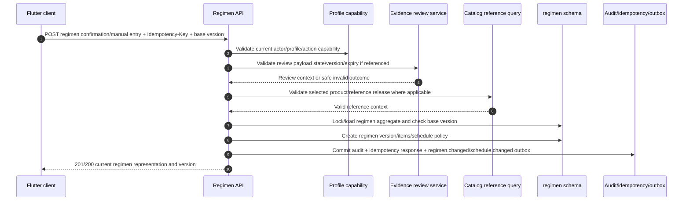
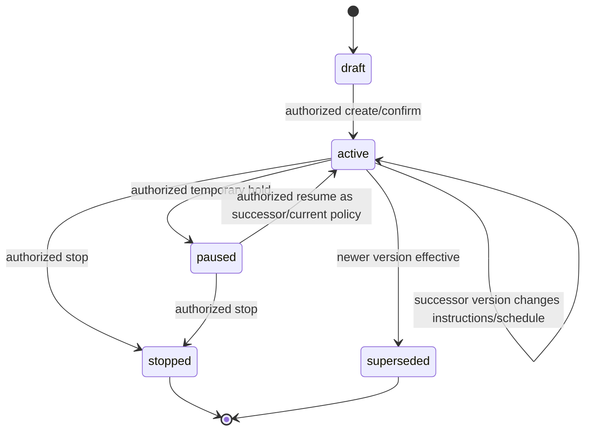

# Review Confirmation to Regimen Workflow

## 1. Purpose

This workflow converts an authorized person’s explicit confirmation or manual entry into a versioned medication regimen. It is the only workflow that creates medication-management action from an evidence-assisted review. The Evidence module supplies a review payload; the Regimen module validates and owns the new plan.

## 2. Confirmation sequence

## 3. Confirmation gate

| Input source | Required validation | Result if invalid |
|---|---|---|
| Review payload | profile scope, payload state, evidence revision, expiry, policy/release compatibility | conflict/blocked/manual re-entry; no regimen mutation. |
| Manual entry | profile capability, typed fields, required dose/form/frequency semantics | field error/manual draft correction. |
| Catalog selection | referenced release/product eligibility and field compatibility | safe reference error or manual/private item path under policy. |
| Existing regimen | aggregate base version/current state | `409` current representation; no overwrite. |
| Idempotency key | same actor/scope/request hash | replay original response; mismatched reuse errors safely. |

The API must not interpret “high confidence” as confirmation. Review evidence may prefill/assist; the write is authorized by the actor’s explicit command and persists who confirmed it, when, under which profile capability, and—if relevant—which review payload was used.

## 4. Regimen version model

| Record | Required fields | Rule |
|---|---|---|
| Regimen aggregate | `id`, `profile_id`, `state`, `current_version`, timestamps | profile-scoped owner; state controls active projection. |
| Regimen version | `regimen_id`, `version`, `effective_at`, `confirmed_by`, `confirmation_reference`, reason | material changes create successor; historic version retained. |
| Regimen item | product/manual reference, dose/unit/form/route, instructions, start/end | typed validation; reference context captured where applicable. |
| Schedule policy | frequency/local time/timezone/policy version | source for rebuildable occurrences, not provider message template. |
| Audit/provenance | actor/profile/action/policy/correlation and source payload reference | does not duplicate raw evidence or token content. |

## 5. Branches and edge cases

| Condition | Outcome |
|---|---|
| Evidence payload expires after display but before confirmation | deny confirmation; user refreshes/reviews or manually enters; never accept stale hidden state. |
| Caregiver can view but not confirm | deny action under permission template; preserve draft only if policy allows. |
| User submits same confirmation after network timeout | idempotency returns original committed regimen version. |
| Two devices edit same regimen | base version conflict; client compares/reapplies intentional changes. |
| Catalog product retired | confirm only under explicit historic/current reference policy; never silently substitute product. |
| User stops regimen while projector runs | new state/event supersedes future projection work; old worker no-ops after recheck. |
| Existing prescription evidence is purged later | regimen remains a user-confirmed action; provenance link may become allowed tombstone/minimal record under policy. |

## 6. Downstream effects

The command commits `regimen.changed` and, if applicable, `schedule.changed` through the outbox. Projectors create/retire future dose occurrences. Notification and inventory workflows consume the events after commit. No downstream worker rewrites the confirmed regimen version; an error in schedule projection is repaired by rebuilding the derivative from the canonical regimen and policy.

## 7. Acceptance tests

Test high-confidence evidence without confirmation, expired review, manual entry, revoked caregiver permission, idempotent replay, stale aggregate version, retired catalog release, no ML role write access, and projector recovery after commit.
