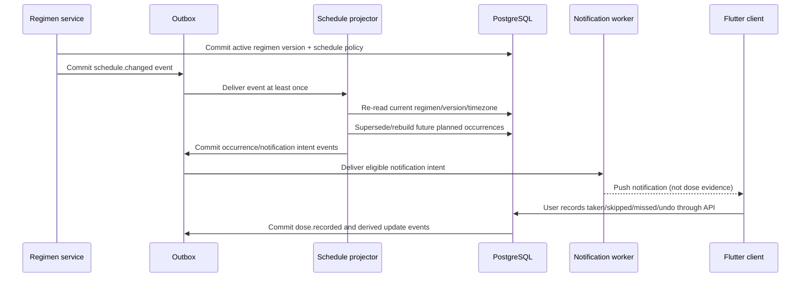
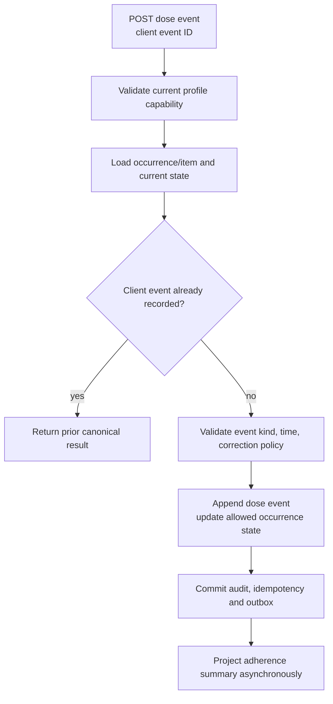

# Schedule, Dose, Inventory, and Refill Workflow

## 1. Purpose

Once a regimen version is active, Nirog projects future schedule occurrences, delivers eligible reminders, records explicit dose events, maintains inventory/refill history through controlled adjustments, and derives adherence summaries. Each represents a different kind of fact; they must not be conflated.

## 2. Schedule projection and dose record

## 3. Occurrence and dose event semantics

| Artifact | Meaning | Can be rebuilt? | Can establish dose taken? |
|---|---|---|---|
| Schedule policy | Versioned local timing/frequency rule. | no; versioned source. | no. |
| Planned occurrence | Expected future/past dose opportunity projected from policy. | future occurrences yes; historic display must respect event links. | no. |
| Notification intent | Request to attempt user notification before expiry. | yes, from active occurrence/notification policy. | no. |
| Provider delivery receipt | Provider/device delivery outcome. | operational evidence; may reconcile. | no. |
| Dose event | Explicit user/delegate-authorized record of taken/skipped/missed/corrected. | no, append/correct via linked event. | yes, as self-reported event. |
| Inventory event | Explicit quantity adjustment/refill/use policy event. | no, append-oriented ledger. | no. |
| Adherence summary | Interpretation over occurrences/dose events and period policy. | yes. | no new fact. |

## 4. Time and recurrence workflow

| Stage | Rule |
|---|---|
| Interpret | Use named IANA timezone and schedule-policy version. |
| Materialize | Store absolute `scheduled_at` plus local-time/timezone context and source regimen version. |
| Timezone change | Effective change rebuilds future occurrences only; does not rewrite previous dose event timestamps. |
| DST gap | Apply declared schedule policy such as next valid local time; record policy version. |
| DST repetition | Distinguish occurrence by absolute offset/id; do not create duplicate notification intent accidentally. |
| Regimen change | Supersede future projection from old version; preserve explicit historical dose events. |
| Retroactive user record | Store `recorded_at` and claimed/effective time separately with retroactive flag. |

## 5. Dose event command

The API does not infer a taken dose from opening a notification. A user action becomes a dose event; a correction links to the earlier event instead of deleting it. A caregiver-recorded dose must be explicitly allowed by permission/policy and carries its actor type.

## 6. Inventory and refill

Inventory is a separate controlled ledger. Refill records add quantities; authorized use/decrement policy creates event records; manual corrections record actor/reason; threshold detection produces a refill alert/intent. A notification or schedule occurrence alone never decrements stock.

| Event | Required fields | Idempotency/concurrency rule |
|---|---|---|
| Refill | item, quantity added, before/after or event delta, source/actor | idempotency key; item version/locking. |
| Consumption adjustment | item, delta, reason, source dose policy if linked | never decrement more than once on duplicate event. |
| Manual correction | actor, reason, delta, prior state context | privileged/profile-authorized action + audit. |
| Threshold crossing | source inventory version, threshold policy, alert state | alert state de-dupes repeated worker observations. |

## 7. Failure and recovery

| Condition | Safe behavior |
|---|---|
| Projector duplicate/retry | consumer ledger plus source regimen version yields idempotent/replaceable future projection. |
| Notification provider unknown outcome | provider intent/reconciliation; no implication of dose result. |
| App offline dose replay | client event ID returns existing event or appends once; conflict/correction displayed safely. |
| Schedule worker sees stopped regimen | mark stale/superseded and stop future intent. |
| Inventory update concurrent with refill | item version/lock detects stale command; client reads current state. |
| Adherence summary divergence | rebuild from canonical occurrence/dose event data and period policy. |

## 8. Acceptance tests

Test DST transitions, timezone change, stopped regimen during projection, duplicate notification intent, open notification without dose event, offline duplicate dose submit, retroactive correction, concurrent inventory changes, and summary rebuild after lost projector state.
