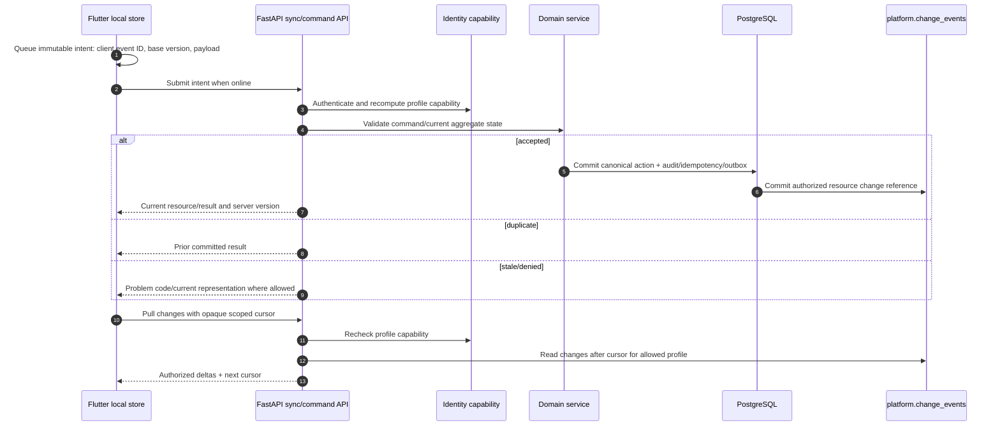

# Flutter Offline Intent and Synchronization Workflow

## 1. Purpose

Flutter can work through intermittent connectivity, but it cannot become a divergent medication system of record. The application stores a protected local view plus an intent outbox. The backend resolves current authorization, idempotency, aggregate versions, policy, and canonical state; it returns an authorized change feed for local projection.

## 2. Offline mutation round trip

## 3. Local data categories

| Local category | Cache behavior | Server authority |
|---|---|---|
| Current regimen/read model | encrypted/protected cached representation; replace/merge by resource version | server validates active version and permissions. |
| Planned upcoming doses | short-lived projection with `as_of`/source version | server can rebuild/supersede after schedule change. |
| Pending intent | durable local command with client event ID/base version | server executes once or returns conflict/denial. |
| Dose event acknowledgment | local optimistic display marked pending/synced/conflict | canonical append event on server. |
| Device/push metadata | protected reference, registration state | server controls installation validity/revocation. |
| Restricted evidence | avoid persistent general cache; use narrow preview/grant policy | private object access only through current authorization. |

## 4. Conflict handling

| Command type | Conflict mechanism | Client presentation |
|---|---|---|
| Regimen/schedule/inventory mutation | `base_version`/`If-Match` optimistic concurrency | show current values and preserve user’s unsent intent for conscious reapply/discard. |
| Dose event | unique client event ID plus correction relationship | replay prior event if duplicate; show correction path if conflicting meaning. |
| Profile selection/grant state | current capability recalculation | remove unavailable profile; prompt safe selection. |
| Review confirmation | review payload state/version/expiry | refresh review/manual entry; never silently submit old payload. |
| Device registration | installation ID/token version | server returns current/revoked state; client re-registers only after auth. |

## 5. Change feed contract

| Field | Purpose |
|---|---|
| Opaque cursor | prevents client construction/inference of database sequences. |
| Profile scope | binds feed and cursor to authorized profile context. |
| Resource kind/ID/version | tells client which authorized local representation changed. |
| Change kind | create/update/delete/supersede/refresh-required semantics. |
| `as_of`/projection metadata | signals eventual consistency for schedule/stats/search. |
| Representation/reference | contains only allowed mobile fields; excludes raw object keys, raw OCR, secrets. |

## 6. Revocation and local data handling

On the next API request, current capability is authoritative. A revoked caregiver/device cannot pull new profile changes or submit new profile actions. The client receives an explicit safe state, removes profile navigation and pending sensitive operations, and applies local secure-cache policy. Server-side revocation also cancels/supersedes queued sensitive effects as appropriate; local deletion alone is not relied on as the protection mechanism.

## 7. Acceptance tests

Test offline queue restart, repeated send after timeout, stale regimen base version, dose event duplicate, refresh after revoked profile, cursor scope isolation, server-side deleted/purged evidence reference, and eventual schedule projection `as_of` behavior.
