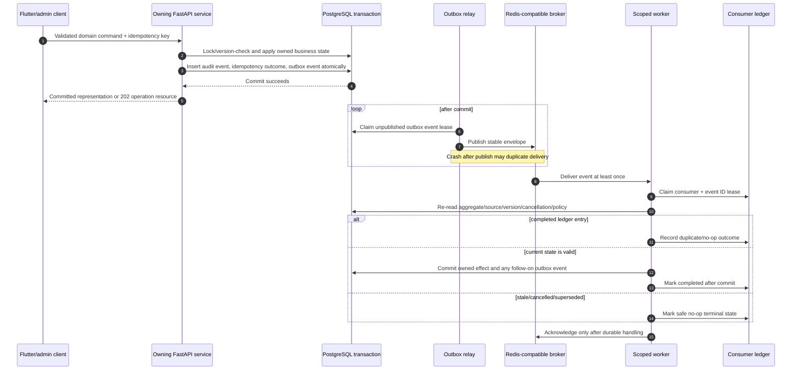

# Committed Effect and Worker Claim Workflow

## 1. Purpose

Nirog’s transactional outbox workflow ensures that a committed domain decision is not lost because a process crashes before it publishes asynchronous work. It separates **business commitment** from later **effect delivery**, accepts at-least-once broker delivery, and uses a consumer ledger plus current-state rechecks to make owned effects safe.

## 2. Command-to-worker sequence

## 3. Event envelope contract

| Field | Meaning | Safety rule |
|---|---|---|
| `event_id` | immutable delivery identity | consumer ledger keys deduplication. |
| `event_type` + payload version | versioned intent | consumer blocks/handles unknown incompatible semantics safely. |
| `aggregate_type/id/version` | source state identity | worker uses version to reject stale work/order gaps. |
| `profile_id` when applicable | authorization scope reference | no raw profile health content in event. |
| `causation_id`/`correlation_id` | request/event trace links | support audit/recovery without secrets. |
| payload | minimal typed reference/change facts | never contains asset bytes, token, raw OCR/provider output, or broad object URL. |

## 4. Claim/lease state machine

| Ledger state | Meaning | Allowed transition |
|---|---|---|
| `unseen` | no consumer processing record | claim with lease. |
| `claimed` | worker owns temporary processing lease | complete, retry_wait, outcome_unknown, no-op, terminal_failed; lease may expire. |
| `completed` | owned effect committed | duplicate delivery acknowledges/no-ops. |
| `no_op_cancelled` | source was cancelled/purged/revoked | terminal unless new current event triggers fresh work. |
| `no_op_superseded` | aggregate/release/version no longer current | terminal unless new current event triggers fresh work. |
| `retry_wait` | transient still-relevant work deferred | claim on next eligible attempt within budget. |
| `outcome_unknown` | provider may have accepted prior request | reconcile deterministic provider intent before resend. |
| `terminal_failed` | permanent/exhausted failure recorded | DLQ/manual/operator recovery only. |

## 5. Worker ownership boundary

| Worker family | May write | Must not write |
|---|---|---|
| Evidence worker | `prescription.*` stage/review records and platform control records | regimen/adherence business tables. |
| Catalog/index worker | catalog import/index status and platform controls | profile medical records. |
| Schedule/adherence projector | owned derived adherence projection and platform controls | regimen canonical version without Regimen command. |
| Notification worker | notification intent/delivery state and platform controls | dose event or inventory count solely from delivery. |
| Retention worker | platform job state and owning module purge command outcome | arbitrary cross-schema deletes. |

## 6. Relay and consumer failure rules

| Failure window | Required behavior |
|---|---|
| API before transaction commit | no state/outbox event exists; client retry uses idempotency. |
| Commit succeeds, relay has not published | relay scans durable outbox and eventually publishes. |
| Relay crashes after broker publish | broker may redeliver; consumer ledger resolves duplicate. |
| Worker crashes before effect commit | lease expires; later worker claims/rechecks current state. |
| Worker commits effect before broker ack | redelivery sees completed ledger and no-ops. |
| Event delivered out of order | aggregate version/order policy buffers/rechecks; stale effect no-ops. |
| Source changed/cancelled while queued | worker re-read converts work to superseded/cancelled state. |

## 7. Acceptance tests

Simulate every crash window, duplicate event, lost acknowledgement, delayed event, lease expiry, aggregate-version gap, cancellation after queue, and role-boundary violation. A test is successful only if the system produces one durable owned effect or a durable safe no-op, plus traceable ledger/audit evidence.
