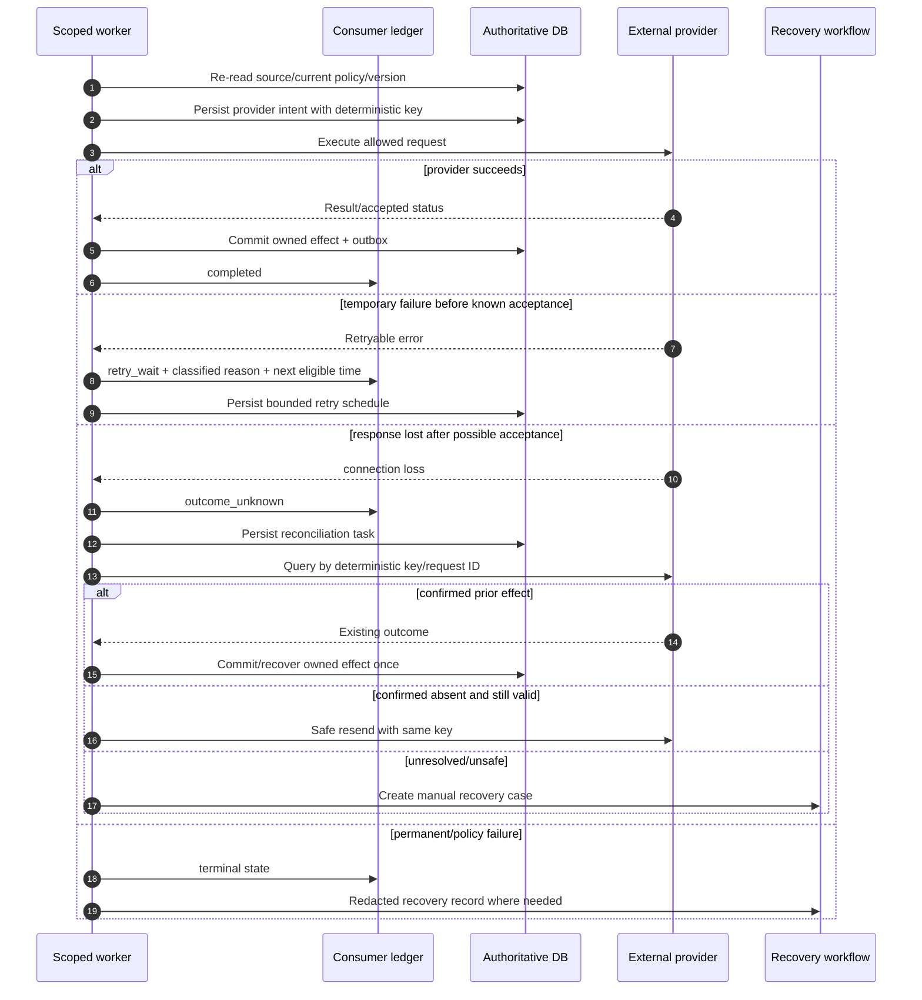
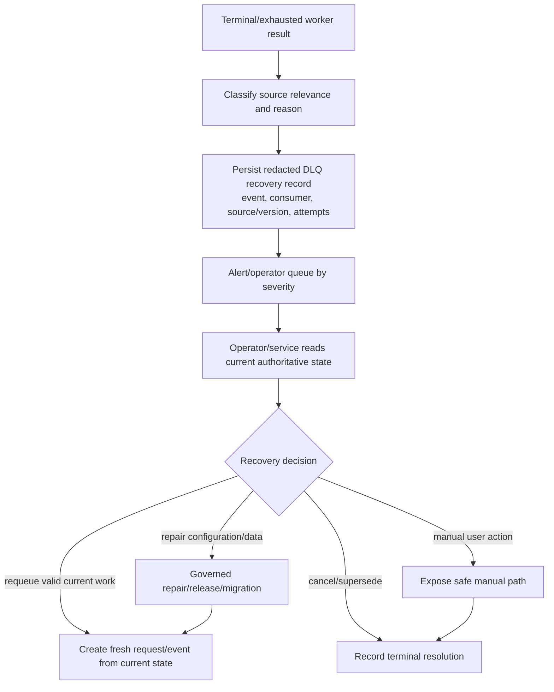

# Retry, Dead-Letter, and Reconciliation Workflow

## 1. Purpose

Retry is not a generic “try again” loop. Nirog classifies failures by permanence, source relevance, external-effect uncertainty, and user safety. It retries only temporary, still-valid work within a budget. It dead-letters terminal cases with redacted recovery context. It reconciles provider outcomes before a resend when a request might already have succeeded.

## 2. Failure classification

| Class | Examples | Action |
|---|---|---|
| `temporary` | network timeout before request, provider 429/5xx, broker transient issue | bounded backoff retry if source/current policy remains valid. |
| `outcome_unknown` | connection lost after possible provider acceptance | persist provider intent; reconcile by deterministic key/status before resend. |
| `permanent_input` | malformed payload, invalid asset, schema violation | terminal safe result/manual path; no retry. |
| `permanent_policy` | revoked access, expired consent, source cancelled/purged, invalid release | cancel/no-op/blocked; no retry until a new valid request. |
| `permanent_contract` | unsupported event version, impossible state transition | terminal/DLQ and defect alert. |
| `capacity` | queue saturation/worker paused | delay/admission control; preserve order and expiry. |
| `operator_required` | corrupt manifest, ambiguous data repair, non-automatic recovery | DLQ/manual case with current-state reconstruction. |

## 3. Retry and reconciliation sequence

## 4. Retry budget and backoff

| Field | Requirement |
|---|---|
| Attempt count and budget | bounded per event/consumer/failure class; visible in ledger. |
| Next eligible time | persisted, not only broker-local; supports restart/reconciliation. |
| Backoff | capped exponential with jitter; respects provider quota and item expiry. |
| Relevance check | before each attempt, verify source state, aggregate/release version, consent/grant, cancellation, and retention. |
| Expiry | notification/scan/import/request-specific deadline ends retries safely. |
| Error representation | stable redacted reason class; no provider secrets/raw restricted input in retry record. |

## 5. Dead-letter workflow

The DLQ is not a replay bucket. It never republishes an old payload blindly. A recovery creates a fresh attempt from current state after checking authorization, cancellation, release compatibility, and source validity.

## 6. Provider intent model

| Field | Purpose |
|---|---|
| internal intent ID and event/consumer reference | connect external effect to durable workflow identity. |
| deterministic provider idempotency key | makes retry/reconciliation safe. |
| provider request/reference ID | supports status lookup and support correlation. |
| permitted request fingerprint | proves/rechecks inputs without storing raw sensitive payload. |
| state/timestamps | requested, accepted, unknown, reconciled, failed, cancelled. |
| result reference/redacted diagnostic | links owned effect or safe error evidence. |

## 7. Acceptance tests

Test 429/5xx backoff, provider timeout before and after possible acceptance, stale queued event, revoked device before push, cancelled scan before model fetch, unsupported event schema, DLQ requeue from changed source, and no sensitive payload in ledger/DLQ/log. Prove that provider reconciliation occurs before resend.
