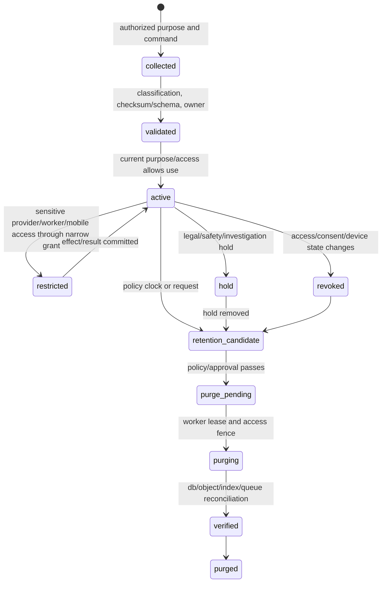
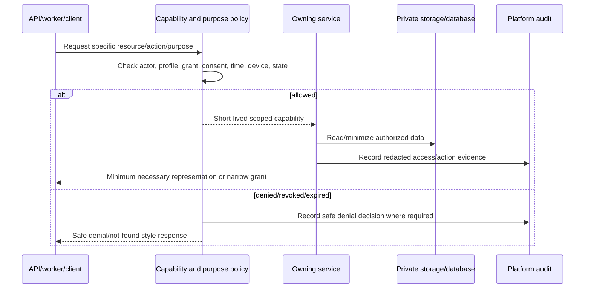

# Sensitive Data Lifecycle, Revocation, and Retention Workflow

## 1. Purpose

This workflow governs data that is profile-private or restricted: prescription assets, raw OCR/provider output, review payloads, profile medication records, grants/consent, device tokens, and supporting audit/control records. It applies purpose limitation, narrow access, retention/hold, purge, backup/recovery, and incident response without confusing deletion requests with instant disappearance from every operational layer.

## 2. Access-to-retention lifecycle

## 3. Sensitive data access sequence

## 4. Retention and purge execution

| Step | Required workflow behavior |
|---|---|
| Candidate selection | Evaluate class, purpose, policy version, age, account/profile state, active work, and hold. |
| Access fence | Mark `purge_pending`/cancel source; block new grants/stage commits/notification exposure. |
| Derivative handling | invalidate review/download grants, caches, indexes, and pending worker operations as policy directs. |
| Object/database processing | process manifest-backed original/derived objects and sensitive rows idempotently. |
| Reconciliation | verify object state, database references, index/cache records, worker queue/leases, and audit outcome. |
| Completion | mark purged only after verification; retain permitted minimum tombstone/audit evidence. |
| Exception | hold, object mismatch, provider dependency, or recovery constraint routes to manual review/retry, not blind deletion. |

## 5. Revocation versus retention

| Event | Immediate effect | Does it purge data? |
|---|---|---|
| Caregiver grant revoked | denies new profile reads/actions and cancels dependent future outputs. | No; retention policy controls lifecycle. |
| Device revoked | invalidates sync/push access. | No; device metadata retention follows policy. |
| Consent/purpose withdrawn | blocks new restricted use/egress and stops relevant queued work. | Not necessarily; record/evidence retention must follow policy/hold. |
| User requests deletion | begins governed retention/deletion workflow. | Only after policy/hold/recovery checks. |
| Retention expiration | schedules purge/reconciliation. | Yes, when verified and no exception. |
| Security incident | may revoke access/rotate credentials/preserve evidence. | No automatic purge that destroys investigation evidence. |

## 6. Backup and restore considerations

Backups are encrypted controlled copies, not an ungoverned new use. Restore occurs first into isolation, then reconciles profile/account/consent/purge state before access is enabled. Object manifests, catalog releases, and worker control records guide recovery. A restored outbox/provider intent set is reconciled before external effects resume; a stale projection/index is rebuilt from authoritative source rather than trusted blindly.

## 7. Acceptance tests

Test revocation during queued work, expired capability grant, purge while upload/stage runs, unreferenced object cleanup, held record, restore to isolation, stale signed grant denial, no raw evidence in audit/DLQ, and post-purge reconciliation of object/database/index/queue state.
