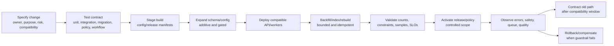
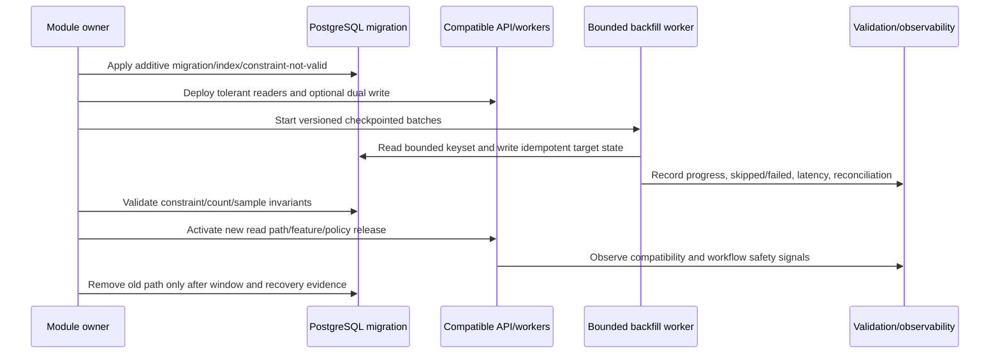

# Release, Migration, and Controlled Change Workflow

## 1. Purpose

Nirog changes code, schemas, policies, catalog releases, ML configurations, indexes, and retention rules without breaking active mobile clients, worker consumers, or historical explanation. This workflow applies explicit ownership, compatibility, controlled rollout, observable activation, and safe rollback/compensation.

## 2. Release pipeline

## 3. Change classes

| Change | Required owner | Workflow-specific gate |
|---|---|---|
| API/resource field | module owner | mobile compatibility, schema version, safe unknown fields. |
| Database schema | owning schema + operations | expand/migrate/contract, lock/backfill plan, RLS test. |
| Event payload | producer/consumer owners | versioned envelope, consumer compatibility, replay/DLQ behavior. |
| Catalog release/index | catalog curator/owner | source/curation, release manifest, index validation. |
| ML/prompt/preprocess/policy | ML/evidence owner | evaluation release gate, lineage manifest, manual fallback, rollback. |
| Notification policy | adherence/product owner | privacy payload, expiry, schedule version, provider behavior. |
| Retention/access policy | platform/security owner | current lifecycle/hold/backup/revocation impact. |

## 4. Migration and backfill workflow

## 5. Rollout and rollback rules

| Condition | Response |
|---|---|
| New API field unrecognized by older app | keep additive/optional representation; do not make required until support window. |
| Worker consumer cannot parse payload | safe block/DLQ/compat mode; do not interpret unknown semantic field. |
| Backfill error | pause/checkpoint/reconcile; compensate or rebuild derived data; no direct untracked repair. |
| Catalog index quality fails | keep prior active release/index; do not publish candidate. |
| ML quality/safety guardrail fails | stop rollout, route to prior approved release/manual path; preserve evaluation manifest. |
| Migration lock/capacity risk | defer/throttle/online migration strategy; protect API/worker SLO. |
| Retention-policy change risk | hold candidates and review; never bulk destructive run without lifecycle evidence. |

## 6. Acceptance evidence

Every change records migration checksum, release/config version, owner, compatibility notes, test matrix result, backfill checkpoint/count, validation query/sample outcome, deployment references, feature/policy activation scope, alerts/metrics, and rollback or contract decision. This evidence connects operational change to future incident/recovery workflows.
