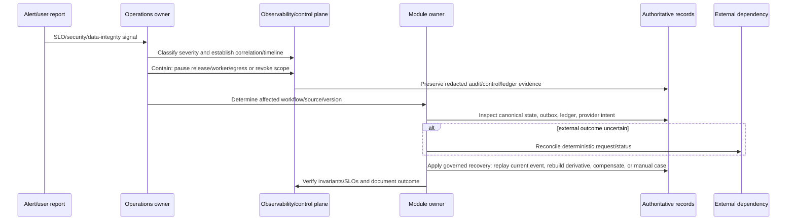
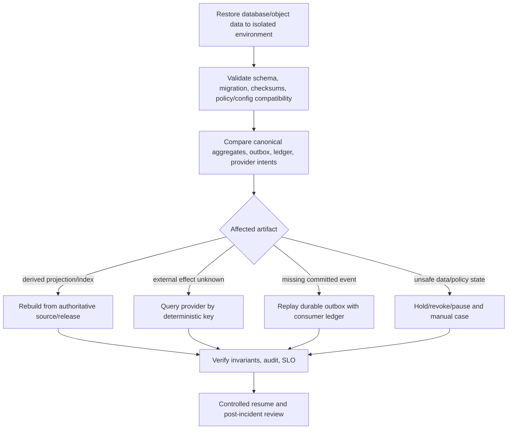

# Incident, Restore, and Reconciliation Workflow

## 1. Purpose

This workflow governs operational failure without making unsafe assumptions about lost or duplicated external effects. It covers detection, containment, evidence preservation, diagnosis, restore/reconciliation, user-safe recovery, and learning. The target is a correct current state with explainable history—not merely a restarted process.

## 2. Incident response sequence

## 3. Incident categories and first actions

| Category | Examples | First containment action | Recovery source |
|---|---|---|---|
| Authorization/privacy | cross-profile attempt, revoked access still observed, token/key exposure | revoke affected capability/credential, limit egress, preserve audit | policy/grant/device records and redacted access evidence. |
| Evidence/ML safety | malformed output, wrong release/model, scan leakage risk | pause policy/model/release, route manual entry | stage manifests, review payloads, release/evaluation artifacts. |
| Async reliability | queue backlog, duplicate effect, worker stall, provider uncertainty | pause consumer/retry flood, inspect ledger/intent | outbox, consumer ledger, provider intent, current aggregate. |
| Data integrity | migration/backfill defect, index mismatch, projection divergence | pause activation/writes as needed, retain source | canonical records, release manifests, backfill checkpoints. |
| Availability | database/broker/object provider outage | apply degradation, protect write integrity | backups, failover/restore plan, reconciliation. |
| Notification/device | push failure/privacy issue | stop affected notification policy/adapter scope | intent/delivery/device records; canonical dose state unaffected. |

## 4. Restore and reconciliation

## 5. Communication and user safety

Status messages distinguish system availability from medication advice. If a scan/review cannot be processed safely, the user receives manual-entry/retry guidance rather than model-derived medication instruction. If reminder delivery is impaired, the system does not mark doses missed/taken. If a synchronization issue exists, the client displays freshness/conflict state rather than presenting an unverified local view as authoritative.

## 6. Post-incident workflow improvement

Each significant incident creates a redacted incident record, timeline, affected workflow/version/release, detection gap, containment, data repair/reconciliation actions, user impact, root cause, and accepted preventive change. A preventive change follows the release/migration workflow and is tested against the original failure mode.

## 7. Recovery acceptance tests

Exercise database restore into isolation, broker replay, consumer duplicate handling, provider-outcome reconciliation, index rebuild from release manifest, cancelled/purged source handling, device/grant revocation, and ML rollback/manual fallback. A recovery is complete only when current invariants, audit evidence, and reconciliation checks pass.

