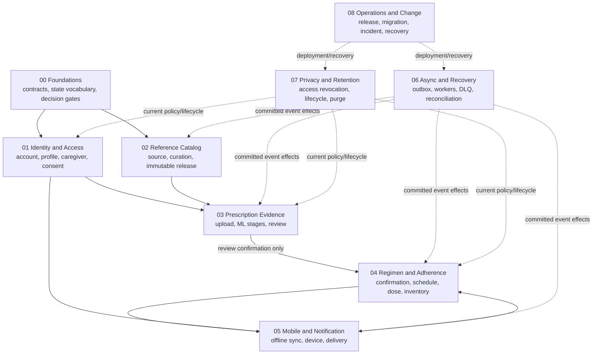

# Nirog Design Workflows

## Purpose

This root consolidates Nirog’s workflow design into a single, implementation-ready library. Earlier documentation establishes requirements, data products, subsystem ownership, async reliability, security, and deployment. This folder connects those decisions as complete flows: what triggers a workflow, which actor/module owns its state, which data becomes authoritative, which work may run asynchronously, what can fail safely, and which condition ends or recovers the process.

The documents are **Nirog-specific**. They do not reproduce the supplied study-product workflow catalog. They model the actual medication-management system: profile-scoped identity, curated medicine reference data, restricted prescription evidence, ML-assisted review, user-confirmed regimens, medication reminders, dose/adherence events, Flutter offline synchronization, and reliable backend operations.

## Workflow design contract

Every workflow document uses the same contract.

| Contract element | Required design answer |
|---|---|
| **Trigger** | Which authenticated command, committed event, scheduled time, or operational signal starts it? |
| **Actor and scope** | Which account/profile, service role, worker, or operator acts—and which profile/resource scope applies? |
| **Authoritative state** | Which owning module/table/object manifest is the source of truth? |
| **Synchronous boundary** | What completes in the FastAPI transaction, and what result is safe to return immediately? |
| **Asynchronous boundary** | Which outbox event/worker owns deferred work? What reference/version—not sensitive payload—crosses the queue? |
| **Safety gate** | Which policy, validation, consent, release, review, or version condition must hold before an effect? |
| **Failure behavior** | Which errors retry, reconcile, cancel, surface manual action, or enter dead-letter recovery? |
| **Produced evidence** | Which audit, provenance, idempotency, state transition, correlation, and version records make the result explainable? |
| **Terminal outcome** | What does completed, cancelled, superseded, blocked, or failed mean to the user and operations team? |

## Workflow map

## Folder map

| Folder | Workflow focus | Detailed documents |
|---|---|---|
| [`00-foundations/`](./00-foundations/) | Shared workflow vocabulary, state ownership, and decision gates. | `01-workflow-contract-and-state-vocabulary.md` |
| [`01-identity-and-access/`](./01-identity-and-access/) | Account bootstrap, session, active profile, caregiver grant, consent, revocation. | `01-account-session-and-profile.md`, `02-sharing-consent-and-revocation.md` |
| [`02-reference-catalog/`](./02-reference-catalog/) | Source import, curation, release publication, safe catalog search. | `01-source-to-release.md`, `02-reference-selection-and-match-context.md` |
| [`03-prescription-evidence/`](./03-prescription-evidence/) | Restricted upload, scan request, ML stage execution, review, manual fallback. | `01-upload-and-ingest.md`, `02-stage-processing-and-review.md` |
| [`04-regimen-and-adherence/`](./04-regimen-and-adherence/) | Confirmed regimen lifecycle, schedule, dose, inventory/refill, adherence interpretation. | `01-confirmation-to-regimen.md`, `02-schedule-dose-and-refill.md` |
| [`05-mobile-and-notification/`](./05-mobile-and-notification/) | Flutter intent synchronization, device lifecycle, notification delivery/acknowledgment. | `01-offline-intent-and-sync.md`, `02-reminder-delivery-and-device-state.md` |
| [`06-async-and-recovery/`](./06-async-and-recovery/) | Outbox publication, worker processing, retries, DLQ, provider reconciliation. | `01-committed-effect-and-worker-claim.md`, `02-retry-dead-letter-and-reconciliation.md` |
| [`07-privacy-and-retention/`](./07-privacy-and-retention/) | Access revocation, sensitive data lifecycle, retention hold, purge and access review. | `01-sensitive-data-lifecycle.md` |
| [`08-operations-and-change/`](./08-operations-and-change/) | Deployment/release, schema/backfill, incident response, restore/reconciliation. | `01-release-and-migration.md`, `02-incident-and-recovery.md` |

## Non-negotiable workflow invariants

> **Evidence is not action.** ML processing can create reviewable evidence only; an authorized user confirmation command creates a regimen version.

> **Database commitment precedes deferred effect.** A command commits owned business state, audit, idempotency record, and outbox event together. Workers act only after committed publication and remain idempotent.

> **Current authorization defeats stale intent.** Profile grants, consent, cancellation, retention, release compatibility, and aggregate version are checked again at sensitive execution/commit boundaries.

> **A queue message is a reference, not a sensitive data parcel.** Restricted assets and raw output are loaded through scoped service access after current policy checks.

> **User-visible medication state is explainable.** Regimen, dose, and inventory actions connect to actor, version, source/confirmation reference where applicable, policy decision, and audit/provenance evidence.

## Reading paths

Start with **00 Foundations** for the shared contract, then follow the product path: Identity → Catalog/Evidence → Regimen/Adherence → Mobile. Read **Async and Recovery** alongside any flow that creates an outbox event or provider effect. Read **Privacy and Retention** and **Operations and Change** for the lifecycle and recovery controls that apply across every domain.
