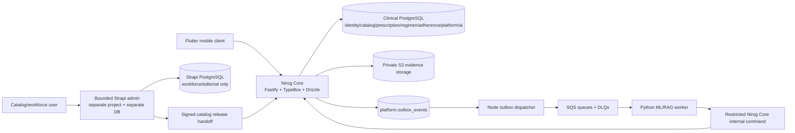

# Platform Decision and Boundaries

## 1. Decision

Nirog will use a **bounded Strapi topology**. The clinical system is a custom TypeScript modular monolith, named **Nirog Core**, built with Fastify and Drizzle. A separately deployed Strapi application provides a convenience administration surface for workforce catalog drafting, controlled knowledge authoring, editorial templates, and optionally a custom Nirog administration plugin. This preserves the benefit of Strapi’s mature administration ergonomics without making Nirog’s safety-critical records depend on Strapi’s Koa/Knex internals.

The official Strapi source is a Koa/Yarn/Nx CMS; it uses its own database abstraction with Knex and manages generated content-type tables. Its documented extension mechanisms can be broken by updates, particularly where an extension reaches into plugin internals. [1] [2] Replacing that persistence layer with Drizzle inside a permanent fork would create a large, ongoing upstream-maintenance liability. The direct Strapi core fork is therefore rejected.

## 2. Comparative decision record

| Candidate | Strength | Material limitation for Nirog | Decision |
|---|---|---|---|
| Direct Strapi fork as all backend | Ready administration, content builder, generated APIs, plugin system. | Koa and Knex are structural dependencies; content-type schema generation does not model Nirog’s RLS, immutable release, outbox, or profile-capability invariants. A fork would permanently diverge from upstream. | Rejected. |
| Custom Fastify/Drizzle core only | One data authority, exact RLS and migration control, Scalar-first contract, straightforward worker boundary. | Workforce catalog editorial UX would be built from scratch. | Chosen for clinical core. |
| Bounded Strapi administration plane plus Fastify/Drizzle core | Reuses an established admin tool for appropriate workforce workflows while keeping clinical records and mobile APIs under explicit control. | Requires two deployables, clear handoff contracts, and independent identity/database separation. | Chosen. |

## 3. Bounded Strapi responsibilities

Strapi may hold **draft-only** catalog descriptions, non-clinical knowledge articles, approved content templates, editorial media metadata, localization content, and workforce review state. It uses workforce OIDC, its own database role, and its own object-storage prefix. Its custom plugin can provide a catalog-review dashboard and submit a release proposal to Nirog Core.

Strapi must not contain `identity.accounts`, patient profiles, profile access grants, patient prescription images, ML stage data, active regimens, adherence occurrences, notification evidence, medical consent records, provider tokens, or AI usage balances. It does not issue Flutter credentials, accept Flutter traffic, or directly connect to the clinical PostgreSQL cluster.

## 4. Release handoff

The Strapi-to-Core boundary is a reviewed command, not a shared table or database trigger. An authorized workforce user submits a **catalog release proposal**. The Strapi service signs a versioned envelope with its workload identity; Nirog Core verifies signature, issuer, audience, idempotency key, editor identity, and approved catalog scope. Core validates the imported payload against its catalog command schema, creates an immutable `catalog.releases` record and successor product/index structures, emits a committed outbox event, and returns a release receipt.

This preserves the existing invariant that catalog corrections create successor releases and that the running system resolves only an approved release. A Strapi update cannot silently rewrite a clinical catalog release.

## 5. Engineering principles adopted from Strapi

Nirog adopts the useful upstream principles of dependency injection, factory-based service composition, strict TypeScript, parameterized access, input validation at boundaries, conventional commits, and layered unit/integration/end-to-end tests. [3] Nirog does **not** import the upstream internal ESLint package as an authority because it declares itself internal and work-in-progress, and its published dependency baseline is not the Nirog runtime. [4]

Nirog uses its own current TypeScript strict configuration, ESLint flat configuration, Prettier, workspace dependency policy, and architecture tests. This permits pinning toolchain behavior and security rules without coupling the clinical service to upstream release choices.

## 6. Version and upgrade policy

Both Nirog Core and `nirog-strapi-admin` pin exact major versions and commit lockfiles. The Strapi administration project is generated from a supported released version rather than forked from the upstream `develop` branch. `UPSTREAM.md` records the upstream version, plugin list, extensions used, upgrade test plan, and any patch with a removal target.

No Strapi upgrade reaches production without an isolated upgrade branch, test database migration rehearsal, plugin compatibility review, workforce smoke test, and confirmation that the catalog release handoff contract is unchanged. Nirog Core has no runtime dependency on Strapi availability: existing catalog releases remain readable even if the administration plane is offline.

## References

[1] [Strapi source repository](https://github.com/strapi/strapi)

[2] [Strapi 5 plugin extensions](https://docs.strapi.io/cms/plugins-development/plugins-extension)

[3] [Strapi upstream engineering guide](https://github.com/strapi/strapi/blob/develop/AGENTS.md)

[4] [Strapi shared ESLint configuration](https://github.com/strapi/eslint-config)
