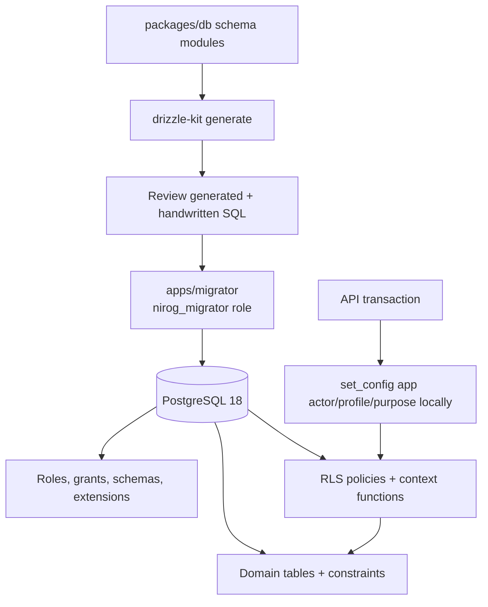

# Database, Drizzle, and Schema Plan

## 1. Persistence decision

PostgreSQL is the clinical authority. Drizzle provides typed TypeScript schema declarations, query construction, and generated SQL migration scaffolding. It does not replace PostgreSQL constraints, database roles, RLS, immutable-audit requirements, or manually reviewed migration SQL. Drizzle supports migrations and transactions; its documented RLS declaration surface is currently associated with beta documentation, so Nirog keeps policy SQL explicit and independently reviewable. [1] [2]

## 2. Schema modules

The physical names established in the documentation remain canonical. Each PostgreSQL schema maps to one focused Drizzle module, while joins and command repositories remain in their owning business module.

| PostgreSQL schema | Drizzle module | Principal records |
|---|---|---|
| `identity` | `packages/db/src/schema/identity.ts` | accounts, OIDC identities, patient profiles, profile access, consents, devices, role template versions. |
| `catalog` | `schema/catalog.ts` | immutable releases, products, ingredients, release indexes. |
| `prescription` | `schema/prescription.ts` | documents, scan jobs, stage runs, review payloads, review decisions. |
| `regimen` | `schema/regimen.ts` | regimens, items, versions, schedule policies. |
| `adherence` | `schema/adherence.ts` | planned occurrences, dose events, notification intents/deliveries. |
| `platform` | `schema/platform.ts` | idempotency, outbox, consumer ledger, audit, change events, permission releases. |
| `ai` | `schema/ai.ts` | model/prompt releases, request intents, reservations, immutable usage ledger, retrieval documents/chunks/embeddings. |

Database schema definitions use `pgSchema('identity')` and equivalent Drizzle declarations. All foreign-key names, index names, and checks are named deliberately. IDs use UUIDv7 generated by the application or approved database function; timestamps use `timestamptz`; money and usage cost use integer micros rather than floating point; unstructured model evidence is JSONB with a documented schema/version; and security-sensitive secrets remain outside tables whenever a managed secret reference suffices.

## 3. Migration policy

Migrations are forward-only, ordered, checksum-tracked files. `drizzle-kit generate` creates the initial DDL delta; engineers then add a clearly marked **manual SQL section** for database extensions, roles, grants, RLS policies, triggers, partial indexes, `CREATE INDEX CONCURRENTLY`, and safe data backfill. The pull request must state whether a migration is transactional, lock-sensitive, reversible by compensation, and safe for existing mobile clients.

| Migration class | Example | Required control |
|---|---|---|
| Foundation | schemas, `pgcrypto`, `vector`, database roles | Executed by `nirog_migrator`; no application role ownership. |
| Additive | nullable column, new table, index | Backward-compatible before code begins to write it. |
| Backfill | permission registry version, normalized release key | Checkpointed batches with audit and restart semantics. |
| Restrictive | RLS enablement, non-null, unique rule | Canary verification; code must already meet new invariant. |
| Destructive | column/table removal | Separate release after compatibility window, backup and rollback rehearsal. |

The migrator is the only runtime with DDL rights. API, dispatcher, and worker roles are non-owners. Production migrations run as a one-shot deployment task before new API/worker tasks receive traffic. Local and CI environments apply the identical migration sequence from an empty database and from a fixture representing the preceding release.

## 4. RLS context and roles

Nirog uses PostgreSQL RLS as defense in depth. Each clinical request opens a database transaction, validates the external actor in application code, and calls `set_config('app.account_id', $1, true)`, `set_config('app.profile_id', $2, true)`, `set_config('app.purpose', $3, true)`, and `set_config('app.workload', $4, true)` with bound parameters. The `true` scope ensures values are `SET LOCAL` and disappear at transaction completion.

| Role | May do | Must not do |
|---|---|---|
| `nirog_migrator` | DDL, roles, grants, RLS policy changes. | Serve HTTP or process messages. |
| `nirog_api` | Profile-scoped clinical commands through RLS. | Own tables, bypass RLS, modify migration history. |
| `nirog_dispatcher` | Read unpublished outbox rows and mark delivery leases. | Read patient payloads beyond the event envelope or mutate clinical aggregates. |
| `nirog_worker_ml` | No direct clinical database access in MVP. | Write regimen/adherence, use a human actor, or bypass the internal command boundary. |
| `nirog_strapi_handoff` | Call a constrained internal release endpoint with workload identity. | Connect to clinical PostgreSQL or query patient data. |
| `nirog_readonly_audit` | Approved redacted audit/report views. | Read raw evidence or mutate records. |

No production application role owns a table or has `BYPASSRLS`. A migration test must demonstrate that an `nirog_api` session without an explicitly set local context cannot read a profile-scoped row, while a valid capability context can read only the authorized profile/resource. PostgreSQL RLS rules are not permission logic in disguise: the application still evaluates live grants, permission snapshots, consent, relation, and aggregate state.

## 5. Constraint design

Constraints enforce facts that remain true regardless of client, route, worker retry, or application defect. Examples include a partial unique index for one live `identity.profile_access` grant per `(profile_id, grantee_account_id)`, unique idempotency scope/key, unique consumer/event pair, non-negative AI balance counters, append-only audit ledger triggers, and a unique active catalog release pointer. State-machine rules requiring context remain in domain/application handlers and are verified by concurrency tests.

`permission_set` remains JSONB to preserve immutable persisted grant snapshots. A check validates array shape and deduplication; the TypeScript permission registry validates recognized values, scope, template compatibility, delegation, and registry version. Database-managed role template versions are immutable records, not editable rows.

## 6. AI usage ledger schema

AI usage is financial/safety accounting, not a telemetry counter. It is isolated in the `ai` schema and every row uses a server-generated request ID, account/billing subject, optional profile reference, purpose, provider/model release, correlation ID, and non-sensitive provider receipt reference.

| Record | Purpose | Important invariants |
|---|---|---|
| `ai.model_releases` | Approved provider/model configuration and rate card release. | Immutable after publish; no plaintext credentials. |
| `ai.prompt_releases` | Approved prompt/version metadata and safety policy reference. | Immutable; raw patient prompts are not retained here. |
| `ai.request_intents` | Server-authorized AI operation before provider invocation. | One idempotent operation intent; carries quota decision and expiry. |
| `ai.usage_reservations` | Concurrency-safe hold against a user/account budget. | One active reservation per intent; released, settled, expired, or reconciliation-required. |
| `ai.usage_ledger_entries` | Immutable `reserve`, `settle`, `release`, `adjust`, or `reverse` entry. | Unique idempotency key; append-only; integer input/output tokens and cost micros. |
| `ai.usage_balances` | Locked/current period counters for fast quota check. | Updated in the same transaction as a ledger entry; recomputable from ledger. |
| `ai.retrieval_documents`, `chunks`, `embeddings` | Approved retrieval source provenance. | Scope, purpose, source release, retention, and embedding model release required. |

Reservation locks the relevant balance row, validates limit and purpose, writes reservation plus `reserve` ledger entry, and returns a one-time provider-work authorization. Settlement consumes actual provider counts from the trusted worker/provider result. A timeout moves the operation to reconciliation rather than silently allowing repeated calls. The mobile client receives safe quota state only; it cannot choose an arbitrary model, submit cost, or settle a ledger row.

## References

[1] [Drizzle migrations](https://orm.drizzle.team/docs/migrations)

[2] [Drizzle RLS](https://orm.drizzle.team/docs/rls)

[3] [PostgreSQL row security](https://www.postgresql.org/docs/current/ddl-rowsecurity.html)
