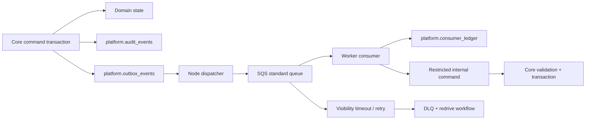

# Async, ML/RAG, and AI Usage Ledger

## 1. Async execution model

Nirog uses a PostgreSQL transactional outbox plus Amazon SQS. The outbox gives the clinical transaction one authoritative commit point; SQS provides decoupled cross-language delivery; the consumer ledger makes at-least-once processing safe. SQS supports dead-letter queues with a configured retry threshold and controlled redrive, while LocalStack supports the same SQS/DLQ workflow for Docker-based verification. [1] [2]



The dispatcher leases an unpublished outbox row, publishes a versioned envelope with stable event ID, records delivery attempt metadata, and marks publication after broker acknowledgement. A consumer begins by inserting its `(consumer_name, event_id)` claim in `platform.consumer_ledger`; duplicate claims are successful no-ops. It rechecks current aggregate state rather than trusting the historical event. A DLQ message is operational evidence, not an automatic retry storm or silent data loss.

## 2. Envelope and worker contracts

All messages use a small versioned envelope: `event_id`, `event_type`, `schema_version`, `occurred_at`, `correlation_id`, `causation_id`, `aggregate_ref`, `idempotency_key`, `trace_context`, and a minimum necessary payload. Events never contain raw prescription image bytes, bearer tokens, broad user profiles, or mutable full database rows.

The worker must retrieve authorized data through a one-purpose internal Core command or short-lived signed asset capability after Core has verified the workload identity, job state, profile, consent/purpose, classification, and allowed object reference. It returns a typed result to another restricted Core command. The command validates stage/run version, output schema, model release, duplicate result, review state, and current job ownership before it stores evidence.

| Workload | Executes in | Can do | Cannot do |
|---|---|---|---|
| Outbox dispatcher | Node process with dispatcher DB role | Publish event envelopes and maintain delivery leases. | Run business commands or access raw evidence. |
| OCR/classification | Python worker | Process a scoped evidence object; return extracted candidates/confidence/evidence references. | Activate or edit a regimen, write adherence, impersonate a user. |
| Embedding/retrieval ingestion | Python worker | Chunk approved source, produce embedding, return source/model provenance. | Index patient evidence by default, change consent, return uncited clinical claims. |
| Reminder projection/delivery | Purpose-specific worker | Create delivery attempt from a notification intent. | Create dose evidence from delivery result. |
| Strapi handoff | Core internal command | Validate and publish a reviewed successor catalog release. | Accept direct database writes from Strapi. |

## 3. ML and RAG placement

ML/OCR and RAG do **not** run in the API server. The API must remain responsive, restartable, and free from model binaries/GPU dependencies. Python 3.13 worker images use only the libraries required by their workload—for example Pydantic, boto3, HTTPX, PaddleOCR, and ONNX Runtime. GPU worker profiles are a separate deployment option and never change the event or command contracts.

The first retrieval capability is intentionally narrow. `ai.retrieval_documents` accepts only approved catalog release material, approved product documents, and governed non-clinical knowledge assets. `ai.retrieval_chunks` records source URI/reference, release, classification, text hash, language, retention, chunking release, and purpose. `ai.embeddings` records model release, vector dimension, and provenance. pgvector permits exact and approximate nearest-neighbor search; HNSW is introduced only after recall, memory, and tenant-filter tests demonstrate its value. [3]

Patient-specific retrieval is not part of initial RAG. It requires a separate consent, purpose, retention, redaction, encryption, access, prompt-safety, and human-review decision. Even then, retrieval output is a cited assistance artifact. It cannot issue medication instructions, mutate a regimen, or bypass prescription confirmation.

## 4. AI usage ledger lifecycle

```mermaid
sequenceDiagram
  autonumber
  participant Client as User request
  participant Core as Nirog Core
  participant DB as ai ledger transaction
  participant Queue as SQS
  participant Worker as AI/ML worker
  participant Provider as Provider or local model

  Client->>Core: Request allowed AI operation + idempotency key
  Core->>DB: Validate actor/purpose/quota; reserve budget
  DB-->>Core: Intent + reservation + reserve ledger entry
  Core->>Queue: Publish approved job envelope
  Queue->>Worker: Deliver job
  Worker->>Provider: Invoke approved model only
  Provider-->>Worker: Trusted usage receipt
  Worker->>Core: Settle operation through internal command
  Core->>DB: Settle ledger; update balance; audit/outbox
  Core-->>Client: Safe result or pending receipt
```

The quota subject is explicitly modeled: it may be the requesting account, the patient-profile owner, an organization sponsor, or a system allowance, never an implicit user inferred from a prompt. The server chooses the approved model/prompt release based on operation and policy. It reserves a maximum safe allowance before work, settles actual input/output tokens or local GPU/compute units afterward, releases unused reservation, and records unresolvable provider outcomes as `reconciliation_required`.

The ledger stores only minimum necessary accounting facts: requested/actual units, rate-card version, integer cost micros, model/prompt release, safe provider receipt reference, operation code, actor/billing subject, profile reference if applicable, purpose, correlation, and state. It does not store raw prompts, raw model responses, OIDC tokens, or provider API keys. A separate redacted audit event records the authorization decision.

## 5. Retrieval safety controls

| Control | Required behavior |
|---|---|
| Source admission | Only an approved immutable catalog/knowledge release can be ingested. |
| Attribution | Every returned fragment includes source release, document/chunk reference, and score/selection metadata for review. |
| Profile and purpose | Query path evaluates profile capability and purpose before retrieval; index filters execute before result presentation. |
| Prompt isolation | Untrusted document text is data, not instructions; system prompts and tool permissions are fixed by server-owned releases. |
| Output boundary | Retrieval/LLM output is labelled assistance or evidence and cannot call clinical mutation commands. |
| Evaluation | Golden sets cover citation correctness, unsafe-answer refusal, tenant/profile isolation, recall, and injection resistance. |

## References

[1] [Amazon SQS dead-letter queues](https://docs.aws.amazon.com/AWSSimpleQueueService/latest/SQSDeveloperGuide/sqs-dead-letter-queues.html)

[2] [LocalStack SQS](https://docs.localstack.cloud/aws/services/sqs/)

[3] [pgvector](https://github.com/pgvector/pgvector)

[4] [Nirog ML evidence architecture](../system-architecture/06-prescription-evidence-and-ml-architecture.md)
