# Docker, Tests, and Delivery Controls

## 1. Local Docker environment

Docker Compose creates a production-shaped but development-safe environment. The default profile runs PostgreSQL with pgvector, LocalStack for S3/SQS, API, dispatcher, and a migrator task. The `ml` profile adds Python worker images; it may use CPU-only libraries unless a developer explicitly selects a GPU profile. Strapi runs from its own repository/Compose project and communicates only through the signed release handoff contract.

| Service | Local image/function | Persistent volume | Production equivalent |
|---|---|---|---|
| `postgres` | PostgreSQL 18 + pgvector | Development-only named volume | RDS PostgreSQL with backups/PITR. |
| `localstack` | S3 and SQS APIs, queues, DLQs, bucket bootstrap | Optional local state | S3, SQS, CloudWatch alarms. |
| `migrator` | One-shot Drizzle/manual SQL migration task | None | ECS one-shot deployment task. |
| `api` | Fastify Core and Scalar reference | Source bind mount in dev | ECS Fargate API task. |
| `dispatcher` | Outbox publisher | None | ECS Fargate dispatcher task. |
| `ml-worker` | Python OCR/RAG consumer | None | Dedicated CPU/GPU ECS task/service. |
| `mailpit` | Optional local notification observation | None | Transactional email/SMS provider adapter. |

Compose uses health checks and dependency readiness rather than startup order alone. Containers run non-root, receive explicit immutable image tags, use `NODE_ENV=production` when built for production, and process signals directly through a small init wrapper as recommended by the official Node image guidance. [1] Secret values are loaded from an uncommitted `.env.local`; `.env.example` contains only names, formats, and safe development defaults.

## 2. Environment configuration

`packages/config` owns a TypeBox configuration schema. Application startup refuses to run when a production issuer, audience, database URL, AWS endpoint policy, storage bucket, encryption key reference, internal service audience, or telemetry endpoint is malformed or absent. Development values may point to LocalStack only when `APP_ENV=local`; a production environment cannot silently use a `localhost` endpoint.

Configuration is split by responsibility: API database URL, dispatcher SQS permissions, ML worker provider/model configuration, and migrator credentials are not loaded by processes that do not require them. Feature flags are server-owned and declared with expiry, owner, default, and safe fallback. They are not client-provided query switches.

## 3. Test architecture

Tests prove safety and behavior rather than code coverage alone. Unit tests use Vitest for domain/application logic. Integration tests use disposable PostgreSQL/pgvector and LocalStack containers through Testcontainers or the Compose test profile. The test migrator applies the exact production migration chain before every integration suite.

| Suite | Scope | Examples |
|---|---|---|
| `test:unit` | Pure domain/application logic | Permission registry, schedule policy, ledger arithmetic, problem mapping. |
| `test:architecture` | Import/dependency constraints | HTTP does not import Drizzle directly; workers do not depend on clinical repositories. |
| `test:integration` | PostgreSQL, RLS, Drizzle, transactions, SQS adapter | Cross-profile denial, revocation, unique idempotency, outbox retry, RLS missing-context denial. |
| `test:contract` | OpenAPI/events/internal commands | Scalar/OpenAPI snapshot, Flutter-safe responses, producer/consumer envelope compatibility. |
| `test:security` | Abuse and authorization regressions | BOLA, IDOR, malformed JWT, over-posting, prompt-injection inputs, redaction. |
| `test:worker` | Python worker behavior | Duplicate envelope, invalid stage run, provider timeout, evidence-only output, token settlement. |
| `test:e2e` | Narrow critical journeys | Owner shares caregiver access; upload→review→confirmation; catalog release handoff. |
| `test:load` | Deliberate later gate | Queue backlog, response latency, RLS query plans, HNSW recall/latency. |

The mandatory initial regression set is: role-template change does not alter historical grants; account/grant revocation denies the next request; one profile cannot access another profile’s records; duplicate client command returns its original receipt; a worker duplicate does not create a duplicate review/evidence record; reminder delivery never creates dose evidence; and a double-submitted AI request produces one reservation/settlement chain.

## 4. CI/CD quality gates

GitHub Actions runs locked installation, format, lint, TypeScript strict check, unit tests, architecture tests, integration tests, OpenAPI generation/lint/diff, Python lint/type/test, migration rehearsal, Docker build, and secret/dependency scanning. Commit messages use Conventional Commits; pull requests require a problem statement, schema/API migration declaration, security impact, rollback/compensation plan, test evidence, and documentation change statement.

```mermaid
flowchart LR
  PR[Pull request] --> Install[pnpm install --frozen-lockfile]
  Install --> Static[format + lint + typecheck + architecture]
  Static --> Unit[unit + Python worker tests]
  Unit --> DB[migrate blank + previous fixture DB]
  DB --> Integration[PostgreSQL RLS + LocalStack integration]
  Integration --> Contract[OpenAPI snapshot + Redocly lint/diff]
  Contract --> Build[Docker build + vulnerability/secret scan]
  Build --> Review[Required review and merge]
  Review --> Deploy[Migration task then canary application tasks]
```

Database migration PRs additionally run an empty-database migration, preceding-version fixture migration, schema dump comparison, RLS deny/allow tests under application roles, and a downgrade/compensation assessment. Any breaking mobile contract must be explicitly versioned and accepted by the Flutter release plan.

## 5. Operational readiness

Each process exposes `/health/live` and `/health/ready` appropriately. Readiness confirms only dependencies required to accept the process’s responsibility; the API does not mark itself unhealthy because a non-critical worker queue is briefly delayed. Structured logs include service, release, correlation ID, causation ID, actor/workload type, profile hash where safe, and problem code. OpenTelemetry traces cross API, outbox, SQS, worker, internal command, and provider boundary. Metrics cover authorization denials by safe code, idempotency replay, RLS denial, queue age/DLQ depth, worker stage latency, model/provider failure, AI reservation/settlement/reconciliation, and redaction failures.

## References

[1] [Node Docker best practices](https://github.com/nodejs/docker-node/blob/main/docs/BestPractices.md)

[2] [LocalStack SQS](https://docs.localstack.cloud/aws/services/sqs/)

[3] [Nirog audit and observability architecture](../software-access-architecture/04-audit-and-observability.md)
