# Staged Environment Execution Plan

## 1. Delivery principle

The environment is built in **dependency order**, with every stage leaving a runnable, testable system. No business endpoint is added before the required configuration, database role, route validation, safe problem handling, access seam, audit/outbox mechanism, and test fixture exist. The plan avoids a large “foundation later” cleanup that would otherwise turn authorization, audit, and worker safety into retrofits.

```mermaid
flowchart LR
  S0[0. Decisions + repositories] --> S1[1. Workspace + Docker]
  S1 --> S2[2. DB roles + Drizzle migrations]
  S2 --> S3[3. Fastify platform + Scalar]
  S3 --> S4[4. Identity + access capability]
  S4 --> S5[5. Reliability primitives]
  S5 --> S6[6. Catalog + bounded Strapi handoff]
  S6 --> S7[7. Evidence + ML worker]
  S7 --> S8[8. Regimen + adherence]
  S8 --> S9[9. RAG + AI usage ledger]
```

## 2. Stages and acceptance gates

| Stage | Deliverables | Exit gate |
|---|---|---|
| 0. Decisions | This inception library, ADRs, source/repository ownership, threat-model seed, data classification. | No unresolved authority conflict between Strapi, Core, and workers. |
| 1. Workspace | Private repos, Node/pnpm lock, TypeScript strict, Docker Compose, config schema, lint/format/commit hooks. | `pnpm bootstrap` and `pnpm verify` run from a clean clone. |
| 2. Persistence foundation | PostgreSQL/pgvector, Drizzle package, migrator, schemas, roles, RLS test harness, platform primitives. | Application role cannot access scoped records without local context. |
| 3. HTTP platform | Fastify build, TypeBox, RFC 9457 problem envelope, correlation, OIDC adapter shell, OpenAPI, Scalar, health/readiness. | Every route has request/response schemas; OpenAPI lint passes. |
| 4. Identity and access | Accounts, profiles, OIDC mapping, grants, consent, permission registry, RBAC evaluator, audit. | BOLA/revocation/template-snapshot security suite passes. |
| 5. Reliability | Idempotency, audit writer, outbox, dispatcher, consumer ledger, LocalStack queues/DLQs. | Duplicate and failure/retry scenarios create one authoritative result. |
| 6. Catalog and Strapi | Core catalog release model, bounded Strapi app, signed release handoff, workforce permission separation. | Strapi cannot read clinical DB; Core creates immutable successor release. |
| 7. Prescription evidence | Private upload capability, evidence metadata, scan jobs, Python OCR stage runner, review payload/decision. | Worker cannot create regimen state; raw access/purpose audit works. |
| 8. Regimen and adherence | Confirmation commands, versions, schedule projection, dose evidence, notifications. | Only confirmation activates regimen; delivery is not dose evidence. |
| 9. AI/RAG | Approved source ingestion, pgvector retrieval, model/prompt release, quota reservation/ledger, evaluation harness. | Per-user accounting, citations, isolation, and unsafe-mutation tests pass. |

## 3. First repository implementation slice

The initial code milestone comprises only Stages 1–3 and the non-domain portion of Stage 2. It creates the workspace and both local containers; typed configuration; a Fastify server with `/health/live`, `/health/ready`, `/openapi.json`, and `/reference`; a typed problem/error surface; a database migration that creates schemas, roles, extensions, migration metadata, `platform.audit_events`, `platform.outbox_events`, `platform.idempotency_records`, and `platform.consumer_ledger`; a transaction helper that sets local context safely; and architecture/integration tests proving the framework behavior.

It does **not** create patient endpoints, use real OIDC credentials, invoke an AI provider, activate Strapi handoff, or write an OCR integration. Those are separate stage-specific pull requests after their authority and test gates exist.

## 4. Work sequencing and review ownership

Each pull request implements one vertical safety slice. A database change includes schema declaration, migration, repository change, authorization/validation path, tests, OpenAPI impact, runbook impact, and event contract impact in one reviewable set. An AI change includes quota/ledger update and prompt/model-release evidence; a worker change includes duplicate/failure test; a Strapi change includes handoff compatibility test.

| Change type | Mandatory reviewers/evidence |
|---|---|
| RLS, role, grant, consent, or policy evaluator | Security/architecture review; deny/allow regression matrix. |
| Clinical aggregate or schedule rule | Product/clinical owner review; state transition and mobile compatibility tests. |
| Database migration | Migration plan, lock/rollback assessment, fixture rehearsal. |
| Worker/model/RAG | Safety review, redaction, provenance, isolation, failure/retry, and usage-ledger test evidence. |
| Strapi plugin/handoff | Workforce workflow test, payload signature validation, immutable release result. |
| API contract | OpenAPI diff, Scalar preview, Flutter compatibility statement. |

## 5. Deferred choices

The following are intentionally deferred because their need is not proven at inception: Kubernetes, separate vector database, live multi-agent orchestration, autonomous medication advice, general access-policy engine, general-purpose data warehouse, Kafka, real-time collaboration, payment billing, and direct patient access from Strapi. The documented interfaces keep future adoption possible without allowing speculative infrastructure to complicate the safety-critical foundation.

## References

[1] [Nirog implementation inception overview](README.md)

[2] [Nirog system implementation and evolution architecture](../system-architecture/10-implementation-and-evolution-architecture.md)

[3] [Nirog validation architecture](../software-access-architecture/03-validation-architecture.md)

