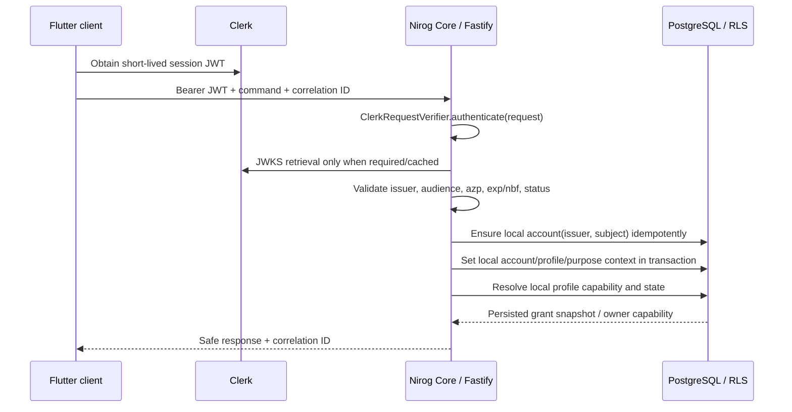

# Clerk-Authenticated User Subsystem Design

**Status:** approved implementation design  
**Primary repository:** `Paradox-Tech-BD/nirog-core`  
**Authentication authority:** Clerk  
**Authorization and health-domain authority:** Nirog Core / PostgreSQL

## 1. Boundary decision

Flutter sends the current Clerk session JWT as `Authorization: Bearer <token>` on each Nirog Core request. The API verifies the token through an internal `ClerkRequestVerifier` adapter around Clerk’s supported backend request-authentication path. The API accepts no decoded client claim as evidence. It extracts a typed verified principal only after signature, temporal validity, Clerk issuer, configured audience, and configured authorized-party validation succeed. Clerk’s Fastify integration recognizes session JWTs in request headers or cookies; its backend APIs support request authentication and public-key/JWKS verification. [1] [2]

> **Decision:** Core does not make an opaque “is this token valid?” network request for every user call. With `CLERK_JWT_KEY`, Clerk’s supported verifier can perform networkless signature verification. Without that key it obtains the JWKS through the Clerk backend path and caches it. Nirog configures the expected audience and exact frontend origins, and responds with a generic `401` for every invalid authentication outcome. [2] [3]

Clerk establishes **who authenticated**. PostgreSQL establishes which local account maps to that user, which patient profile it can act for, which permissions are persisted in a current grant, whether consent/purpose/state requirements pass, and what is recorded in audit/outbox streams. A Clerk Organization claim, a frontend role, or a frontend-selected profile never substitutes for a local capability check.



## 2. Reconciled domain model

The supplied diagram is retained as the conceptual starting point, but Nirog deliberately separates authentication identity, account preferences, health-profile data, team collaboration, and patient-profile capability.

| Supplied UML entity | Core record | Important Nirog rule |
|---|---|---|
| `User` | `identity.accounts` | Maps an immutable Clerk `(issuer, subject)` to a local account. No password hash, local login, refresh token, or provider credential exists in Core. |
| `AuthProvider`, `AuthType` | `identity.auth_identities` | Retains safe provider provenance, never provider tokens/credential hashes. Initial provider is `clerk`; linked method details are projection-only. |
| `UserPreference` | `identity.account_preferences` | One non-clinical preference record per local account. |
| `PatientProfile` | `identity.patient_profiles` | The health subject. Every profile has exactly one owner account and can have several live delegated grants. |
| `ProfileAccess` | `identity.profile_access` | The exclusive source of delegated patient access; team membership never creates it implicitly. |
| `Team`, `TeamMember` | `identity.teams`, `identity.team_members` | Collaboration grouping only. A team role is not a patient-data permission. |
| `TeamInvitation`, `InvitationStatus` | `identity.team_invitations` | A one-time, hashed invitation token. Only idempotent acceptance creates a membership. |
| `UserRole` | Role-template code on a profile grant or team membership | Role templates populate a persisted permission snapshot at grant creation. Authorization never rereads a mutable template for a historical grant. |
| `BloodType` | Optional `identity.patient_profiles.blood_type_code` | Sensitive health profile data; it is neither authentication nor authorization evidence. |

## 3. Physical records and invariant rules

### 3.1 Account and Clerk provenance

`identity.accounts` extends the foundation record with lifecycle timestamps and a safe display projection. Its unique key remains `(issuer, subject)`; the Clerk user ID is the `subject`, not a mutable email address. `identity.auth_identities` records `account_id`, `provider_code`, `provider_subject`, `last_verified_at`, and safe provider metadata. It enforces unique `(provider_code, provider_subject)`.

The API performs just-in-time account projection creation only after a request has been cryptographically verified. It creates an account with status `active`, its `clerk` provider projection, default preferences, an audit event, and an `identity.account.provisioned.v1` outbox event in one transaction. A verified principal can never choose another account ID in the request body.

### 3.2 Preferences and devices

`identity.account_preferences` has a unique `account_id`; language, theme, timezone, notification/digest flags, and snooze minutes are validated non-clinical settings. `identity.devices` is a future-safe registration table for Flutter notification endpoints and fingerprint metadata. A device is revocable and belongs to exactly one account. Its push token is encrypted outside audit/outbox payloads.

### 3.3 Patient profiles and access grants

`identity.patient_profiles` stores owner account, profile lifecycle, preferred name, date of birth, optional blood-type code, and timestamps. User-facing profile creation requires the authenticated account and creates the owner capability implicitly; it does not create a redundant owner `profile_access` row.

`identity.profile_access` adds `granted_by_account_id`, `purpose_code`, optional `consent_id`, acceptance/revocation metadata, and a versioned JSONB permission set. It retains the partial unique live-grant index. The static role registry contains at least `caregiver`, `curator`, and `viewer`. An active grant is valid only if its snapshot validates against the permission registry, its own status/time window is current, and future consent/policy checks allow the request.

### 3.4 Teams and invitations

Teams help organize caregivers or workforce relationships. `identity.teams` has an owner account, name, type, and lifecycle. `identity.team_members` has a team role (`owner`, `admin`, `member`) and membership lifecycle. A membership alone has no Nirog profile capability.

`identity.team_invitations` stores the target account when known, otherwise a normalized identifier hash, the proposed team role, a one-way invite-secret hash, status, expiry, inviter, acceptance account, and completion times. Sending an invitation is idempotent under a caller-supplied idempotency key. Accepting a valid invitation transitions it once and creates membership in the same transaction. It does not create profile access; a separate, authorized grant command is required.

### 3.5 Lifecycle webhook projection

`platform.provider_events` records a verified Clerk provider event ID, type, source instance, received time, payload digest, processed status, and safe failure metadata. The unique provider-event key makes retries/replays harmless. Clerk webhooks are asynchronous and eventually consistent, so they maintain the local display/lifecycle projection but never gate a request that already carries a valid session JWT. [4] [5]

`user.created` and `user.updated` use idempotent account projection upsert. `user.deleted` moves the account to `deactivated`, revokes devices and live delegated grants, records audit/outbox evidence, and enters the privacy-retention workflow. It does not delete health records in a webhook transaction.

### 3.6 Session-token contract for Nirog Web and Flutter

Nirog Core's verified principal requires Clerk's `sub`, `iss`, and `sid` claims. The Web companion and Flutter therefore forward the normal, short-lived **Clerk session token** as `Authorization: Bearer <token>`. For the configured Nirog API audience, Clerk Dashboard → **Sessions** → **Customize session token** must contain the minimal static claim below:

```json
{ "aud": "nirog-mobile-api" }
```

The Web bridge must call `getToken()` without a JWT template. Clerk's custom JWT templates are appropriate for third-party tokens but deliberately omit session-bound claims such as `sid`; a template token will either fail Core's audience check when the claim is absent or, after adding the claim, fail Core's required session binding. `CLERK_AUTHORIZED_PARTIES` remains an exact allowlist for the `azp` browser origin—use `https://www.nirog.me` only when that exact origin is the user-facing domain. [2] [3] [6] [7]

## 4. Authorization and RLS

The first authenticated API hook produces `ActorContext` from the verified Clerk principal and resolved local account. The profile route hook resolves a target profile ID from the path, never from an untrusted header. Command code invokes the `PolicyEvaluator` with actor, profile, permission, purpose, and resource relation. For MVP the evaluator uses owner capability or an active persisted grant. Later PBAC can add constraints without changing the grant table or handler contract.

Each business transaction calls `withRequestContext()` to set `app.account_id`, `app.profile_id`, `app.purpose`, and workload identity with `SET LOCAL`. RLS protects profile, grant, preference/device, invitation, and consent records as defense in depth. The database contains no broad `SELECT` policy that treats a team membership as patient access.

JIT account projection uses a narrow security-definer database function that can upsert only the mapped `(issuer, subject)` and default preference/provenance rows. The general `nirog_api` role cannot use that function to insert an arbitrary profile owner or change an account’s identity mapping.

## 5. Public API surface

All user-domain commands return the standard problem response on failure and carry a correlation ID. Mutating commands require an `Idempotency-Key` header. All successful profile-scoped responses include the server-authorized current profile context—not a token or frontend assertion.

| Endpoint | Purpose | Minimum authorization |
|---|---|---|
| `GET /api/v1/me` | Return safe account projection, default preferences, and available profile summaries. | Verified Clerk principal. |
| `PATCH /api/v1/me/preferences` | Update account UI/reminder defaults. | Current account only. |
| `POST /api/v1/profiles` | Create an owned patient profile. | Verified Clerk principal; idempotency key. |
| `GET /api/v1/profiles/:profileId` | Read an authorized profile. | `profile.read` capability or owner. |
| `PATCH /api/v1/profiles/:profileId` | Update authorized profile fields. | `profile.manage` capability or owner; idempotency key. |
| `GET /api/v1/profiles/:profileId/access-grants` | List active/current grants safely. | Owner or `share.manage`. |
| `POST /api/v1/profiles/:profileId/access-grants` | Create a delegated persisted-permission grant. | Owner or `share.manage`; live purpose/consent checks; idempotency key. |
| `DELETE /api/v1/profiles/:profileId/access-grants/:grantId` | Revoke a grant. | Owner or `share.manage`; idempotency key. |
| `POST /api/v1/teams` | Create a collaboration team. | Verified Clerk principal; idempotency key. |
| `POST /api/v1/teams/:teamId/invitations` | Invite to a team. | Team owner/admin; idempotency key. |
| `POST /api/v1/team-invitations/:invitationId/accept` | Accept a directed, unexpired team invitation. | Invited principal; idempotency key. |
| `POST /api/v1/integrations/clerk/webhooks` | Ingest signed Clerk lifecycle events. | Signed Clerk/Svix webhook only; public to bearer auth. |

## 6. Module and filesystem assignment

```text
packages/
  access/                 # Permission registry, role templates, PolicyEvaluator interface
  auth/                   # ClerkRequestVerifier port and verified principal types
  contracts/              # TypeBox request, response, event, and problem contracts
  db/                     # Drizzle schema, migration SQL, RLS-safe repositories
  user-domain/            # Commands: provision, preferences, profile, grant, team, invitation
apps/api/src/
  plugins/clerk-auth.ts   # Authentication hook and request decoration
  routes/me.ts            # Current account and preferences
  routes/profiles.ts      # Profile and grant routes
  routes/teams.ts         # Team and invitation routes
  routes/clerk-webhooks.ts# Signed webhook ingestion
  composition.ts          # Runtime port wiring
tests/
  auth/, user-domain/, api/, integration/
```

## 7. Test matrix and release order

Unit tests cover strict bearer parsing, invalid issuer/audience/authorized party, expired/pending status, account mapping, role-template snapshot expansion, profile owner/grant decisions, invitation expiry/acceptance, and idempotency replay. API tests cover `401`, `403`, non-leaking `404` for inaccessible resources, response schemas, correlation IDs, and generated OpenAPI security metadata. PostgreSQL integration tests cover forward migration, JIT account function, transaction-local RLS context, owner/grantee separation, revoked/expired grants, webhook replay, and audit/outbox atomicity. Clerk integration is tested with a fake verifier and Clerk testing tokens in a separate environment; real private credentials never enter unit tests.

The implementation order is fixed: first schema/migration and pure domain ports; next testable repository/domain services; then Clerk Fastify authentication and `/me`; then profile creation/read/update and grants; then team/invitation workflows; then signed webhooks; finally integration, migration, OpenAPI, and Docker validation.

## References

[1] [Clerk Fastify integration](https://clerk.com/docs/reference/fastify/clerk-plugin)

[2] [Clerk backend `verifyToken()` reference](https://clerk.com/docs/reference/backend/verify-token)

[3] [Clerk manual JWT verification](https://clerk.com/docs/guides/sessions/manual-jwt-verification)

[4] [Clerk webhook synchronization guidance](https://clerk.com/docs/guides/development/webhooks/syncing)

[5] [Clerk webhook overview](https://clerk.com/docs/guides/development/webhooks/overview)

[6] [Clerk session token claims](https://clerk.com/docs/guides/sessions/session-tokens)

[7] [Clerk session token customization](https://clerk.com/docs/guides/sessions/customize-session-tokens)
