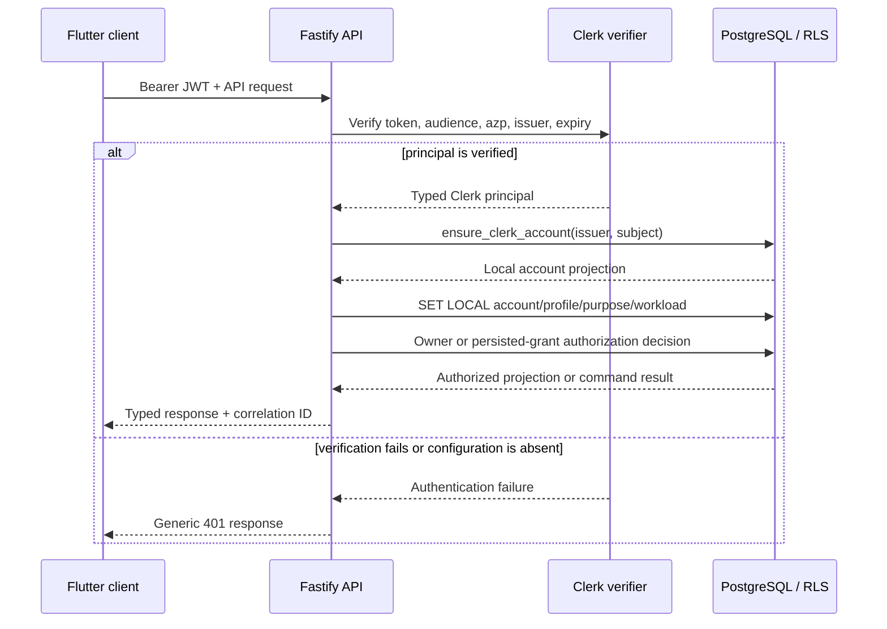
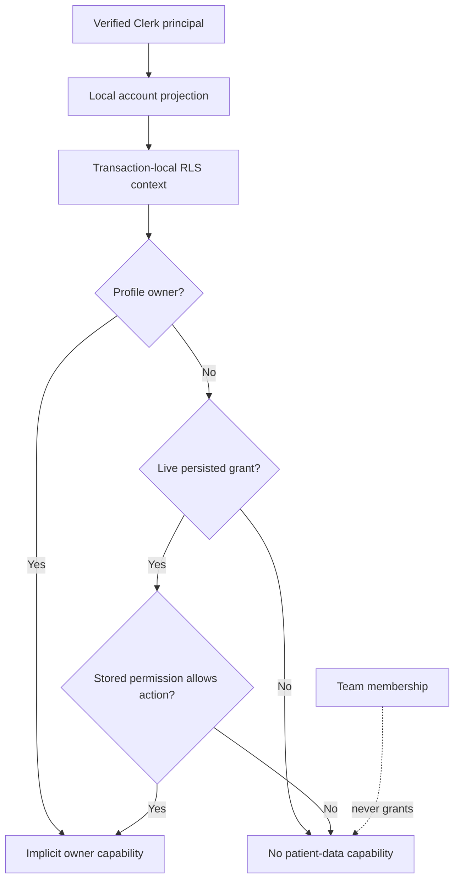

# Clerk User Subsystem — Verified Implementation Record

**Status:** implemented and unit/API verified on 18 August 2026  
**Primary repository:** `Paradox-Tech-BD/nirog-core`  
**API server base:** `/api/v1`  
**Authentication authority:** Clerk  
**Local authorization authority:** Nirog Core with PostgreSQL RLS

## Purpose and scope

This record turns the approved Clerk user-subsystem design into an implementation baseline. It covers the authenticated request boundary, just-in-time local account projection, account preferences, patient-profile ownership, delegated profile grants, collaboration-team creation, persisted RBAC snapshots, RLS-scoped persistence, audit/outbox event emission, generated OpenAPI, and the tests currently exercising those boundaries.

> **Authority rule:** Clerk proves an authenticated external principal. Nirog Core alone maps that principal to a local account, evaluates ownership or a persisted profile grant, applies request purpose and profile scope, and records health-domain state changes. A Flutter claim, selected profile, Clerk Organization, or UI role is never accepted as patient-data authority.

## Implemented request path

Flutter supplies a current Clerk session JWT in `Authorization: Bearer <token>`. The root Fastify app installs the Clerk pre-handler directly with `app.addHook()` so it applies to every subsequently registered protected route; it is deliberately not added through an encapsulated plugin scope. `ClerkBackendRequestVerifier` uses Clerk’s backend `verifyToken()` adapter and accepts no client-decoded claim. It fails closed when neither `CLERK_JWT_KEY` nor `CLERK_SECRET_KEY` is configured.

The JIT projection path is narrow by design. `ensure_clerk_account()` is a PostgreSQL security-definer function, callable by `nirog_api`, that creates or returns only the locally mapped `(issuer, subject)` account, its Clerk provenance row, and default preferences. It is not a general identity-write permission.

## Delivered modules and records

The implementation separates framework boundaries from domain and persistence rules.

| Layer | Implemented responsibility |
|---|---|
| `@nirog/auth` | Framework-independent `ClerkRequestVerifier` port and strict `bearerToken()` parsing. |
| `@nirog/user-domain` | Typed principal, repository/event-writer ports, and commands for projection, preferences, profiles, grants, teams, and directed team invitations. |
| `@nirog/access` | Permission registry, role templates, persisted permission snapshot capability evaluator, and future `PolicyEvaluator` PBAC seam. |
| `@nirog/db` | Drizzle tables, native transaction-scoped RLS context, JIT account helper, user repository, and event writer. |
| API application | Clerk verifier adapter, global authentication hook, injectable user HTTP service, TypeBox route contracts, Fastify Swagger, and Scalar reference. |
| PostgreSQL migration | `0001_clerk_user_subsystem.sql`, including identity/platform records, indexes, RLS policies, and the security-definer account function. |

The migration adds canonical records for `identity.auth_identities`, `identity.account_preferences`, `identity.devices`, `identity.patient_profiles`, `identity.profile_access`, `identity.consents`, `identity.teams`, `identity.team_members`, and `identity.team_invitations`. It also adds `platform.provider_events` beside the existing idempotency, audit, outbox, and consumer-ledger records. The physical schema establishes the future-safe data structures now; only the endpoints and commands described below are exposed at this stage.

## Implemented API contract

The generated OpenAPI server declares `/api/v1` as its base URL. Consequently, the OpenAPI JSON holds server-relative paths such as `/me`, while the Flutter-facing HTTP endpoint remains `GET /api/v1/me`. Every protected operation publishes `bearerAuth` security metadata. Scalar is served by the API application at `/reference`.

| Flutter-facing endpoint | Implemented authorization and behavior |
|---|---|
| `GET /api/v1/me` | Requires a verified Clerk principal, ensures a local projection, and returns a safe account/profile view. |
| `PATCH /api/v1/me/preferences` | Requires the current account and an `Idempotency-Key`; writes only validated non-clinical preferences. |
| `POST /api/v1/profiles` | Requires a verified principal and an `Idempotency-Key`; creates an owned patient profile. Owner capability is implicit rather than stored as a redundant grant row. |
| `GET /api/v1/profiles/:profileId` | Requires profile ownership or a current persisted `profile.read` grant. |
| `PATCH /api/v1/profiles/:profileId` | Requires ownership or `profile.manage`, plus an `Idempotency-Key`. |
| `GET /api/v1/profiles/:profileId/access-grants` | Requires ownership or `share.manage`; lists current delegated access safely. |
| `POST /api/v1/profiles/:profileId/access-grants` | Requires ownership or `share.manage`, validates the role-template snapshot, and requires an `Idempotency-Key`. |
| `DELETE /api/v1/profiles/:profileId/access-grants/:grantId` | Requires ownership or `share.manage`, and requires an `Idempotency-Key`. |
| `POST /api/v1/teams` | Creates a collaboration team for the authenticated account with an `Idempotency-Key`. Team membership conveys no patient-data capability. |
| `POST /api/v1/teams/:teamId/invitations` | An active team owner may invite `admin` or `member`; an active team administrator may invite `member` only. Direct recipient account ID and an `Idempotency-Key` are required. |
| `POST /api/v1/teams/:teamId/invitations/:invitationId/accept` | The direct recipient alone accepts a pending, unexpired invitation with an `Idempotency-Key`; membership changes are transactional and non-clinical. |
| `POST /api/v1/teams/:teamId/invitations/:invitationId/decline` | The direct recipient alone declines a pending, unexpired invitation with an `Idempotency-Key`. |
| `DELETE /api/v1/teams/:teamId/invitations/:invitationId` | An active team owner or administrator cancels a pending invitation with an `Idempotency-Key`. |

## Authorization and persistence invariants

Roles are templates used only when a grant is created. The grant saves a validated `permission_set` snapshot, and `PersistedGrantPolicyEvaluator` evaluates that stored snapshot rather than rereading a mutable role definition. The current evaluator is intentionally behind the `PolicyEvaluator` interface, permitting a future PBAC engine to add relational, contextual, consent, or risk constraints without changing route handlers or grant storage.

The database enforces a partial unique index for one active grant per `(profile_id, grantee_account_id)`. A team owner, team administrator, or team member is not automatically a profile grantee. Commands run through `withRequestContext()`, which opens a native Drizzle transaction, applies local `app.account_id`, `app.profile_id`, `app.purpose`, and workload values with `set_config(...)`, and passes that same transaction to repositories and the event writer. PostgreSQL RLS therefore remains a second authorization barrier without reconstructing a database client around a raw driver transaction.

## Verification evidence

After the invitation release, `pnpm lint`, `pnpm typecheck`, `pnpm test`, and `pnpm openapi:write` completed successfully with **36 passing tests across 12 files** (database-dependent tests are skipped only when no disposable PostgreSQL service is supplied). GitHub Actions then passed its unit and disposable PostgreSQL/RLS jobs, which apply the forward team-invitation and team-capability migrations. The authenticated Nirog Web account refresh was also verified against the active Railway API deployment.

| Test area | Verified behavior |
|---|---|
| Persisted RBAC capability | An allowed snapshot permission is accepted; a missing permission is rejected. |
| Persisted-grant evaluator | A current grant permits `profile.read`; a revoked grant returns `GRANT_INACTIVE`. |
| Clerk boundary | Bearer parsing is strict, and absent server/JWT verification configuration fails closed. |
| API behavior | Anonymous `/me` is rejected with `401`; a dependency-injected verified principal produces the typed local account view; the live Web bridge now retrieves the signed-in account projection successfully. |
| Idempotency and profile command | A mutation without `Idempotency-Key` fails with the declared client error; a keyed profile creation succeeds. |
| Generated contract | The OpenAPI document exposes bearer security on the server-relative `/me` operation and the new typed invitation lifecycle routes. |
| Team invitation RLS | Owners/admins have the intended bounded management paths, only the direct recipient can respond, and team membership does not reveal a patient profile. |

The current suite uses dependency injection for the verifier and HTTP service, so it makes no real Clerk network request and does not require private credentials. Docker and live-PostgreSQL integration validation remain outside this sandbox because a Docker daemon is unavailable.

## Deliberately deferred work

The physical tables and domain seams exist, but the following route slices are intentionally not presented as complete:

| Deferred slice | Required implementation outcome |
|---|---|
| Clerk lifecycle event processing | The public Svix-signed receiving endpoint is implemented with replay-safe provider-event recording and audit/outbox evidence. Safe deactivation, device revocation, active-grant revocation, and dispatcher consumers remain separate lifecycle-processing work. |
| Device management | Registered Flutter device lifecycle, encrypted push-token handling, and revocation endpoints. |
| Consent management | Explicit consent capture/revocation records and command endpoints, later connected to policy decisions. |
| Live database integration | Migration execution, SQL function privileges, RLS owner/grantee isolation, transaction scope, outbox atomicity, and webhook replay tests against PostgreSQL. |

These are the remaining parts of the user-domain release boundary. The next product-domain slice—prescription/OCR—should begin only after this pending user-domain work is explicitly requested and completed.

## Current access-administration position

The implemented roles are **patient-profile roles**, not global platform-administrator roles. A profile owner can grant `caregiver`, `curator`, or `viewer` access through the protected profile-grant contract; the role is converted into a persisted permission snapshot at grant time. Team `owner`, `admin`, and `member` records now have an explicit, RLS-verified invitation lifecycle, but team membership intentionally has no patient-data authority. There is no implemented `platform_admin` assignment or staff-administration API yet, so neither a Clerk Organization role nor a direct database edit should be presented as Core clinical authority.

The recommended next access slice is the documented [current project-state and access-setup handoff](13-current-project-state-and-access-setup.md), which separates platform administration, workforce/editorial access, team collaboration, and patient-care delegation before any global-admin feature is added.

## References

[1] [Approved Clerk user-subsystem design](07-clerk-user-subsystem-design.md)

[2] [Clerk backend `verifyToken()` reference](https://clerk.com/docs/reference/backend/verify-token)

[3] [Clerk webhook synchronization guidance](https://clerk.com/docs/guides/development/webhooks/syncing)

[4] [Nirog user-domain routes and generated OpenAPI contract](https://github.com/Paradox-Tech-BD/nirog-core/tree/main)

[5] [Current project state and access-setup handoff](13-current-project-state-and-access-setup.md)
