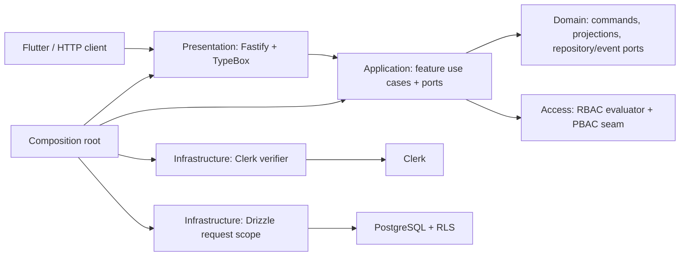

# Clean Architecture, Scalar, and Drizzle Development Artifacts

**Status:** implementation baseline, verified 18 August 2026  
**Primary repository:** `Paradox-Tech-BD/nirog-core`  
**Architecture style:** feature-first modular monolith using Clean Architecture / ports and adapters

## 1. Architectural decision

Nirog Core uses a **feature-first modular monolith with Clean Architecture dependency direction**. It does not use a loose collection of route handlers that call Drizzle directly. The architecture is intentionally pragmatic rather than framework-theoretical: Fastify, Clerk, Drizzle, and PostgreSQL are outer adapters; application use cases depend only on domain and policy ports; a composition root assembles the production graph.

> **Dependency rule:** a domain or application module may depend inward on domain contracts and policy abstractions. It must not import Fastify, Clerk SDK code, Drizzle, `postgres.js`, or a concrete database table definition. Outer delivery and infrastructure adapters may depend inward, but not the reverse.



## 2. Current executable filesystem

The user feature now uses these visible boundaries:

```text
apps/api/src/
  composition/build-server.ts
    # Installs Swagger, Scalar, delivery routes, and concrete adapters.

  features/user/
    application/user-application-service.ts
      # User use cases and UserRequestScope application port.
    presentation/http/user-routes.ts
      # Fastify transport adapter and TypeBox HTTP/OpenAPI schemas.

  infrastructure/
    identity/clerk-backend-request-verifier.ts
      # @clerk/backend adapter for the auth port.
    persistence/drizzle-user-request-scope.ts
      # Drizzle/PostgreSQL transaction + RLS implementation of UserRequestScope.

  presentation/http/plugins/clerk-auth.ts
    # Root Fastify pre-handler that constructs the authenticated request context.

packages/
  user-domain/  # framework-independent commands, projections, repository/event ports
  access/       # permission registry, persisted RBAC, future PolicyEvaluator seam
  auth/         # ClerkRequestVerifier port and typed authentication boundary
  db/           # Drizzle schemas and PostgreSQL implementations
```

`UserApplicationService` imports domain ports and the authorization policy only. It does not import Fastify, Clerk, Drizzle, or PostgreSQL. Its `UserRequestScope` interface is implemented by `DrizzleUserRequestScope`, which starts the scoped transaction, applies `SET LOCAL` RLS context, and creates the concrete repository and event-writer adapters. The composition root is the only place that knows all concrete implementations.

This organization is intentionally close to a feature-first Next.js application layout in discoverability, while retaining backend Clean Architecture boundaries. Next.js itself is not an architecture pattern; Nirog adopts the useful feature-locality convention but keeps domain and infrastructure dependencies explicit.

## 3. API documentation: generated OpenAPI and Scalar

Nirog uses **both generated OpenAPI and Scalar**.

| Artifact | Location or URL | Source |
|---|---|---|
| Live OpenAPI JSON | `GET /openapi.json` | `@fastify/swagger` converts TypeBox route schemas to OpenAPI. |
| Interactive documentation | `GET /reference` | `@scalar/fastify-api-reference` renders the live OpenAPI JSON. |
| Committed snapshot | `openapi/nirog-core.openapi.json` | `pnpm openapi:write` builds the server and writes `app.swagger()` to source control. |
| Route contracts | `apps/api/src/features/*/presentation/http/` | TypeBox request, parameter, response, error, tag, and bearer-security schemas. |

The OpenAPI server base is `/api/v1`. Its path keys are intentionally server-relative; `/me` in the document is the Flutter-facing `GET /api/v1/me` endpoint. The test suite confirms that user operations publish Clerk bearer security and that `GET /reference` returns Scalar HTML.

```mermaid
flowchart LR
    Contract[TypeBox route schema] --> Fastify[Fastify route]
    Contract --> Swagger[@fastify/swagger]
    Swagger --> JSON[/openapi.json]
    JSON --> Scalar[/reference]
    Swagger --> Export[pnpm openapi:write]
    Export --> Snapshot[openapi/nirog-core.openapi.json]
```

## 4. Drizzle migrations: source, generation, and native security SQL

The migration files are present, committed, and applied through Drizzle. They are located here:

```text
packages/db/
  src/schema/*.ts                    # Drizzle TypeScript schema source
  drizzle/0000_foundation.sql         # foundation migration
  drizzle/0001_clerk_user_subsystem.sql
  drizzle/meta/_journal.json          # Drizzle migration journal

apps/migrator/src/main.ts             # calls Drizzle migrate(... migrationsFolder)
drizzle.config.ts                     # schema glob and output directory
```

`drizzle.config.ts` uses `packages/db/src/schema/*.ts` as the input schema and `packages/db/drizzle` as its output directory. `pnpm db:generate -- --name <name>` invokes Drizzle Kit to generate a numbered migration from an intentional schema change. `pnpm db:migrate` runs the dedicated migrator application, which calls Drizzle’s PostgreSQL migrator against `packages/db/drizzle`.

The two existing baseline files are **reviewed SQL migration artifacts in Drizzle’s migration directory**. They include standard relational DDL and necessary PostgreSQL-native controls such as schema creation, RLS, policy definitions, grants, extensions, and the restricted `ensure_clerk_account()` security-definer function. Those security rules are intentionally explicit SQL in the same versioned migration, rather than implicit application behavior or untracked console changes.

```mermaid
sequenceDiagram
    participant Dev as Developer
    participant Schema as Drizzle TypeScript schema
    participant Kit as drizzle-kit
    participant SQL as packages/db/drizzle
    participant Migrator as apps/migrator
    participant DB as PostgreSQL

    Dev->>Schema: Change table/column/index intent
    Dev->>Kit: pnpm db:generate -- --name change_name
    Kit->>SQL: Generate numbered migration + journal update
    Dev->>SQL: Review generated DDL; add required RLS/function/grant SQL
    Dev->>Migrator: pnpm db:migrate
    Migrator->>DB: Apply committed migration directory
```

## 5. Required migration discipline

New relational changes begin with a Drizzle schema edit and `pnpm db:generate`; then the generated SQL is reviewed. PostgreSQL-native security controls may be added to that generated migration when required. Schema code, generated migration, journal metadata, and any reviewed native SQL travel in the same commit. No shared environment is changed manually without a committed migration artifact.

The current baseline should not be regenerated merely to create a cosmetic snapshot. It already represents the reviewed foundation. The next real schema change—for example, the prescription/OCR slice—will generate its own new numbered migration from Drizzle Kit and add only the required RLS/security SQL to that same artifact.

## References

[1] [Nirog Core repository architecture and development commands](https://github.com/Paradox-Tech-BD/nirog-core/tree/main)

[2] [Drizzle Kit migration generation documentation](https://orm.drizzle.team/docs/drizzle-kit-generate)

[3] [Drizzle migrations documentation](https://orm.drizzle.team/docs/migrations)

[4] [Scalar Fastify integration](https://guides.scalar.com/scalar/scalar-api-references/integrations/fastify)
