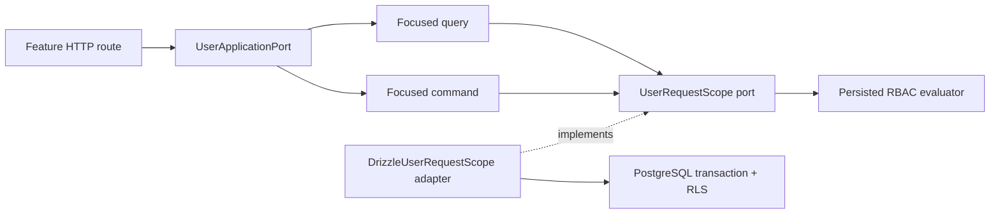

# Feature-Sliced HTTP Platform: Contracts, Errors, and Rate Limits

**Status:** implemented platform baseline, verified 19 August 2026  
**Primary repository:** `Paradox-Tech-BD/nirog-core`  
**Scope:** user feature boundaries, reusable HTTP semantics, generated OpenAPI/Scalar, and abuse controls

## 1. Why the earlier user slice was restructured

The first user slice proved the Clerk, profile, grant, and RLS flows, but its application service and route adapter were too broad. A production backend needs small use cases, localized feature contracts, centralized HTTP behavior, and a single response/error vocabulary. The current structure therefore replaces the large service and aggregated route file with feature-local modules and a reusable HTTP platform.

> **Rule:** application use cases may depend on domain ports and policy abstractions. They may not depend on Fastify, Clerk, Drizzle, PostgreSQL, response envelopes, or HTTP status codes. HTTP-specific translation is performed only in presentation modules.

## 2. User feature layout

```text
apps/api/src/features/user/
  application/
    authorization/require-profile-permission.ts
    commands/
      create-profile.ts
      create-profile-grant.ts
      create-team.ts
      revoke-profile-grant.ts
      update-preferences.ts
      update-profile.ts
    errors/user-errors.ts
    ports/
      user-application-port.ts
      user-request-scope.ts
    queries/
      get-me.ts
      get-profile.ts
      list-profile-grants.ts
    create-user-application-port.ts

  presentation/http/
    contracts/user-contracts.ts
    mappers/user-response-mappers.ts
    routes/
      account-routes.ts
      profile-routes.ts
      profile-grant-routes.ts
      team-routes.ts
    register-user-routes.ts
```

The application layer exposes a small `UserApplicationPort`, composed from focused query and command functions. A `UserRequestScope` port supplies a repository and domain service inside an actor/profile/purpose scope. The PostgreSQL/Drizzle implementation lives outside the feature under `infrastructure/persistence/drizzle-user-request-scope.ts`; that is where the transaction and `SET LOCAL` RLS context are established.



## 3. Shared HTTP platform modules

The shared presentation platform is organized independently of any single feature.

| Module | Responsibility |
|---|---|
| `contracts/api-contracts.ts` | Generic TypeBox success-envelope, metadata, and RFC-7807-style problem schemas. |
| `responses/success-response.ts` | Adds `data` and a request correlation ID consistently to successful responses. |
| `errors/api-error.ts` | Typed transport errors for idempotency and rate limits. |
| `errors/register-error-handling.ts` | One global mapping path for validation, authentication, authorization, not-found, idempotency, rate-limit, unexpected, and unknown-route failures. |
| `idempotency/require-idempotency-key.ts` | Reusable mutation-header validation. |
| `routing/public-request.ts` | One allowlist used by authentication and rate-limit middleware. |
| `openapi/register-openapi.ts` | Fastify Swagger registration plus live `/openapi.json`. |
| `openapi/register-scalar.ts` | Scalar interactive reference at `/reference/`. |
| `rate-limit/register-rate-limit.ts` | Post-authenticated account/IP keying and shared-store configuration. |
| `routes/register-health-routes.ts` | Platform health endpoints using the same success envelope. |

`composition/build-server.ts` is now a short wiring point. It registers the global exception mapper, OpenAPI, Scalar, health routes, Clerk authentication, rate limiting, and feature route registrars in a deliberate order. It does not contain route schemas, business operations, or inline database code.

## 4. Standard success and error contracts

Every successful business response has this exact shape:

```json
{
  "data": {
    "...": "feature-specific response"
  },
  "meta": {
    "correlationId": "request-uuid"
  }
}
```

Every failure is `application/problem+json` and preserves a correlation ID:

```json
{
  "type": "https://nirog.app/problems/rate-limit-exceeded",
  "title": "Rate limit exceeded",
  "status": 429,
  "code": "RATE_LIMIT_EXCEEDED",
  "correlationId": "request-uuid",
  "detail": "Request rate is temporarily limited. Retry after the indicated delay."
}
```

The current shared error codes include `VALIDATION_FAILED`, `UNAUTHENTICATED`, `AUTH_UNAVAILABLE`, `ACCESS_DENIED`, `RESOURCE_NOT_FOUND`, `IDEMPOTENCY_KEY_REQUIRED`, `RATE_LIMIT_EXCEEDED`, `ROUTE_NOT_FOUND`, and `INTERNAL_ERROR`. The server also writes `X-Correlation-Id` on every response.

## 5. Generated OpenAPI and Scalar

TypeBox route schemas are local to each feature. Fastify Swagger builds the live OpenAPI contract from those schemas, and Scalar renders exactly that document. The generated document contains success-envelope responses, problem responses, bearer security, tags, validation contracts, and `429` responses on protected user operations.

```mermaid
flowchart LR
    UserSchema[Feature TypeBox contracts] --> Route[Feature Fastify routes]
    Route --> Swagger[OpenAPI generator]
    Swagger --> Json[/openapi.json]
    Json --> Scalar[/reference/]
    Swagger --> Snapshot[pnpm openapi:write]
    Snapshot --> File[openapi/nirog-core.openapi.json]
```

## 6. User-aware rate limiting

The rate-limit hook runs **after Clerk authentication**. For an authenticated request it uses `account:<local-account-id>` as its key, ensuring different client devices of the same Nirog account share a quota. For a request that has no authenticated context it uses `ip:<client-ip>`. Health, OpenAPI, and Scalar routes are explicit public exemptions.

| Environment | Store | Required configuration |
|---|---|---|
| Unit tests / isolated local process | In-memory plugin store | Defaults are sufficient. |
| Local Compose | Valkey | `RATE_LIMIT_REDIS_URL=redis://valkey:6379`. |
| Production | Redis- or Valkey-compatible shared store | `RATE_LIMIT_REDIS_URL` is mandatory; startup rejects missing configuration. |

The policy is configured by `RATE_LIMIT_WINDOW_SECONDS`, `RATE_LIMIT_ANONYMOUS_MAX`, and `RATE_LIMIT_AUTHENTICATED_MAX`. Exceeded requests return the shared `429 RATE_LIMIT_EXCEEDED` problem response and `RateLimit-Limit`, `RateLimit-Remaining`, `RateLimit-Reset`, and `Retry-After` headers. The Fastify plugin supports Fastify 5 through its `10.x` line and supports custom keys, a shared Redis-compatible store, and standard rate-limit response headers. [1]

Docker daemon validation is still pending because the sandbox does not provide Docker. The Compose definition, configuration validation, account-keyed rate-limit test, and production shared-store guard are committed and verified.

## 7. Verification evidence

`pnpm verify` now passes **12 tests across 5 files**. The suite covers strict Clerk configuration failure, anonymous rejection, success envelopes, problem errors, correlation identifiers, idempotency header rejection, profile creation, OpenAPI bearer metadata, live Scalar HTML, authenticated account-keyed rate limiting, rate-limit headers, and the production shared-store startup guard.

## References

[1] [Fastify Rate Limit — official plugin documentation](https://github.com/fastify/fastify-rate-limit)

[2] [Nirog Core source and generated API contract](https://github.com/Paradox-Tech-BD/nirog-core/tree/main)
