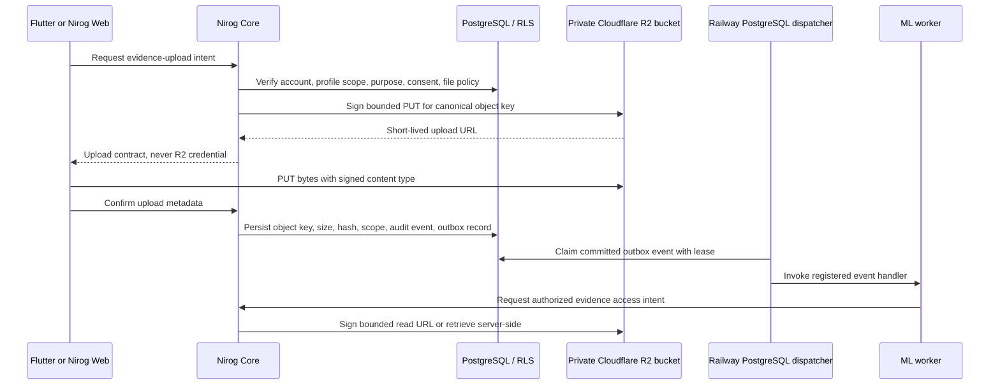

# Cloudflare R2 Evidence Storage

**Status:** approved infrastructure boundary; reusable adapter and strict configuration implemented  
**Applies to:** future prescription/OCR evidence, user-provided attachments, and approved private evidence downloads

## Decision

Nirog uses **Cloudflare R2** for private evidence objects. The application uses R2’s S3-compatible API through a dedicated `@nirog/evidence-storage` infrastructure adapter; no route handler, Flutter client, Next.js browser bundle, ML worker, or database migration receives an R2 master credential.

> **Boundary rule:** R2 holds opaque evidence bytes. PostgreSQL remains the authority for evidence ownership, profile scope, consent, classification, integrity metadata, retention, and every authorization decision.

R2 provides an S3-compatible endpoint at `https://<ACCOUNT_ID>.r2.cloudflarestorage.com`; the S3 client region is `auto` (with `us-east-1` accepted only as an interoperability alias by R2, not by Nirog’s configuration policy). [1] R2 credentials are an Access Key ID and Secret Access Key created from a bucket-scoped R2 API token. [2]

## Architecture boundary



This keeps asynchronous delivery separate from evidence storage. **PostgreSQL `platform.outbox_events` is the durable event transport**, and a separate Railway dispatcher claims eligible rows with a lease. Local development needs no LocalStack or external queue. R2 configuration remains independent of the outbox-worker controls.

## Implemented configuration contract

The backend configuration now separates `OUTBOX_*` PostgreSQL worker controls from `EVIDENCE_R2_*` object-storage configuration.

| Variable | Purpose | Local Compose value | Production value |
|---|---|---|---|
| `OUTBOX_WORKER_ENABLED` | Enables dispatcher claim loop | `false` on API, `true` in Compose dispatcher | `false` on API; `true` on Railway dispatcher service |
| `OUTBOX_POLL_INTERVAL_MS` | Dispatcher polling delay | `1000` | Usually `1000` |
| `OUTBOX_BATCH_SIZE` | Maximum claimed handler-compatible events | `20` | Tune from `20` after handler measurement |
| `OUTBOX_MAX_ATTEMPTS` | Retry bound before PostgreSQL dead-letter state | `12` | `12` unless an event class has an approved override |
| `EVIDENCE_STORAGE_DRIVER` | Evidence-store mode | `disabled` | `r2` |
| `EVIDENCE_R2_ENDPOINT` | R2 S3 API endpoint | Unset while disabled | `https://<ACCOUNT_ID>.r2.cloudflarestorage.com` |
| `EVIDENCE_R2_REGION` | S3 client region | `auto` | `auto` |
| `EVIDENCE_R2_BUCKET` | Private evidence bucket | Unset while disabled | Selected private bucket, e.g. `nirog-evidence` |
| `EVIDENCE_R2_ACCESS_KEY_ID` | Bucket-scoped R2 access key | Unset while disabled | Secret-managed R2 API credential |
| `EVIDENCE_R2_SECRET_ACCESS_KEY` | Bucket-scoped R2 secret | Unset while disabled | Secret-managed R2 API credential |
| `EVIDENCE_PRESIGN_MAX_SECONDS` | Maximum signed-link lifetime | `300` | Usually `300` or lower |

Local Compose deliberately defaults to `EVIDENCE_STORAGE_DRIVER=disabled`. This prevents a developer from believing prescription evidence is stored locally when it is not. A developer who needs real evidence upload testing must provide the R2 values through an untracked Compose override or local environment file.

## R2 token and bucket setup

Create one **private** R2 bucket—for example `nirog-evidence`—and create an R2 API token with **Object Read & Write** permission limited to that bucket. Do not use an account-wide administrator token for the Core runtime. Cloudflare’s R2 token model supports scoping Object Read & Write and Object Read credentials to a selected bucket. [2]

Store the R2 Access Key ID and Secret Access Key only in the backend secret manager or the untracked `.env.local` file. They must never appear in Flutter, Next.js `NEXT_PUBLIC_*` variables, Storybook, Git, browser storage, queue messages, or outbox payloads.

```env
# Production backend: R2 evidence objects
EVIDENCE_STORAGE_DRIVER=r2
EVIDENCE_R2_ENDPOINT=https://<CLOUDFLARE_ACCOUNT_ID>.r2.cloudflarestorage.com
EVIDENCE_R2_REGION=auto
EVIDENCE_R2_BUCKET=nirog-evidence
EVIDENCE_R2_ACCESS_KEY_ID=<bucket-scoped-access-key-id>
EVIDENCE_R2_SECRET_ACCESS_KEY=<bucket-scoped-secret-access-key>
EVIDENCE_PRESIGN_MAX_SECONDS=300

# Production asynchronous transport remains separate
OUTBOX_WORKER_ENABLED=true
OUTBOX_POLL_INTERVAL_MS=1000
OUTBOX_BATCH_SIZE=20
OUTBOX_LEASE_SECONDS=60
OUTBOX_RETRY_DELAY_SECONDS=30
OUTBOX_MAX_ATTEMPTS=12
```

## Upload and download rules

Core generates short-lived, single-object presigned URLs using AWS Signature V4 through the R2-compatible client. R2 supports presigned `GET`, `HEAD`, `PUT`, and `DELETE` operations; `POST` multipart form upload is not supported. [3] Nirog uses the `PUT` contract for new evidence and requires the expected content type to be signed.

The current `CloudflareR2EvidenceObjectStore` adapter rejects traversal-like keys, requires normalized relative paths, validates content types, and bounds every signed URL by `EVIDENCE_PRESIGN_MAX_SECONDS`. It does **not** construct keys from user-provided filenames. A future prescription/OCR command must construct a canonical immutable key from approved server identifiers, for example:

```text
profiles/<profile-id>/prescriptions/<prescription-id>/evidence/<evidence-id>/original
```

The Core command must also validate profile capability, active consent, purpose, declared MIME type, byte limit, allowed evidence category, correlation ID, and idempotency key before signing. It then records the object key—not the short-lived URL—plus SHA-256, content length, MIME type, uploader account, profile ID, retention policy, and audit/outbox event after upload confirmation.

Presigned URLs are bearer capabilities. Anyone holding a URL can perform its signed operation until it expires, so Nirog must use short lifetimes, exact object keys, signed content types, explicit CORS origins, and no public bucket policy. [3] R2 presigned URLs work against the S3 API domain and not a custom domain. [3]

## Client boundary

Flutter and Nirog Web request an upload intent from Nirog Core; they never receive R2 credentials. They upload bytes directly to the returned signed URL using the exact signed HTTP method and content type, then submit upload confirmation to Core. Nirog Web continues to use its same-origin Next.js server route for Core authorization; it must not generate R2 URLs in browser code.

Before a browser direct-upload flow is implemented, configure R2 bucket CORS narrowly for the deployed Nirog Web origins and required `PUT` headers. Cloudflare specifically recommends CORS configuration for browser use of presigned URLs. [3] Flutter does not require browser CORS but follows the same signed-upload contract.

## Verification and delivery status

The Core workspace now includes `@nirog/evidence-storage`, a Cloudflare R2 S3-compatible adapter and contract tests for object-key and expiry bounds. Configuration tests enforce complete R2 values whenever `EVIDENCE_STORAGE_DRIVER=r2`, require `auto` as the R2 region, require R2 in production, and preserve the existing production distributed-rate-limit guard. Live R2 bucket, token, CORS, and real upload verification require user-provided R2 credentials and remain an environment integration step.

## References

[1] [Cloudflare R2 S3 API compatibility](https://developers.cloudflare.com/r2/api/s3/api/)

[2] [Cloudflare R2 authentication and bucket-scoped API tokens](https://developers.cloudflare.com/r2/api/tokens/)

[3] [Cloudflare R2 presigned URLs](https://developers.cloudflare.com/r2/api/s3/presigned-urls/)
