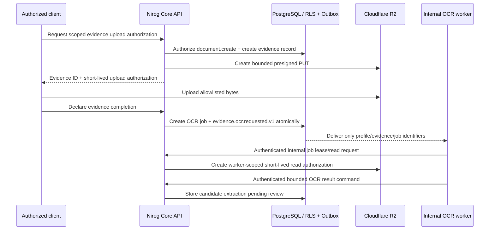

# Prescription Evidence and Bounded OCR Security Contract

**Status:** Phase 8 evidence foundation implemented, verified, and deployed as Core commit `d6d5505`; worker lease/result processing and extraction review remain the next bounded sub-increment.  
**Scope:** profile-bound prescription evidence, constrained Cloudflare R2 upload authorization, durable OCR job creation, and a narrow internal worker boundary.

> **Authority rule:** a client, platform role, team role, R2 object key, or OCR worker never becomes clinical authority. Core authorizes every profile action from ownership or a persisted profile-grant permission snapshot, then uses RLS as a second barrier.

## 1. Increment boundary

Phase 8 extends the deployed manual medication slice. The deployed foundation permits an authorized caller to attach evidence to an existing manual prescription, receive a short-lived upload authorization, declare completion, and enqueue one durable OCR job for that evidence version. Core remains the source of truth for evidence lifecycle and job state; Cloudflare R2 stores opaque object bytes only. The worker-facing lease/read/result flow is designed below but is not active in this release.

| Included | Explicitly excluded |
|---|---|
| Profile-scoped evidence metadata and opaque R2 storage keys | Public evidence URLs or browser-accessible buckets |
| Allowlisted image/PDF upload authorization with short expiry | Raw image bytes in Core audit/outbox payloads |
| Completion validation, idempotent OCR-job creation, and transactional outbox event | Direct client-to-worker invocation or a worker accepting a patient profile ID as authority |
| Durable OCR job reference with a designed future lease/read/result contract | Autonomous medication changes, diagnosis, prescribing recommendations, or automatic regimen creation |
| Safe lifecycle metadata pending later candidate extraction/reconciliation storage | OCR text, confidence, prompts, or model-provider output in audit/outbox payloads |

## 2. Clinical records and lifecycle

The deployed foundation adds `clinical.prescription_evidence` and `clinical.ocr_jobs`, with RLS predicates identical in principle to the deployed medication records. Evidence belongs to exactly one profile and one prescription. OCR jobs are profile-bound denormalized records for policy clarity and query efficiency; the foreign-key chain remains mandatory. `clinical.ocr_extractions` is deliberately deferred until an authenticated worker result boundary and explicit review workflow are implemented.

| Record | Key state | Stored fields that may be sensitive | API rule |
|---|---|---|---|
| `prescription_evidence` | `upload_authorized`, `uploaded`, `processing`, `processed`, `rejected`, `deleted` | Opaque object key, MIME type, size, checksum, capture timestamp | Metadata requires `document.read_metadata`; object access requires the separate image/document permission. |
| `ocr_jobs` | `queued`, `leased`, `succeeded`, `retry_scheduled`, `dead_lettered`, `cancelled` | Failure category and attempt counters only | Never exposes worker credentials, provider request IDs, prompts, or object bytes. |
| Future `ocr_extractions` | `pending_review`, `accepted`, `rejected`, `superseded` | Raw extracted text and bounded candidate fields, retained only in the clinical schema | Deferred; never appears in audit/outbox payloads and never mutates a regimen automatically. |

An evidence object key is generated by Core, not accepted from the client. Its deterministic scope is `profiles/{profileId}/prescription-evidence/{evidenceId}/source`; it is opaque to the API response except through a time-bounded presigned upload or authorized-download operation. Filename is not used as a storage key or audit field.

## 3. Public API and permission matrix

The public API keeps the existing `/api/v1` base, Clerk bearer verification, typed success/problem envelopes, correlation IDs, and mandatory `Idempotency-Key` for every mutation.

| Endpoint | Required persisted permission | Behavior |
|---|---|---|
| `POST /profiles/:profileId/prescriptions/:prescriptionId/evidence/uploads` | `document.create` | Creates an `upload_authorized` evidence record and returns one short-lived R2 upload authorization for an allowlisted media type. |
| `POST /profiles/:profileId/prescriptions/:prescriptionId/evidence/:evidenceId/complete` | `document.create` | Validates profile/prescription/evidence association, records the completion declaration, creates an OCR job if eligible, and emits one transactional job-reference event. |
| `GET /profiles/:profileId/prescriptions/:prescriptionId/evidence` | `document.read_metadata` | Lists safe evidence and job lifecycle metadata only. |
| Future download authorization | `document.read_image` | Deferred; will return a short-lived authorized download authorization and never redirect to a public R2 domain. |
| Future OCR-extraction listing | `document.read_metadata` and `regimen.read` | Deferred; will return bounded candidate fields and review status, not an automatic regimen mutation. |

The implementation must block a cross-profile prescription, evidence, or job reference before any storage operation. A platform administrator has none of these permissions by assignment. Current `caregiver`, `curator`, and `viewer` grants do not receive `document.create`; only an owner currently has that capability unless a future explicit grant policy changes the stored permission snapshot.

## 4. R2 upload controls

The existing `EvidenceObjectStore` remains transport-only. Core constructs the scoped object key and validates all authorization, evidence lifecycle, content type, expiry, and maximum-size policy before presigning. The first allowlist is `image/jpeg`, `image/png`, `image/webp`, and `application/pdf`; executable, archive, SVG, HTML, and unconstrained binary uploads are rejected. Upload URLs expire quickly and are single evidence-object authorizations, not reusable bucket credentials.

Completion does not trust a client-declared checksum, MIME type, or byte count as evidence of file integrity. The bounded worker first checks object metadata and enforces the server policy before processing. A failed verification transitions the evidence/job to a safe rejection or retry state with a non-sensitive failure category.

## 5. Durable OCR dispatch and worker boundary

Inside the same profile-scoped Core transaction that transitions an eligible evidence record, Core creates an `ocr_jobs` row and writes `evidence.ocr.requested.v1` to `platform.outbox_events`. The event payload is restricted to `{ profileId, evidenceId, ocrJobId }`; it includes no R2 URL, storage key, raw evidence, extracted text, prompt, token, or model response.

The worker is not permitted to query clinical tables directly, choose another evidence object, accept a patient profile from a client, or write a regimen. When introduced, it will receive an independently authenticated Core job lease and only a short-lived read authorization for the evidence object selected by that job. The result command will accept bounded candidate fields and a controlled status; any raw extraction will be stored only in the clinical extraction record. Production Core already fails closed when R2 evidence processing is enabled without a sealed `NIROG_INTERNAL_WORKER_SECRET`. The locally generated value is masked in Railway API configuration and is not committed or documented; the worker peer will receive the same service identity only when its implementation and deployment are activated.

## 6. Audit, outbox, and review invariants

Every evidence authorization, completion, OCR enqueue, lease, result, retry, rejection, and review decision emits audit/outbox evidence in the same transaction where applicable. These records may contain safe identifiers, state codes, byte-size category, and controlled failure code only. They must not contain a raw evidence key, URL, filename, media bytes, OCR text, prompt, model name, provider request ID, checksum, device token, or generated medication instruction.

OCR results are advisory evidence. A later reconciliation command, authorized through `regimen.write`, may allow a user to create or update a manual regimen after explicit review. Phase 8 itself creates no automatic medication instruction and does not send reminders or notifications.
