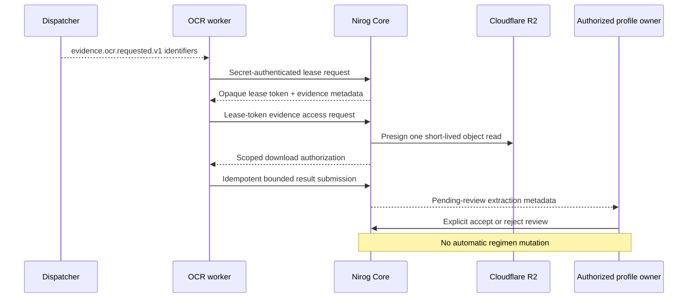

# OCR Worker Lease, Result, and Review Contract

**Status:** implemented, verified, and deployed as Core commit `7a29173`; a concrete OCR-engine worker service remains deliberately deferred.  
**Depends on:** Core commit `d6d5505`, clinical migration `0009_prescription_evidence_ocr.sql`, clinical migration `0010_ocr_worker_boundary.sql`, and the sealed `NIROG_INTERNAL_WORKER_SECRET` API runtime configuration.

> **Non-authority rule:** the OCR worker processes a job Core already selected. It does not obtain patient authority, query clinical tables, choose evidence, accept client input, or write a regimen. Core keeps every clinical state transition, RLS context, and audit/outbox record.

## 1. Deployment and trust boundary

The existing Railway dispatcher remains responsible only for durable delivery of `evidence.ocr.requested.v1`, whose payload is restricted to `{ profileId, evidenceId, ocrJobId }`. Core commit `7a29173` implements and deploys the private worker-facing lease, read-authorization, result, extraction-review, retry, and dead-letter boundary. A concrete OCR-engine worker service that consumes a dispatched job reference remains a separate follow-on deployment. It will authenticate with the same independently managed service-identity secret already required by production Core R2 evidence processing. The raw secret is never included in an event, database record, API response, source file, or documentation.

Core does not give the worker a PostgreSQL connection. Instead, it validates the secret with a constant-time comparison and opens an internal Core-controlled transaction with a fixed worker workload and purpose. The internal RLS predicate is only reachable through the audited Core route; no public request can supply the workload or purpose values.

## 2. Lease protocol

| Step | Core behavior | Worker-visible data | Prohibited data |
|---|---|---|---|
| Acquire lease | Atomically claims one eligible `queued` or `retry_scheduled` job, increments its attempt count, stores a hash of a fresh opaque lease token, and sets a short expiry. | Job ID, evidence ID, declared MIME type/size, lease token, and expiry. | Profile ID, R2 object key, public URL, raw bytes, owner/account details. |
| Read evidence | Requires the current opaque lease token and a non-expired lease, then returns a short-lived R2 download authorization scoped to that one object. | Time-bounded download authorization and expiry. | Bucket credential, object key, database connection, unrelated evidence. |
| Submit result | Requires the same active lease token. Core records a controlled success, retry, or permanent rejection result and invalidates the lease token. | Accepted lifecycle result and safe identifiers. | Audit/outbox payload containing OCR text, prompt, provider response, or storage internals. |

Lease acquisition remains idempotent at the job state level: an active lease is never reassigned. A worker retry occurs only through a Core-controlled delay and bounded maximum attempts. A job exceeding the configured cap becomes `dead_lettered`; it cannot silently loop forever.

## 3. Private API contract

These endpoints are intentionally outside the Clerk-facing route family. Each requires `X-Nirog-Worker-Secret`; result submission also requires an `Idempotency-Key`. They return standard typed envelopes and a correlation ID, but are not part of the public mobile OpenAPI surface.

| Endpoint | Input | Core state transition |
|---|---|---|
| `POST /api/v1/internal/ocr/jobs/:jobId/lease` | Worker secret + profile ID supplied by the trusted dispatcher job reference | Eligible job → `leased`; returns opaque lease material. |
| `POST /api/v1/internal/ocr/jobs/:jobId/evidence-access` | Worker secret + lease token | No clinical lifecycle mutation; returns one short-lived object-read authorization only for the leased job. |
| `POST /api/v1/internal/ocr/jobs/:jobId/result` | Worker secret + lease token + controlled result | `leased` → `succeeded`, `retry_scheduled`, `dead_lettered`, or evidence `rejected`, depending on the controlled outcome. |

The first result shape permits `succeeded`, `retryable_failure`, and `permanent_failure`. A successful result may contain bounded raw text and candidate medication/dose/frequency strings, which are stored only in `clinical.ocr_extractions` as `pending_review`. A retryable or permanent failure accepts only a controlled failure code from a server allowlist. The worker cannot prescribe, create a regimen, edit a dose, or nominate its own retry time.

## 4. Human review and reconciliation

An authorized profile owner may list bounded extraction candidates and explicitly mark an extraction `accepted` or `rejected`. Review never changes a prescription or regimen. A later, separate `regimen.write` command may use a reviewed candidate as user-entered input to create or update a manual regimen, leaving an auditable human decision between OCR and clinical action.

## 5. Safe event and audit policy

Audit/outbox evidence can record only profile, evidence, job, extraction, and actor identifiers; transition status; attempt count; and controlled failure/review codes. It must never record a lease token, secret, R2 key/URL, OCR text, candidate strings, model/provider identity, prompt, checksum, or image bytes.

The deployed boundary has API coverage for missing/incorrect secret rejection and a disposable PostgreSQL RLS integration assertion that an internal OCR context is scoped to its selected profile/job. Core lint, strict type-checking, and the full test suite passed locally (`41` passing; disposable-environment suites skipped when unavailable), and GitHub Actions run `32374259187` passed. Railway applied migration `0010_ocr_worker_boundary.sql` through the migrator before activating the matching API revision; public liveness returned HTTP `200`. Lease exclusivity/expiry, stale-token rejection, bounded result validation, retry/dead-letter handling, safe redaction, and owner-only review are implemented in the repository/command boundaries and remain targets for expanded direct integration coverage alongside the concrete OCR-engine worker.
