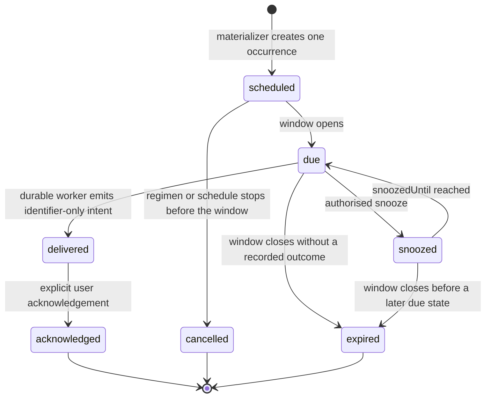
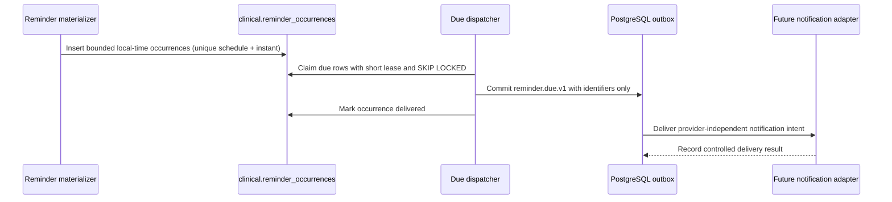

# Phase 9 Reminder, Adherence, and Refill Foundation

**Status:** schema foundation, local-time materialization, and the inventory/refill API are deployed. Due-notification delivery and persisted adherence reporting remain intentionally incomplete.

> **Design position:** a medication schedule expresses the expected local-time pattern; a materialized reminder occurrence expresses one immutable due opportunity; a dose outcome remains the clinical source record; adherence metrics and streaks are rebuildable projections; inventory movements are an append-only ledger; and a refill alert is a workflow state, not a medication decision.

## 1. Scope and boundary

Phase 9 extends the manual medication slice without changing its clinical authority model. It introduces timezone-aware reminder scheduling, reviewable dose-window state, deterministic adherence projections, current inventory balances, append-only inventory movements, and refill-alert workflow records. It does not introduce a pharmacy integration, prescribe a medication, infer a dose, perform clinical triage, or let OCR populate a regimen automatically.

The initial reminder worker remains deterministic. It materializes bounded future occurrences and claims due rows safely; it emits an identifier-only notification intent for a later channel adapter. A notification provider, device token, message text, and external delivery receipt are deliberately outside this migration. This separation keeps patient-facing wording and provider credentials out of the clinical scheduling ledger.

## 2. Schedule semantics

The existing `clinical.regimen_schedules` record remains the schedule pattern. Phase 9 adds its owning `profile_id` and a composite regimen/profile foreign key so every downstream record is both relationally correct and directly enforceable by RLS. A schedule’s `timezone` and `local_time` represent the intended wall-clock administration time. `regimens.started_on` is the recurrence anchor for `interval_days`; a schedule is eligible only while the regimen and schedule are active.

Recurring medical prompts must be calculated in the schedule’s local time, then persisted as a concrete `timestamptz` occurrence. This follows the same distinction used by calendaring standards between a recurring pattern, a start time, and timezone information; a recurring pattern is not safely represented by repeatedly adding 24 hours to a prior UTC timestamp across daylight-saving transitions. [1]

The first implementation uses a constrained daily interval rule already present in Nirog rather than exposing free-form calendar grammar. It supports one or more local times per regimen and an interval of 1–365 days. The materializer uses a deterministic daylight-saving policy: when a local wall time does not exist, it selects the first valid instant after the gap; when a local time occurs twice, it selects the earlier occurrence. The selected instant is stored on the occurrence, so later reads and audits are stable even if timezone rules evolve.

## 3. Reminder records and state machine

`clinical.reminder_schedules` owns user-controllable notification behavior for one regimen schedule and one channel. Its bounded window and default snooze duration are policy parameters, not message content. Its materialization watermark makes generation idempotent and allows the system to create a short planning horizon without generating an unbounded future table.

`clinical.reminder_occurrences` stores one scheduled instant and one execution state. The unique `(reminder_schedule_id, scheduled_for)` key prevents a retry, scheduler restart, or concurrent worker from creating two opportunities for the same planned dose. `window_opens_at`, `window_closes_at`, and an optional `snoozed_until` are immutable scheduling facts or controlled state transitions. The optional `dose_log_id` links an acknowledged opportunity to a separately recorded dose outcome; it never creates that outcome by itself.

> **Important:** `delivered` means Nirog emitted a durable provider-independent intent. It does not assert that an operating system displayed an alert, that a device was reachable, or that medication was taken.

## 4. Due-work execution

The existing Railway dispatcher is the selected execution host for the Phase 9 deterministic worker. This avoids an external polling product and reuses the already deployed PostgreSQL retry, lease, observability, and identifier-only outbox conventions. The deployed materializer has the dedicated `reminder-dispatcher` workload and the narrow `reminder.materialize` purpose. The later due-dispatch slice will add only `reminder.due.claim` and `reminder.due.complete`.

The deployed materializer claims active reminder schedules inside a short transaction with row locking, `SKIP LOCKED`, and an expiring materialization lease. It derives bounded future occurrences in the schedule’s IANA timezone using compatible daylight-saving disambiguation, inserts them under the unique schedule/instant key, and advances its watermark only after processing the claimed schedule. PostgreSQL documents `SKIP LOCKED` as a locking-clause option for `SELECT`, permitting a claimant to bypass rows already locked by another worker. [2] The worker never scans raw prescription evidence, OCR text, device credentials, or another clinical profile’s dosage details. Its RLS exception is limited to reminder schedules and occurrences under the explicit workload/purpose function; all other Phase 9 records keep ordinary profile-context RLS.

The reminder event payload will contain only `profileId`, `regimenId`, `reminderOccurrenceId`, and correlation metadata. It must not contain a medicine name, quantity, instructions, raw OCR text, patient label, device token, signed URL, or free-text notification body.

## 5. Adherence projections and streaks

FHIR’s dosage model distinguishes dosage instructions from the timing of administration. [3] Nirog applies the same boundary: `clinical.dose_logs` remains the immutable record of a user-recorded `taken`, `late`, `missed`, or `skipped` outcome, while Phase 9 projection records never rewrite that source.

`clinical.adherence_daily_metrics` stores an idempotently recomputed per-regimen local-day result. It captures scheduled, taken, late, missed, and skipped counts with a non-negative aggregate constraint. Profile-wide daily figures are sums of these rows; weekly and monthly results are grouped from the same local-day projection, rather than maintained as conflicting independent totals. A worker can safely rebuild a day when a late user edit is introduced.

`clinical.adherence_streaks` stores the current and longest qualifying-day streak for one regimen. It is a cacheable projection: a recalculation can derive it from daily metrics, and no workflow should treat it as a clinical fact or use it to alter a prescription. The qualification threshold will be an explicit product policy in the command layer, not a hidden database trigger.

## 6. Inventory and refill workflow

Inventory is intentionally separate from adherence. Recording a dose outcome does not reduce stock until a future command explicitly creates one idempotent `dose_deduction` movement for that outcome. This preserves user control when a medication was marked late, skipped, or taken from an untracked supply. The deployed inventory API currently supports profile-authorized read, idempotent initialization, and positive refill movements; it does not yet deduct stock from a dose outcome.

`clinical.regimen_inventories` is the current balance projection and optional refill threshold for one regimen. `clinical.inventory_movements` is the append-only accounting record: `refill`, `adjustment`, `dose_deduction`, `reversal`, quantity delta, and before/after balances. The deployed refill command uses decimal-safe arithmetic, rejects a transition that would make the balance negative, and opens a refill alert only when a balance crosses downward through its configured threshold. A refill history is therefore a filtered ledger view rather than a mutable separate log.

`clinical.refill_alerts` captures an observed balance, threshold snapshot, workflow state, and acknowledgement/resolution timestamps. The partial unique index allows at most one open or acknowledged alert per regimen. Alert creation is deterministic from an inventory change; acknowledgement does not modify a balance, and resolving an alert does not create a refill.

## 7. Access, validation, and data ownership

The existing owner/caregiver/curator/viewer model remains the authorization source. Initial reminder settings use `notification.manage`; dose outcome recording uses `adherence.write`; analytics reads use `adherence.read`. The deployed refill slice adds explicit `inventory.read` and `inventory.write` capabilities rather than overloading `regimen.write`: owners have both by default, while caregivers receive inventory read only. This preserves the future policy-evaluator seam and does not silently broaden caregiver stock-mutation authority.

All Phase 9 tables are profile-scoped. The migration enforces composite `(regimen_id, profile_id)` references where a child carries a profile, so an application bug cannot connect a record to a regimen in another profile. The normal RLS policy requires both the request’s profile context and the active profile-access capability. The only exception is `reminder_occurrences` under the narrowly named reminder-dispatcher workload and purpose pair.

The API command layer must validate IANA timezone names, `HH:MM:SS` local times, bounded minute windows, valid state transitions, non-negative inventory, non-zero movement deltas, and request idempotency keys. It must obtain the profile capability before opening a scoped database operation, emit audit events with identifiers and safe count/status metadata only, and write identifier-only outbox events inside the same transaction.

## 8. Forward migration contents

Migration `0012_reminders_adherence_refills.sql` performs the first Phase 9 foundation rollout. It backfills `regimen_schedules.profile_id` from its owning regimen, makes the column non-null, adds the composite foreign key, then creates these records:

- `reminder_schedules` and `reminder_occurrences` for local-time policy and durable execution state.
- `adherence_daily_metrics` and `adherence_streaks` for rebuildable user-visible analytics.
- `regimen_inventories`, `inventory_movements`, and `refill_alerts` for stock and refill workflow.

It also creates the restricted reminder-dispatcher RLS helper, grants only necessary DML to `nirog_api`, and enables profile-context policies on the new tables. The migration has no device-provider credential, no notification body, no model data, and no direct patient notification side effect.

## 9. Deployed Phase 9 increment record and remaining gates

The deployed materializer increment adds migration `0013_reminder_materializer_boundary.sql`, which snapshots recurrence inputs on each reminder policy, adds a short-lived schedule-materialization lease, and scopes the dispatcher RLS exception to `reminder.materialize`, `reminder.due.claim`, and `reminder.due.complete`. The dispatcher’s materializer feature is explicitly enabled, plans only a bounded future horizon, and has focused tests for daylight-saving transitions, skipped local times, duplicate insertion, and migration-journal ordering. It sends no notification and emits no medication decision.

The deployed inventory increment adds the profile-authorized `/inventory` and `/inventory/refills` API surface. Mutations require an idempotency key, use decimal quantities, write an audit record with identifiers only, and publish no balance or medicine-name text in the event payload. Automated stock deduction, alert acknowledgement, and patient-facing provider delivery are not yet enabled.

The medication-domain package now contains pure, tested daily-adherence and streak calculations. Persisting these calculations into `clinical.adherence_daily_metrics` and `clinical.adherence_streaks`, plus exposing authorized daily/weekly/monthly reporting queries, remains the next implementation slice.

The remaining acceptance gates are the controlled due-row/outbox flow, snooze and acknowledgement state transitions, persisted adherence recalculation and report isolation, idempotent dose-linked inventory deduction, refill-alert acknowledgement, and a bounded authenticated production smoke path for each completed workflow.

The first executable Phase 9 slice is complete only when it proves local-time materialization across ordinary and daylight-saving dates, schedule pause/cancellation, duplicate-materialization prevention, authorized snooze transitions, and concurrent due-row claim safety. It must also prove profile RLS isolation, absence of cross-profile composite-FK writes, rebuildable daily metrics, idempotent inventory movement insertion, one-open-refill-alert behavior, identifier-only outbox payloads, and authorization denials for missing profile capabilities.

Deployment remains migration first. The Railway migrator must apply `0012` and report completion before the API image that writes Phase 9 records is approved. No notification adapter is enabled until a controlled synthetic due occurrence has completed the local database, outbox, dispatcher, and redacted-observability flow.

## References

[1] [IETF RFC 5545 — Internet Calendaring and Scheduling Core Object Specification](https://datatracker.ietf.org/doc/html/rfc5545)

[2] [PostgreSQL Documentation — `SELECT` locking clause, including `SKIP LOCKED`](https://www.postgresql.org/docs/current/sql-select.html)

[3] [HL7 FHIR R4 — Dosage and timing model](https://hl7.org/fhir/R4/dosage.html)
