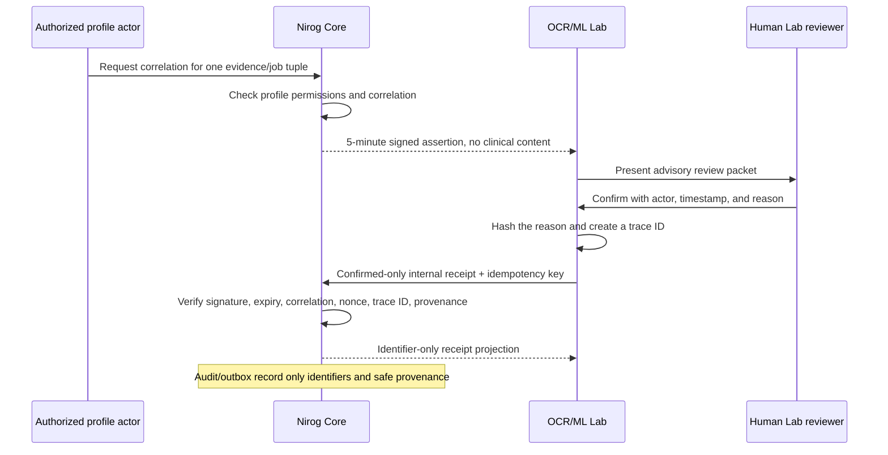

# Core-linked OCR Lab Correlation and Review Receipt Contract

**Status:** implemented, verified, and deployed with Core commit `a95511b`; migration `0016_core_linked_ocr_lab_receipts.sql` completed before the matching API rollout.

**Scope:** an explicitly user-authorized, short-lived correlation assertion from Nirog Core to the separate OCR/ML Lab, followed by an identifier-only receipt for a human-confirmed review. This is an evidence/audit boundary. It does not transfer prescription, regimen, dose, reminder, refill, or diagnostic authority.

> **Non-authority rule:** Core may acknowledge that an external review was human-confirmed for a Core-selected OCR job. The acknowledgment must never create or alter a medication, prescription, regimen, schedule, dose outcome, refill state, reminder, or diagnosis.

## 1. Why this boundary exists

The OCR/ML Lab is deliberately separated from Core so that it can operate an advisory extraction, deterministic matching, retrieval, and operator-review pipeline without receiving a direct clinical database connection or authority to mutate Core state. Core therefore issues a narrowly scoped correlation assertion only after an authenticated profile actor has permission to inspect the relevant evidence and regimen context. The Lab may return a receipt only after its own mandatory human review reaches `confirmed`.

The assertion binds one profile, evidence record, OCR job, and Core actor reference. It contains no image bytes, R2 key or URL, OCR text, candidate medicine name, candidate dosage, diagnosis hypothesis, reason text, model output, or clinical instruction. The receipt carries only provenance, review, version, and trace identifiers needed to make the handoff auditable and replay-safe.

## 2. Issuance contract

An authenticated caller requests a correlation assertion from:

```text
POST /api/v1/profiles/:profileId/evidence/:evidenceId/ocr-jobs/:jobId/lab-correlation
```

Core requires the existing `document.read_metadata` and `regimen.read` persisted profile permissions. It first verifies that the profile, evidence, and OCR job belong together. It then creates a version-1 compact assertion in the form:

```text
base64url(JSON claims).base64url(HMAC-SHA-256 signature)
```

| Claim | Safety purpose |
|---|---|
| `version` | Rejects unsupported assertion formats. |
| `profileId`, `evidenceId`, `jobId` | Binds the Lab action to one Core-selected evidence workflow. |
| `coreActorAccountId` | Preserves Core-side actor attribution without granting the Lab a clinical identity. |
| `nonce` | Provides one-time receipt replay protection. |
| `issuedAt`, `expiresAt` | Limits validity to five minutes. |

Core signs the assertion with the independently managed internal worker secret. The secret is never exposed in the assertion, event payload, database record, response logging, source, or documentation. The issuance audit record contains only safe identifiers and the expiry timestamp.

## 3. Confirmed-only review receipt

The Lab sends a receipt to Core only through the internal route:

```text
POST /api/v1/internal/ocr/lab-review-packets
```

The request must include `X-Nirog-Worker-Secret` and an `Idempotency-Key`. The Lab uses its generated `traceId` as the idempotency key. The receipt accepts the following fields and rejects every unrecognized or malformed combination.

| Field | Requirement |
|---|---|
| `correlationAssertion` | The current signed assertion issued by Core for this exact profile/evidence/job tuple. |
| `decision` | Must be exactly `confirmed`; rejected Lab decisions are not delivered to Core. |
| `resultSource` | `demo` or `ml`, subject to the same provenance constraints used by Core extraction results. |
| `demoFixtureId` | Required only for demo provenance and must match `demo.[A-Za-z0-9._-]{1,127}`. |
| `reviewerRef` | A bounded Lab-side reviewer reference; no patient-facing identity or plaintext review rationale. |
| `reviewReasonHash` | SHA-256 hexadecimal digest of the required Lab review reason. |
| `reviewedAt` | A valid ISO-8601 review timestamp. |
| `pipelineVersion`, `modelVersion`, `datasetVersion` | Bounded version references used for reproducibility. |
| `traceId` | Bounded receipt trace identifier and idempotency key. |

Core verifies the HMAC with a timing-safe comparison, validates the assertion version and expiration, checks the profile/evidence/job correlation, rejects any decision other than `confirmed`, validates provenance, and persists an identifier-only receipt. A uniqueness constraint over the hashed assertion nonce and another over `traceId` prevent replay through either the signed assertion or the Lab transport identifier.

## 4. Review and handoff sequence



The Lab refuses delivery for any job that is not locally `confirmed`. Core separately enforces the same rule and does not interpret a receipt as a clinical command. The returned receipt projection is a handoff acknowledgement rather than a medication recommendation or a workflow transition that can activate a regimen.

## 5. Identifier-only audit and outbox policy

Core records the `evidence.ocr.lab_review.received` audit action and emits `evidence.ocr.lab_review.received.v1`. Their safe payloads are limited to the Core profile, evidence, and OCR job identifiers; `confirmed` decision; `resultSource`; optional demo fixture identifier; and `traceId`. They must not contain the signed assertion, nonce, review reason text, OCR text, medicine or regimen candidates, diagnosis hypotheses, prompts, model outputs, image bytes, object storage references, or secrets.

The database stores a hash of the assertion nonce rather than the nonce itself, and stores the review-reason hash rather than plaintext review content. This preserves correlation and receipt accountability while avoiding a new path for patient data or human-review narrative to enter the Core audit/outbox plane.

## 6. Failure behavior

| Condition | Required Core behavior |
|---|---|
| Missing/invalid worker secret | Fail closed before opening the internal worker scope. |
| Expired, malformed, wrong-version, or incorrectly signed assertion | Reject without recording a receipt. |
| Profile/evidence/job tuple absent or mismatched | Reject without recording a receipt. |
| `rejected` or any non-confirmed decision | Reject; no rejected Lab packet is forwarded to Core. |
| Invalid demo/ML provenance pairing | Reject before persistence; database constraints repeat the invariant. |
| Reused assertion nonce or `traceId` | Reject as a replay; no duplicate receipt or event is created. |
| Valid receipt | Store only the identifier/version/provenance receipt and emit the safe audit/outbox records. |

## 7. Verification and release order

Focused Core tests cover valid signed delivery, invalid/expired assertions, confirmed-only enforcement, demo-provenance validation, replay-safe receipt recording, and the exclusion of patient/OCR content from audit and outbox payloads. The full Core `pnpm lint`, `pnpm typecheck`, and `pnpm test` gates passed before commit `a95511b` was pushed. Railway completed migration `0016` with `@nirog/migrator` before the matching `@nirog/api` deployment; the OCR worker was subsequently rolled forward and passed its `/health/live` health check. The OCR/ML service’s adapter and confirmed-only delivery guard are separately covered by its unit suite, and its non-mutating live credential probe returned the expected unknown-job `404`, confirming that the deployed Core accepted the sealed internal worker identity.

## References

[1] [Prescription Evidence and Bounded OCR Security Contract](16-prescription-evidence-ocr-security-contract.md)

[2] [OCR Worker Lease, Result, and Review Contract](17-ocr-worker-lease-result-contract.md)

[3] [Nirog Core signed-correlation command](https://github.com/Paradox-Tech-BD/nirog-core/blob/main/apps/api/src/features/evidence/application/commands/manage-ocr-lab-correlation.ts)
