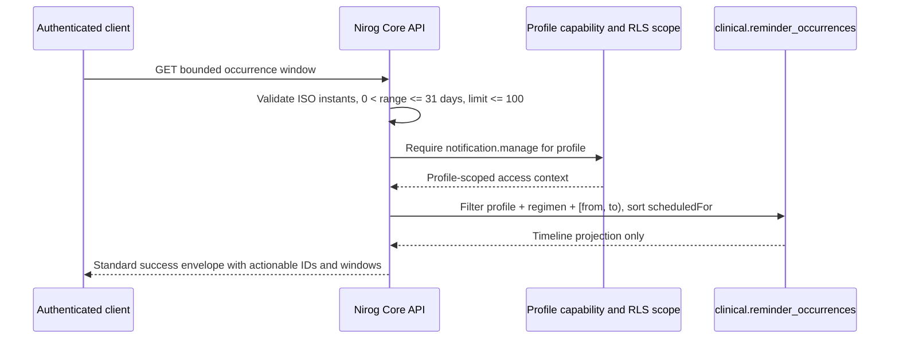

# Phase 9 Reconciliation and Reminder Occurrence Timeline

**Status:** the continuation history has been reconciled through Nirog Core commit [`63c8c6b`](https://github.com/Paradox-Tech-BD/nirog-core/commit/63c8c6b). The new reminder occurrence read model is committed and pushed without a schema migration. The production public health endpoint returned HTTP 200 after the push; Railway’s project canvas had not yet exposed the revision label during the read-only check, so revision-specific deployment confirmation remains an operational follow-up.

> **Clinical boundary:** a reminder occurrence is a durable scheduling and workflow record. Reading, delivering, snoozing, or acknowledging it does **not** record a dose, adjust stock, alter a prescription, or create a clinical decision.

## Reconciliation outcome

The newer continuation already completed several capabilities that were previously tracked as future work. Core now persists timezone-aware adherence daily metrics and streaks, exposes authorized daily, weekly, monthly, and streak reporting, provides reminder due-intent dispatch with authorized snooze and acknowledgement transitions, and maintains inventory movements, refill history reads, and refill-alert acknowledgement. The evidence/OCR flow now carries provenance and a Core-linked receipt audit while remaining review-gated: OCR data cannot mutate a medication automatically. [1]

The local `0014_adherence_timezone_metric_key` draft was intentionally not committed before synchronization. The published migration has the same purpose but corrects the original database object type by dropping `adherence_daily_metrics_regimen_day_uq` as an **index**, then creating a timezone-inclusive unique index. The local draft and its test were preserved outside the checkout for audit, then removed only after this semantic comparison. This makes the reconciliation forward-only and avoids replaying a conflicting migration.

## Reminder occurrence timeline

The deployed reminder worker already materializes local-time occurrences and emits an identifier-only `reminder.due.v1` outbox intent for rows that become due. Existing profile-authorized operations can snooze or acknowledge an occurrence. The new timeline completes the application-facing read path that lets a patient client discover the concrete occurrence identifier, immutable scheduled instant, due window, and current workflow state needed to use those operations safely.



### Contract

The read-only endpoint is:

```text
GET /api/v1/profiles/{profileId}/regimens/{regimenId}/reminder-occurrences
```

The client supplies `from` and `to` as ISO-8601 instants and may supply `limit`. The interval is **start-inclusive and end-exclusive**: `scheduledFor >= from` and `scheduledFor < to`. A requested window must be greater than zero and no more than 31 days. `limit` is optional, defaults to 50, and is constrained to 1–100. The endpoint requires the existing `notification.manage` capability for the named profile and confirms that the regimen belongs to that profile before reading.

Each response item preserves the established identifier and state fields and now includes `scheduledFor`, `windowOpensAt`, and `windowClosesAt`. Optional transition timestamps (`snoozedUntil`, `deliveredAt`, and `acknowledgedAt`) remain present only when the corresponding event has happened. No notification copy, medicine name, dosage, device token, OCR text, provider credential, or signed object URL is included.

### Persistence and safety properties

The timeline requires no new table, index, or migration. Its repository query reads the existing `clinical.reminder_occurrences` rows under the request’s profile scope, filters by `profile_id`, `regimen_id`, and the bounded instant interval, sorts deterministically by `scheduled_for` then occurrence ID, and applies the requested page limit. The existing unique schedule/instant constraint remains the duplicate-prevention boundary for materialization.

The route has no idempotency key because it is read-only. The existing snooze and acknowledgement routes retain their mutation idempotency requirement. The occurrence state machine therefore remains explicit: user acknowledgement is a reminder-workflow acknowledgement, not a dose log; a separate authorized dose-recording command is required to establish a medication outcome.

## Verification record

The Core change set includes TypeBox query and response contracts, a dedicated application query command, the Drizzle repository projection, a route-level Fastify API assertion, focused validation tests, and regenerated OpenAPI. Changed-file formatting, `git diff --check`, linting, strict type checking, and the complete unit/API suite passed: **81 tests passed, 9 database-dependent tests skipped**. The repository-wide formatter still reports unrelated pre-existing formatting drift from upstream; no broad reformat was performed as part of this clinical increment.

## Deliberately deferred boundary

Nirog still does not enable a third-party push or message provider. The worker writes only the durable identifier-only due intent. Selecting a provider, storing a device-credential boundary, defining message content, and recording provider delivery receipts require a separate, provider-specific increment and sealed runtime credentials. A provider acknowledgement must never imply that a patient saw an alert or took a medication.

## References

[1] [Nirog Core continuation implementation — commit `63c8c6b`](https://github.com/Paradox-Tech-BD/nirog-core/commit/63c8c6b)

[2] [PostgreSQL documentation — `SELECT` locking clause and `SKIP LOCKED`](https://www.postgresql.org/docs/current/sql-select.html)

[3] [IETF RFC 5545 — Internet Calendaring and Scheduling Core Object Specification](https://datatracker.ietf.org/doc/html/rfc5545)
