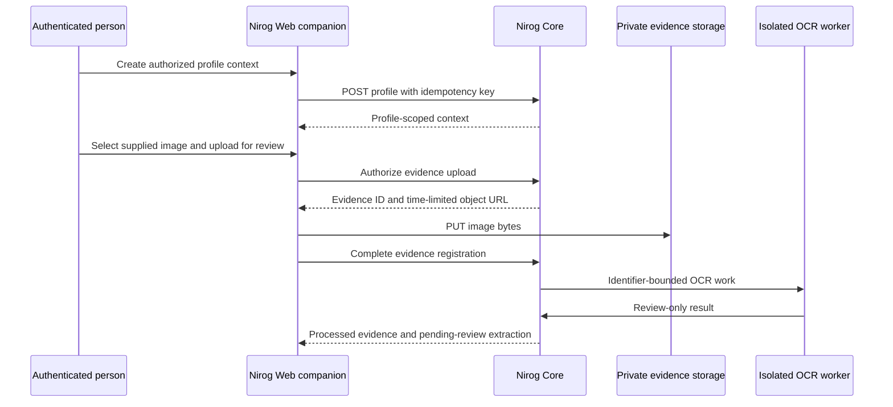

# Real Prescription Evidence Acceptance

**Status:** the complete patient-controlled prescription-evidence path was accepted against an authenticated production session on 22 August 2026. The supplied image reached a persisted `pending_review` OCR extraction without automatic medication, regimen, reminder, inventory, diagnosis, or clinical confirmation mutation.

> **Acceptance boundary:** image upload and OCR are evidence-management operations. They may create a profile-scoped prescription container, evidence record, job, and review candidate, but they never establish a medication instruction or health decision by themselves.

## Acceptance sequence

The signed-in companion initially had no care profile. This was a correct prerequisite failure: the evidence interface did not permit a prescription container or upload without profile context. The web companion now provides an authenticated onboarding form that calls the existing Core `POST /profiles` contract through its server-side Clerk bridge. The browser receives no Core bearer token; the mutation carries Core’s idempotency header and creates only the requested profile context.

Once the authorized profile was Core-confirmed, the evidence workspace created an empty, profile-scoped prescription container. The supplied JPEG was then validated by the browser as a supported `image/jpeg` file below the 10 MB boundary. The review upload executed the existing sequence: create evidence/upload authorization, PUT to the time-limited object URL, and complete registration to enqueue isolated OCR work.

## Observed result

The authenticated same-origin Core bridge was checked using status/count-only reads, not raw OCR text. It confirmed one available profile, one active prescription container, one `processed` evidence record, and one `pending_review` extraction. This proves the real image completed the secure upload, durable evidence registration, asynchronous dispatch, isolated OCR, Core receipt, and human-review persistence path.

The final status is deliberately a review state. `pending_review` does not create a medication, regimen, dose log, reminder, inventory movement, refill event, diagnosis, or patient-facing notification. Any future clinical action requires a separate, explicitly authorized workflow and cannot be inferred from this extraction.

## Web companion completion

The acceptance exercise exposed two genuine usability boundaries. First, an authenticated account with no profile could not enter the evidence workflow because the companion had no profile-create control. Web commit [`c359a1f`](https://github.com/Paradox-Tech-BD/nirog-web/commit/c359a1f) adds a Core-authoritative profile-onboarding form through the narrow server-side proxy allowlist.

Second, evidence processing could complete asynchronously after a page load. Web commit [`54cb347`](https://github.com/Paradox-Tech-BD/nirog-web/commit/54cb347) adds an explicit **Refresh status** action and cancellable five-second processing-state polling. The client continues to render Core-authoritative status; it does not fabricate a result or re-upload the file.

Both web changes passed linting, the companion unit suite, and a clean-environment Next.js production build. The live acceptance record contains no prescription text, OCR candidate fields, signed URL, token, credential, or private object key.

## Follow-up boundary

The current implementation is a functional evidence-to-review workflow. A future medication-confirmation experience must be designed as a separate clinical command with explicit user controls, review provenance, authorization, validation, idempotency, audit/outbox evidence, and no automatic OCR-to-medication transfer.
