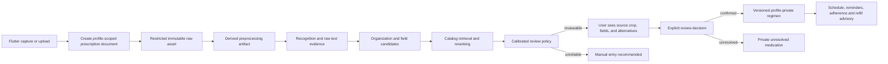

# ML Integration Pre-Analysis from Notion Design Sources

**Status:** General pre-analysis supplement. **Technical implementation analysis:** deferred.

## Source purpose

This guidance incorporates the user-supplied [Nirog Notion product page](https://ha5an.notion.site/Nirog-392379c3555d80f08615d1d349e7c955?pvs=74) and [AI/ML Pipeline Full Design](https://ha5an.notion.site/Ai-ML-pipeline-Full-design-3b9379c3555d807bbdfcd5d68b51a98f?pvs=74). The product page establishes the intended OCR-plus-manual medication-management experience; the pipeline page supplies a detailed candidate flow for image preparation, handwritten recognition, medicine retrieval, review feedback, and operating metrics.

The sources are treated as **design inputs**, not as an approved production technology selection. This document reconciles them with Nirog’s evidence-preserving, user-confirmed safety boundary.

## 1. ML integration purpose

The ML integration exists to transform a prescription image into an understandable, reviewable medication draft. It may help organize handwritten content, normalize mixed Bangla/English text, retrieve plausible catalog medicines, and surface alternatives. It must not independently create an active medication regimen, schedule, reminder, refill policy, or medical conclusion.

> **Core rule:** ML produces evidence and suggestions. An authorized user creates the personal medication plan by reviewing and confirming that evidence.

## 2. Accepted general workflow

The Notion proposal for camera/gallery input, hashing, preprocessing, two-pass recognition, text organization, semantic retrieval, candidate ranking, feedback, and asynchronous progress is aligned with this general workflow. The existing ML contract supplies the necessary requirement that each material stage preserves lineage to its evidence, configuration, and release artifacts.

## 3. Reconciled guidance by concern

| Concern | Accepted pre-analysis position | Deferred implementation choice |
|---|---|---|
| Scan initiation | Flutter may offer a fast result when work finishes within a bounded UX budget and must support asynchronous completion for longer work. | Exact timeout, polling versus push, and queue implementation. |
| Image intake | The client can compress and hash an image for transfer efficiency and deduplication, while the server validates and records an immutable restricted source asset. | Exact quality limits, antivirus provider, object storage service, and object-key format. |
| Preprocessing | Orientation repair, contrast/denoise, deskew, crop, page separation, and resize are permissible derived transformations when their configuration and derivative artifact remain traceable. | Exact OpenCV methods, parameters, and page/ROI heuristics. |
| Recognition | Raw transcription and structured extraction should remain distinct so a parsed dose, frequency, or medicine name can point back to its source text or crop. | Vision model provider, fallback model ensemble, prompting, inference hardware, and retry budget. |
| Text organization | Section/layout association, Bangla numeral normalization, and curated abbreviation expansion can prepare reviewable field candidates. | Specific abbreviation corpus, language routing, spell-correction method, and schema parser. |
| Medicine retrieval | Exact, fuzzy, semantic, and reranked candidate retrieval are compatible inputs to the review screen. Form, strength, ingredient, and route compatibility must constrain any ranking. | Vector store, embedding model, search weighting, candidate count, and reranker strategy. |
| Match confidence | Confidence routes the result to an appropriate review treatment; it does not activate therapy. A preselection is a suggestion, never an accepted medicine fact. | Calibration method, threshold values, metric segments, and release gate. |
| Feedback | A profile-private correction may improve that profile’s future experience. Any shared alias, generic mapping, or catalog change requires curation, source evidence, release publication, and rollback. | Feedback storage shape, curator interface, reviewer roles, and release cadence. |
| Observability | Traceability should cover document, stage, model/prompt, catalog/index, policy, user decision, latency, cost, failures, and correction outcomes. | Specific telemetry vendor, dashboards, alerting rules, and retention period. |

## 4. Important interpretation decisions

### 4.1 “RAG” is retrieval support, not clinical authority

The Notion pages describe saving recognition output for RAG and using a medicine knowledge base. In Nirog, semantic retrieval is best understood as a **catalog-candidate service**. It may retrieve verified release-bound product records, aliases, generic mappings, and evidence-aware alternatives. It cannot transform an unverified user-entered medicine into a shared fact or substitute for prescription review.

### 4.2 Private medicine and shared catalog are different records

The product Notion page proposes `isVerified=true` medicines visible to all and `isVerified=false` medicines visible only to the creator. The canonical interpretation is more explicit: a `MedicineProduct` belongs to a shared catalog release; an `UnresolvedMedication` or `RegimenItem` is profile-private. A user correction can start a curation case, but it does not directly toggle shared verification.

### 4.3 Auto-match means review treatment, not automatic activation

The pipeline source suggests an “Auto” matching tier. Nirog may display a high-quality candidate as **preselected** in the review UI. It must still present evidence and let an authorized user confirm, edit, reject, or save as unresolved before creating a regimen. The policy outcome remains `ready_for_review`, `review_required`, `manual_entry_recommended`, or failure—not `active_regimen`.

### 4.4 Model self-confidence is insufficient

The pipeline source proposes line/field confidence. Nirog retains those signals, but its pre-analysis requires calibration against representative labelled outcomes, input-quality signals, schema validation, candidate margin, and field compatibility. The numerical targets and thresholds in the source are useful hypotheses for later evaluation design, not present release criteria.

## 5. ML-to-product interaction contract

| Product interaction | ML integration responsibility | Product/backend responsibility |
|---|---|---|
| Upload a prescription | Receive an evidence-scoped job request and emit stage state. | Authorize the selected profile, issue restricted upload capability, preserve the raw document, and enforce idempotency. |
| Process handwriting | Produce raw text, regions/crops when available, organized text, and structured field candidates. | Persist immutable stage manifests and protect raw health data. |
| Suggest medicine | Return ranked catalog candidates with feature evidence and release provenance. | Filter candidates using compatibility/policy rules and show source evidence plus alternatives. |
| Ask for user review | Supply signals that explain why a result is reviewable or uncertain. | Capture explicit acceptance/edit/rejection and prevent automatic regimen activation. |
| Learn from feedback | Retain provenance for a profile-private preference or candidate correction. | Gate any shared catalog update through curation and a published release. |
| Operate safely | Report failures, latency, cost, quality, and drift signals. | Set product policy, audit access/decisions, monitor releases, and offer manual entry/retry paths. |

## 6. Technical-analysis handoff, intentionally deferred

The following source proposals are valuable inputs but remain **unselected** until technical analysis is explicitly started: DeepSeek-VL2 versus a managed model; fallback OCR composition; GPU availability; OpenCV/Celery/Redis implementation; Qdrant versus pgvector; embedding service; exact endpoints; FCM/WebSocket approach; exact preprocessing parameters; cache TTL; HNSW configuration; matching formula; A/B rollout; and numerical evaluation/service-level targets.

When authorized, technical analysis should refine these options against the pre-analysis safety contract, expected Bangladesh prescription mix, labeled data availability, privacy/data location, operator capacity, latency budget, and MVP cost envelope. It must produce benchmarked, versioned, and reversible engineering decisions rather than treating the Notion candidate stack as predetermined.

## 7. Resulting pre-analysis conclusion

The two Notion documents reinforce the existing Nirog direction. They justify an ML integration that is asynchronous-capable, evidence-preserving, multilingual-aware, catalog-assisted, feedback-aware, observable, and human-confirmed. They do not change the core safety boundary or start the technical-analysis phase.
