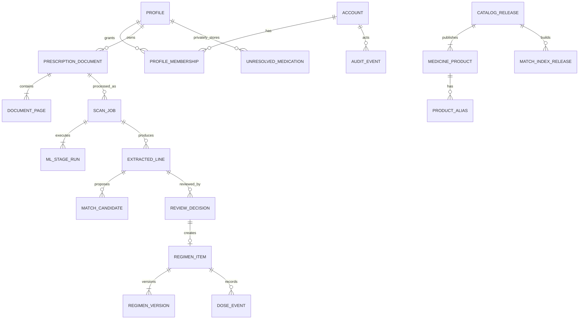

# Logical Domain Schema

**Status:** Proposed baseline • **Storage direction:** PostgreSQL for transactional state and append-only records; object storage for restricted image assets; vector index derived from catalog release.

## Entity map

## Identity, authority, and consent

| Entity | Key fields | Invariants |
|---|---|---|
| `account` | `id`, login identity, status, created_at, deleted_at | Account is not directly used as the patient scope. |
| `profile` | `id`, owner_account_id, display_name, relationship_type, status | A person/dependent context selected before document intake. |
| `profile_membership` | `profile_id`, `account_id`, role, permission_set, consent_id, effective_at, revoked_at | Access is explicit and time-bounded; a caregiver role does not imply raw-image access. |
| `consent_record` | subject profile, purpose, scope, granted_by, version, state, timestamps | Separate consent exists for sharing, optional ML research use, and other distinct purposes. |
| `device` | `id`, account_id, installation id, platform, notification state, last_seen_at | Device is a sync principal, not an authorization bypass. |

## Evidence and ML execution

| Entity | Key fields | Invariants |
|---|---|---|
| `prescription_document` | `id`, profile_id, status, document_version, created_by, retention_class | One explicit profile scope; document can survive failed scan processing. |
| `document_page` | `id`, document_id, position, original_asset_id, content_sha256, upload_validation | Ordered, immutable original asset reference; hash is not a public object key. |
| `restricted_asset` | `id`, storage_key, media_type, byte_size, encryption context, deletion_state | Never expose storage key as a durable public URL. |
| `scan_job` | `id`, document_id, status, current_stage, input_fingerprint, request_idempotency_key | Materialized current state; unique command key per actor/route scope. |
| `ml_stage_run` | `id`, scan_job_id, stage, attempt, input_fingerprint, execution_manifest, result_asset_id, error_code | Append-only; each material configuration change produces a distinct fingerprint/lineage. |
| `extracted_line` | `id`, scan_job_id, page/region reference, raw text, field candidates, review_state | Source evidence links are retained even after normalization. |
| `match_candidate` | `id`, extracted_line_id, catalog_product_id, rank, feature scores, compatibility, policy outcome | Candidate score is evidence, not an accepted product fact. |
| `review_decision` | `id`, line_id, actor, decision, selected product/unresolved item, edited fields, evidence version, policy findings | Immutable user/caregiver decision; updates create superseding decision. |

## Catalog and curation

| Entity | Key fields | Invariants |
|---|---|---|
| `catalog_release` | `id`, status, source manifest, release notes, published_at, rollback_of | All user-visible product facts resolve to a release. |
| `catalog_source` | `id`, publisher, license, source URL, source version, checksum, import batch | A source claim is independently traceable. |
| `medicine_product` | `id`, release_id, brand, generic display, manufacturer, dosage form, strength, route, market, product status | A product is not the same as a person’s therapy. Inactive products remain historically resolvable. |
| `ingredient` | `id`, normalized name, coding system/code, display | Products can have one or more ingredient links. |
| `product_ingredient` | product id, ingredient id, strength value/unit, order | Strength must be composition-aware for combinations. |
| `product_alias` | product id, alias, script/language, alias type, source case, validity, publish release | Shared aliases require curator approval and release. |
| `curation_case` | subject kind/id, evidence, proposed change, reviewer decisions, outcome, release id | Supports dual review, source evidence, rejection, and rollback. |
| `match_index_release` | catalog release, embedding model id, vector config, build checksum, state | Matching is reproducible against a named index release. |
| `unresolved_medication` | profile_id, display name, source line id, status, visibility | Private by default; never enters public search without curation. |

## Personal regimen and adherence

| Entity | Key fields | Invariants |
|---|---|---|
| `regimen_item` | `id`, profile_id, product/unresolved reference, current_version, status, source review decision | Personal therapy record, not catalog object. |
| `regimen_version` | regimen item, version number, effective period, dosage JSON, change reason, created_by, policy evidence | Critical change always creates a version; version numbers are monotonically increasing. |
| `schedule_specification` | regimen version, timezone, timing kind, occurrences, generation rules | Canonical input to server-owned occurrence/reminder projection; Flutter may render a local device notification as a delivery channel, never as the authoritative schedule executor. |
| `planned_dose_occurrence` | regimen version, planned_at, local label, state projection | Generated/derived per schedule policy; preserves old version linkage. |
| `dose_event` | occurrence/regimen version, event type, occurred_at, reporter, client_event_id, note | Append-only. `system_inferred_missed` differs from a user-reported skip. |
| `notification_event` | device, occurrence, scheduled/delivery telemetry, failure code | Does not prove a dose occurred. |
| `inventory_movement` | regimen item, kind, quantity/base unit, occurred_at, source, confidence | Refill state is an advisory estimate. |
| `refill_policy` | regimen item, threshold, notification state, acknowledgement | Threshold is only meaningful with compatible base unit and estimated balance. |

## Governance and operations

| Entity | Key fields | Invariants |
|---|---|---|
| `model_release` | component, provider, revision/checksum, capability profile, approval state | Store primary/fallback/embedding/reranker separately. |
| `prompt_template_release` | component, template, schema version, checksum, approval state | Prompt edits are material changes. |
| `policy_release` | policy type, thresholds/rules, calibration report, approval state | Policy version appears in every decision. |
| `evaluation_run` | artifact release set, dataset release, segment metrics, report URI, approved_by | Release readiness must be reproducible. |
| `audit_event` | actor, action, entity reference, outcome, timestamp, request context | Append-only and access-restricted; no raw health payload. |
| `provenance_record` | target entity/version, source entities, agents, activity, occurred interval | Explains how a derived artifact was produced. |
| `client_command` | client event id, device, command type, request digest, resolution, resulting sequence | Exact-once command boundary for offline replay. |
| `change_event` | monotonic sequence, profile scope, event type, payload version | Policy-filtered delta feed. |
| `purge_job` | subject, request, data category, status, completed_at, exception | Tracks deletion beyond the primary row cascade. |

## Key constraints and indexes

1. Unique `client_command(device_id, client_event_id)` prevents replayed offline mutations.
2. Unique `review_decision(extracted_line_id, evidence_version, idempotency_key)` prevents duplicate acceptance.
3. Unique `regimen_version(regimen_item_id, version_number)` and a row lock/version precondition protect medication-critical edits.
4. `catalog_release` and `match_index_release` are immutable after publication; corrections create a new release.
5. `audit_event` is insert-only for application principals; no generic update/delete path exists.
6. Profile-scoped tables are queried through an authorization-aware repository/policy layer, not only a `WHERE user_id = ...` convention.
7. Product search indexes include normalized brand, generic, manufacturer, form, strength, transliteration/alias, and vector representation scoped to the active catalog release.
