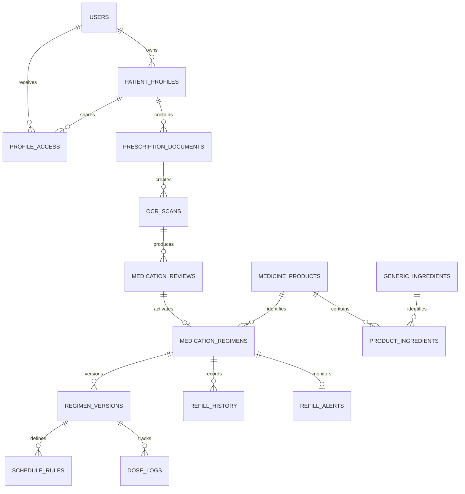

# Nirog Subsystem Schema Ownership

This is the table-level ownership map for the grouped Nirog design. It gives backend implementation a practical rule: **a table is written only by its owner module**. An API handler in another module uses the owning service contract, command, query, or event rather than importing the table repository directly.

## Schema ownership map

| Database schema / module | Tables | Allowed foreign-key references | Published integration data |
|---|---|---|---|
| `identity` / User Management | `users`, `auth_providers`, `user_preferences`, `devices`, `patient_profiles`, `teams`, `team_members`, `team_invitations`, `profile_access`, `consent_records` | Internal identity references only. Other modules hold `patient_profile_id` but do not write identity tables. | Profile status, effective permissions, device preference snapshot, profile deletion event. |
| `catalog` / Medicine Catalog | `catalog_sources`, `catalog_releases`, `medicine_products`, `manufacturers`, `generic_ingredients`, `product_ingredients`, `dosage_forms`, `drug_classes`, `indications`, `product_aliases`, `match_index_releases` | Internal catalog references only. Regimens reference an immutable `medicine_product_id`. | Product lookup, catalog release, index release, product retired event. |
| `prescription` / Prescription and ML Evidence | `media_assets`, `prescription_documents`, `document_pages`, `ocr_scans`, `ml_stage_runs`, `ocr_lines`, `extracted_medication_lines`, `field_candidates`, `medicine_match_candidates`, `medication_reviews` | `patient_profile_id`, catalog product candidate IDs. Never an active regimen ID before review command succeeds. | Scan status, review payload, medication review confirmed/rejected event. |
| `regimen` / Medication Regimen | `unresolved_medications`, `medication_regimens`, `regimen_versions`, `schedule_rules`, `planned_doses`, `inventory_movements`, `refill_rules` | `patient_profile_id`, product ID or unresolved item ID, review ID as source reference. | Regimen activated/changed/paused/ended, schedule changed, refill rule changed. |
| `adherence` / Adherence and Notifications | `reminder_deliveries`, `notifications`, `dose_logs`, `refill_alerts`, `refill_history`, `adherence_stats` | Regimen/version/planned-dose IDs as immutable foreign references. | Dose logged, refill recorded, notification lifecycle, adherence projection updated. |
| `platform` / Cross-cutting | `client_commands`, `change_events`, `audit_events`, `provenance_records`, `purge_jobs`, `outbox_events` | Entity ID plus entity type, never business-table ownership. | Ordered sync stream, audit record, outbox delivery, purge completion. |

## Implementation naming reconciliation

The table above is the **pre-analysis ownership map**. Its entity labels intentionally remain readable for product analysis, while the later technical design defines the current PostgreSQL physical-name target. The following mapping removes ambiguity for implementation work without changing the settled ownership model.

| Pre-analysis logical label | Canonical implementation target | Notes |
|---|---|---|
| `users`, `auth_providers`, `user_preferences`, `devices` | `identity.accounts`, `identity.auth_identities`, `identity.account_preferences`, `identity.devices` | An account is the local application actor; OIDC identity linkage is separate from credentials. |
| `patient_profiles`, `profile_access`, `consent_records` | `identity.patient_profiles`, `identity.profile_access`, `identity.consents` | Profile authority and purpose-bound consent remain separate records. |
| `catalog_releases`, `medicine_products`, `generic_ingredients` | `catalog.releases`, `catalog.products`, `catalog.ingredients` | Published releases are immutable; product rows remain release-bound. |
| `prescription_documents`, `ocr_scans`, `ocr_lines`, `medication_reviews` | `prescription.documents`, `prescription.scan_jobs`, `prescription.extracted_lines`, `prescription.review_payloads` and `prescription.review_decisions` | Scan status is materialized; stage/evidence/review history is append-oriented. |
| `medication_regimens`, `schedule_rules`, `planned_doses` | `regimen.regimens`, `regimen.schedule_policies`, `adherence.planned_dose_occurrences` | The Regimen module owns schedule policy; Adherence owns projected occurrences. |
| `dose_logs`, `reminder_deliveries`, `notifications` | `adherence.dose_events`, `adherence.notification_deliveries`, `adherence.notification_intents` | User dose evidence remains distinct from reminder execution/delivery telemetry. |

The [technical persistence architecture](../../technical-analysis/05-api-persistence-security.md) and [data-domain ownership model](../../data-management/01-data-domains-and-ownership.md) are the authoritative sources for new physical migrations. Earlier conceptual names should not be copied into new SQL, ORM, or migration code.

## Reference versus private health data

| Concept | Storage owner | Visibility | Example |
|---|---|---|---|
| Product name, form, strength, manufacturer, ingredients | Medicine Catalog | Shared reference data governed by catalog release. | `Napa 500 mg tablet` product identity. |
| User-confirmed dose/timing/start/end state | Medication Regimen | Profile-private health data. | One tablet at 08:00 and 20:00 for a confirmed course. |
| Source image and OCR text | Prescription/ML Evidence | Profile-private health evidence with retention policy. | Uploaded handwritten prescription page and its text regions. |
| Reminder delivery and dose record | Adherence/Notifications | Profile-private operational health data. | Local reminder fired at 08:00; user marked the dose taken at 08:08. |
