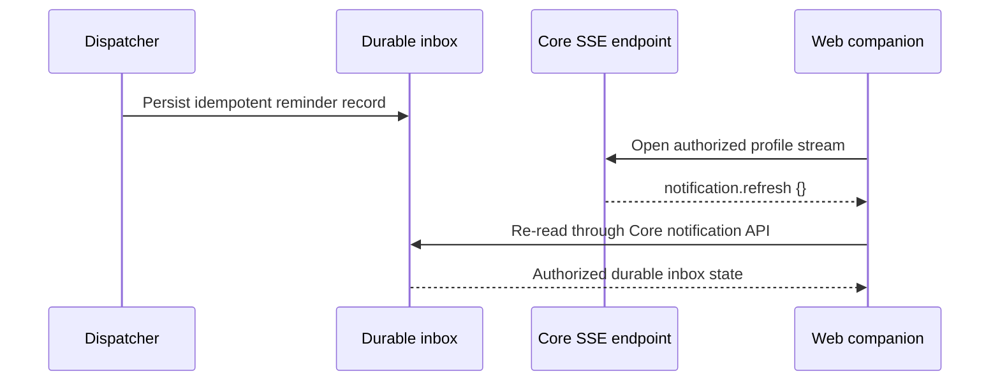

# Autonomous Delivery Increments

## Purpose

This record describes the post-acceptance increments that make durable Nirog reminders more immediate, auditable, and operable without replacing the existing Core authorization or database architecture.

## Live in-app update path

The server-sent event is a **refresh hint only**. It carries no prescription data, medication data, notification body, recipient, or identifier. The browser uses it to re-read the existing profile-authorized durable inbox. Each stream has a bounded lifetime and heartbeat; a failed or unavailable stream leaves ordinary inbox reads functional.

## External delivery foundation

The dispatcher now contains an optional, disabled-by-default email adapter contract. When a provider is not completely configured, the provider status remains disabled and no external request is made. If a provider is enabled in a future environment, each attempt is idempotent per outbox event, channel, and provider; the ledger stores lifecycle metadata only and does not return recipient addresses, credentials, provider response bodies, or clinical content through application APIs.

| Capability | Present state | Boundary |
|---|---|---|
| Durable in-app inbox | Implemented and live | Profile-scoped Core data; source of truth |
| SSE refresh hint | Implemented and live | Clerk-authenticated, profile-authorized, generic event only |
| Email adapter | Implemented but disabled | Requires valid provider configuration and explicit operational activation |
| SMS / push | Not implemented | No provider, recipient, consent, or delivery claim exists |

## Operability signals

The internal operations snapshot is protected by the existing internal-worker secret and returns aggregate-only values. It covers claimable and dead-lettered outbox work, OCR retry/dead-letter state, and oldest **unread** in-app inbox age. The snapshot route is exempt from browser-session authentication only so its own sealed worker-secret guard can run; it is not browser-exposed or public. Migration execution itself remains observable through the targeted migrator deployment status; this is intentionally reported as an external-monitoring responsibility rather than fabricated as a database fact.

| Signal | Owner | Recovery direction |
|---|---|---|
| Claimable outbox backlog | Dispatcher owner | Verify worker availability, lease expiry, and retry schedule. |
| Dead-lettered outbox work | Dispatcher owner | Inspect safe failure classification; replay only through a controlled recovery procedure. |
| OCR retry/dead-letter state | ML/Core owner | Verify worker health and callback authentication; do not expose evidence contents in dashboards. |
| Oldest unread inbox age | Product/Core owner | Distinguish unread user state from delivery failure; inbox persistence remains authoritative. |
| Migrator deployment result | Release owner | Treat a failed migration service run as a release blocker; do not infer migration success from API liveness. |

## Verification

The Core complete verification command passed after the formatting-only cleanup, including formatting, lint, typechecking, and tests. A later focused operations-snapshot route test proved the `401` worker-secret boundary and the safe aggregate response. The stream and external-delivery architecture include focused contract and migration tests. Targeted API and migrator deployments completed successfully. The operational snapshot is not exposed through the browser proxy, so user sessions cannot obtain platform-wide aggregate operational data.
