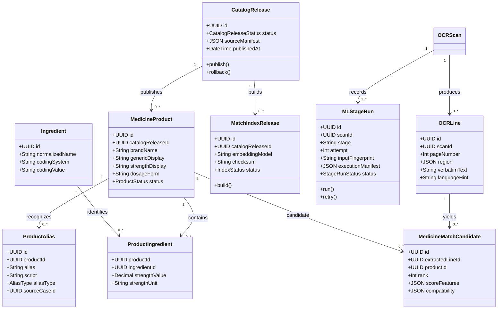

# Nirog Application Class Model

This is the merged application model based on the original Nirog class diagram. It retains the important user-facing concepts—`User`, `UserPreferences`, `UserProfile`, `OCRScan`, `Reminder`, `DoseLog`, `RefillAlert`, `RefillHistory`, `Notification`, and `AdherenceStats`—while using the backend model needed for a real prescription-intelligence workflow.

The key refinement is the split between a shared **`MedicineProduct`** and a profile-specific **`MedicationRegimen`**. A medicine product is a catalog identity, such as brand, generic, form, strength, and manufacturer. A medication regimen is a user-confirmed course for one profile, including timing, start/end dates, reminders, dose logs, and refill state. The split lets one catalog product be used by many profiles without mixing shared reference facts and private health data.

Similarly, `OCRScan` represents the ML processing run, while `PrescriptionDocument` represents the original multi-page source and `MedicationReview` represents the user’s decision about what the scan means.

## Primary application class diagram

> Copy the full Mermaid block into a Notion Mermaid block to render it.

```mermaid
classDiagram
    class User {
        +UUID id
        +String email
        +String passwordHash
        +String name
        +String avatarUrl
        +Date dob
        +UserRole role
        +UserStatus status
        +DateTime createdAt
        +register()
        +login()
        +resetPassword()
        +deleteAccount()
        +updateProfile()
    }

    class UserPreferences {
        +UUID id
        +String theme
        +String language
        +String timezone
        +Int snoozeDurationMinutes
        +Boolean digestEnabled
        +Boolean notificationsEnabled
        +update()
    }

    class UserProfile {
        +UUID id
        +UUID ownerUserId
        +String name
        +String relationship
        +Boolean isDefault
        +ProfileStatus status
        +DateTime createdAt
        +switchTo()
        +update()
        +archive()
    }

    class ProfileAccess {
        +UUID id
        +UUID profileId
        +UUID userId
        +ProfileRole role
        +JSON permissions
        +DateTime grantedAt
        +DateTime revokedAt
        +grant()
        +revoke()
    }

    class PrescriptionDocument {
        +UUID id
        +UUID profileId
        +DocumentStatus status
        +Int documentVersion
        +DateTime createdAt
        +submitPages()
        +delete()
    }

    class OCRScan {
        +UUID id
        +UUID documentId
        +ScanStatus status
        +String currentStage
        +String modelReleaseId
        +String policyReleaseId
        +DateTime scannedAt
        +enqueue()
        +extractFields()
        +getProgress()
        +retry()
    }

    class MedicationReview {
        +UUID id
        +UUID scanId
        +UUID profileId
        +ReviewDecision decision
        +UUID selectedProductId
        +JSON editedInstruction
        +String evidenceVersion
        +DateTime reviewedAt
        +acceptMatch()
        +saveUnresolved()
        +reject()
    }

    class MedicineProduct {
        +UUID id
        +String brandName
        +String genericDisplay
        +String strengthDisplay
        +String dosageForm
        +String route
        +String manufacturerName
        +ProductStatus status
        +UUID catalogReleaseId
        +search()
        +getDetails()
    }

    class MedicationRegimen {
        +UUID id
        +UUID profileId
        +UUID medicineProductId
        +UUID unresolvedMedicationId
        +RegimenStatus status
        +Int currentVersion
        +DateTime createdAt
        +addMedicine()
        +editMedicine()
        +pause()
        +resume()
        +end()
    }

    class RegimenVersion {
        +UUID id
        +UUID regimenId
        +Int versionNumber
        +JSON dosageInstruction
        +DateTime startDate
        +DateTime endDate
        +String changeReason
        +DateTime createdAt
        +createVersion()
        +activate()
    }

    class Reminder {
        +UUID id
        +UUID regimenVersionId
        +ScheduleType scheduleType
        +JSON timingRule
        +Boolean isEnabled
        +Int snoozeMinutes
        +DateTime nextTrigger
        +generate()
        +enable()
        +disable()
        +snooze()
    }

    class DoseLog {
        +UUID id
        +UUID regimenVersionId
        +UUID plannedDoseId
        +DateTime scheduledTime
        +DateTime actualTime
        +DoseStatus status
        +DoseReporter reporterType
        +Boolean isRetroactive
        +String clientEventId
        +logDose()
        +editLog()
    }

    class RefillAlert {
        +UUID id
        +UUID regimenId
        +Decimal thresholdQuantity
        +String baseUnit
        +DateTime alertSentAt
        +Boolean isAcknowledged
        +checkThreshold()
        +sendAlert()
        +acknowledge()
    }

    class RefillHistory {
        +UUID id
        +UUID regimenId
        +DateTime refillDate
        +Decimal quantityAdded
        +Decimal stockBefore
        +Decimal stockAfter
        +String baseUnit
        +record()
    }

    class Notification {
        +UUID id
        +UUID reminderId
        +NotificationType type
        +String title
        +String body
        +DateTime scheduledAt
        +DateTime sentAt
        +Boolean acknowledged
        +send()
        +acknowledge()
    }

    class AdherenceStats {
        +UUID id
        +UUID profileId
        +Date periodStart
        +Date periodEnd
        +Float dailyPercentage
        +Float weeklyPercentage
        +Float monthlyPercentage
        +Int takenCount
        +Int missedCount
        +Int skippedCount
        +calculate()
    }

    User "1" --> "1" UserPreferences : has
    User "1" --> "1..*" UserProfile : owns
    User "1" --> "0..*" ProfileAccess : receives
    UserProfile "1" --> "0..*" ProfileAccess : shares
    UserProfile "1" --> "0..*" PrescriptionDocument : contains
    PrescriptionDocument "1" --> "0..*" OCRScan : processes
    OCRScan "1" --> "0..*" MedicationReview : produces review options
    UserProfile "1" --> "0..*" MedicationReview : confirms
    MedicationReview "0..1" --> "1" MedicationRegimen : creates
    UserProfile "1" --> "0..*" MedicationRegimen : manages
    MedicineProduct "1" --> "0..*" MedicationRegimen : identifies
    MedicationRegimen "1" --> "1..*" RegimenVersion : versions
    RegimenVersion "1" --> "0..*" Reminder : schedules
    RegimenVersion "1" --> "0..*" DoseLog : tracks
    MedicationRegimen "1" --> "0..1" RefillAlert : monitors
    MedicationRegimen "1" --> "0..*" RefillHistory : logs
    Reminder "1" --> "0..*" Notification : triggers
    RefillAlert "1" --> "0..*" Notification : triggers
    DoseLog "1" --> "0..*" Notification : triggers
    UserProfile "1" --> "0..*" AdherenceStats : generates
```

## Supporting ML and catalog class diagram

The application diagram deliberately keeps ML inference and catalog governance compact. The following supporting model is the backend layer that makes OCR matching reproducible and administratively manageable.

## Merge notes

| Original class | Merged class | Implementation reason |
|---|---|---|
| `User` | `User` | Retained as the account/authentication owner. |
| `UserPreferences` | `UserPreferences` | Retained as account-level UI and notification preferences. |
| `UserProfile` | `UserProfile` + `ProfileAccess` | Retained for personal/dependent medication contexts; profile sharing is added explicitly. |
| `Medicine` | `MedicineProduct` + `MedicationRegimen` + `RegimenVersion` | Separates shared catalog facts from the user’s private medication course and instruction history. |
| `OCRScan` | `PrescriptionDocument` + `OCRScan` + `MedicationReview` | Separates original source, ML processing run, and user confirmation. |
| `Reminder` | `Reminder` | Retained as a versioned regimen schedule rule. |
| `DoseLog` | `DoseLog` | Retained as an append-only medication event with reporter and offline idempotency fields. |
| `RefillAlert` | `RefillAlert` | Retained as an advisory threshold configuration for a regimen. |
| `RefillHistory` | `RefillHistory` | Retained with precise quantity and unit fields. |
| `Notification` | `Notification` | Retained as delivery/acknowledgement telemetry separate from dose events. |
| `AdherenceStats` | `AdherenceStats` | Retained as a profile-level projection derived from dose logs. |

## Important implementation rules

1. `MedicineProduct` is shared reference data. `MedicationRegimen` is private profile data. They must not be stored in the same table.
2. A `MedicationRegimen` points to its current `RegimenVersion`; editing dose, timing, route, start date, or end date creates a new version instead of mutating historical records.
3. `DoseLog.status` differentiates user-reported `taken` or `skipped` from a system-inferred `missed` event. Notifications are not evidence that a dose was consumed.
4. `OCRScan` should store links to source evidence, ML stage manifests, model/prompt/index releases, and review payloads. It should not write directly into a private regimen before a `MedicationReview` decision.
5. Refill quantities require a base unit such as tablet, capsule, millilitre, puff, or unit. `stockCount` alone is not adequate for multi-form medicine products.
