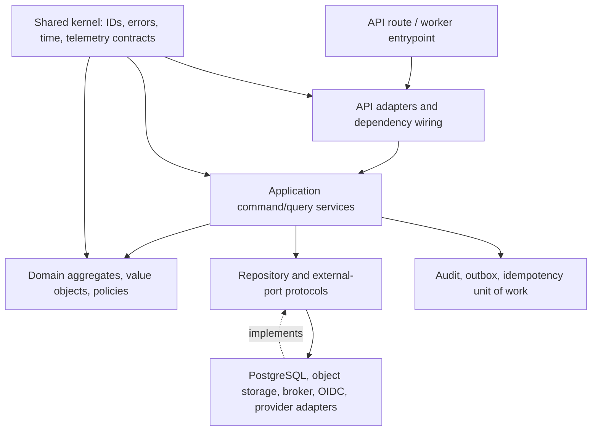
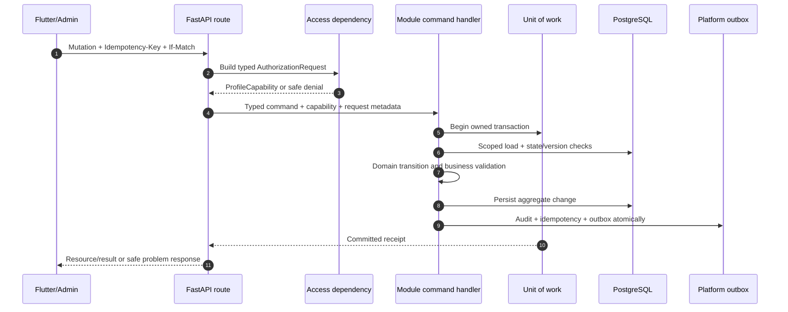

# Modular Software Architecture

## 1. Architectural intent

Nirog is a **modular monolith**: one deployable FastAPI application with explicit domain boundaries, independently testable application services, and one canonical PostgreSQL database. The design deliberately avoids both an unstructured `routers → ORM models` implementation and premature microservices. Each module owns its behavior, persistence schema, migrations, API contract, and emitted domain events. A shared access boundary gives every module the same safe way to obtain an authenticated actor and an evaluated profile capability.

> A module may depend on another module’s **published application contract**, typed query result, or versioned event. It must not reach into another module’s repository, ORM entity, private table, or domain internals.

This pattern preserves the existing ownership rules: Identity owns profile access and consent; Prescription owns evidence; Regimen owns regimen state and schedule policy; Adherence owns projected occurrences and dose evidence; Catalog owns releases; and Platform owns cross-cutting reliability records. Workers are execution entrypoints, not a second domain layer; they call the same command/query services that an API route uses.[1]

## 2. Module shape and dependency direction

Every domain module has five local layers. Dependencies always point inward; the domain model never imports FastAPI, SQLAlchemy, Celery, a vendor SDK, an ORM session, or a JWT implementation. This allows policy, business-state, and validation logic to be tested with ordinary Python values rather than a running server.



| Layer | Permitted responsibility | Must not do |
|---|---|---|
| **API adapter** | Parse HTTP, declare response contract, obtain dependencies, map safe errors to problem details. | Decide domain state transitions, construct SQL, or trust a client-provided permission. |
| **Application service** | Orchestrate one command/query, call authorization, load owned aggregate, coordinate validation, commit unit of work. | Expose ORM entities, parse JWTs, or call a vendor SDK directly. |
| **Domain** | Model aggregate invariants, value objects, state transitions, deterministic business decisions. | Import framework/infrastructure code or fetch unrelated data. |
| **Port** | Declare a narrow typed protocol for a repository, clock, policy evaluator, external adapter, or publisher. | Leak a generic database session or unbounded repository access. |
| **Infrastructure adapter** | Implement ports, map persistence/vendor errors, honor transaction and redaction rules. | Invent module business policy or bypass application authorization. |

The shared kernel remains deliberately small: opaque identifiers, standard time/clock abstractions, error/problem types, pagination/value primitives, correlation metadata, and telemetry contracts. It must not become a hidden “common domain.” Domain-specific types live with their owner module and are exposed through explicit contracts when another module truly needs them.

## 3. Source layout

The following file layout is a target pattern, not a requirement to create empty folders before behavior exists. A module grows by use case, keeping API and infrastructure adapters thin.

```text
app/
  api/v1/
    dependencies/              # actor, correlation, authz request wiring
    problems.py                # exception-to-problem mapper
  modules/
    identity/
      api/                     # routes + request/response schemas
      application/             # commands, queries, handlers, service contracts
      domain/                  # aggregates, values, events, permissions owned here
      infrastructure/          # SQL repositories, OIDC/invite adapters
      migrations/
    prescription/
    regimen/
    adherence/
    catalog/
    platform/
  access/                      # cross-module policy composition, typed evaluator seam
    contracts.py
    rbac.py
    profile_policy_service.py
    policy_evaluator.py
  workers/                     # task entrypoints and worker-only composition
  shared/
    ids.py                     # opaque typed identifiers
    errors.py                  # safe domain/application error taxonomy
    time.py
    telemetry.py
    transactions.py
```

The `access` package is a cross-module composition boundary rather than a new owner of profile, consent, or resource data. It asks Identity for an owner/grant/consent fact and asks the resource-owning module for a typed relation fact. It does not run broad SQL across all schemas or mirror another module’s access state.

## 4. Modular type patterns

Python’s runtime does not prevent accidental ID mixing or arbitrary string permissions. Nirog therefore treats type shape as part of the security boundary. Routes parse untrusted JSON into strict transport models; application services operate on immutable command/query data; domain code uses value objects and typed identifiers; persistence code maps explicitly between domain values and SQL rows.

| Type family | Pattern | Example use |
|---|---|---|
| Opaque identifier | `NewType` or frozen value object, never a bare UUID in a domain signature. | `ProfileId`, `DocumentId`, `RegimenId`, `AccountId`. |
| Closed vocabulary | `StrEnum` backed by a versioned registry. | `Permission`, `Action`, `ResourceKind`, `ConsentPurpose`, `GrantRole`. |
| Immutable context | Frozen dataclass created only by trusted dependencies. | `ActorContext`, `RequestMeta`, `ProfileCapability`. |
| Discriminated command | Strict Pydantic request schema maps to a frozen application command. | `ConfirmEvidenceRegimenCommand` versus `CreateManualRegimenCommand`. |
| Resource reference | A typed `(kind, id, profile_id)` or module-specific reference that verifies its profile ownership. | `DocumentResourceRef`, `RegimenResourceRef`. |
| Explicit result | `AuthorizationDecision`, `CommandReceipt`, or a known domain error; no `None` meaning both absence and denial. | Safe denial, conflict, or validation outcome. |

The following conceptual types show the boundary. They are illustrative contracts; a concrete implementation may use Pydantic v2 and `typing.Protocol`, provided it preserves the same immutability and narrow interface.

```python
@dataclass(frozen=True)
class ActorContext:
    account_id: AccountId
    issuer: str
    subject: str
    session_id: str | None
    device_id: DeviceId | None
    authenticated_at: datetime

@dataclass(frozen=True)
class AuthorizationRequest:
    actor: ActorContext
    action: Permission
    resource: ResourceRef
    purpose: ConsentPurpose | None
    request_meta: RequestMeta

@dataclass(frozen=True)
class AuthorizationDecision:
    allowed: bool
    reason_code: DecisionReason
    capability: ProfileCapability | None
    policy_revision: str
```

`ActorContext` contains only token facts verified by the OIDC adapter and locally resolved identity. It does not contain a mutable dictionary of client claims, a list of profiles, a raw bearer token, or arbitrary frontend context. `ProfileCapability` is created only after the evaluated profile relationship, permission, consent/purpose, and target scope pass. It is a short-lived in-memory value for the current command/query, never a database credential or serialized mobile authorization token.

## 5. Command, query, and transaction boundary

One application command represents one intentional business change. It carries the actor/capability, command-specific values, idempotency key, correlation metadata, and an expected aggregate version when the command changes mutable current state. The handler validates in a fixed order, loads only the aggregate/references that it owns, invokes a named domain transition, and commits the owned state change together with the idempotency outcome, redacted audit event, outbox event, and change feed record.



Queries use the same authorization boundary but do not create outbox rows merely for reading. Sensitive query decisions may still create a redacted access audit record, as defined in [Audit and Observability](04-audit-and-observability.md). Queries return dedicated read models rather than ORM entities; a module may publish a narrowly scoped read contract where a second module needs one.

| Concern | Required pattern | Why it matters |
|---|---|---|
| Mutation replay | Canonical idempotency key, request fingerprint, actor/profile/action binding, stored outcome. | A retried mobile request cannot duplicate a grant, regimen version, dose event, or invitation acceptance. |
| Concurrent mutation | Expected version or `If-Match`, aggregate lock where necessary, conflict receipt. | A stale client cannot overwrite revocation or replace a newer regimen state. |
| Side effect | Persist event/intent in an outbox transaction; publish after commit. | External notification, scan, or index work cannot be performed for an uncommitted state. |
| Cross-module change | Consume a versioned event, re-read authoritative owner state, apply idempotently. | A stale event cannot itself become an authorization credential. |
| Error | Raise typed, safe application/domain errors; centralized mapper emits `application/problem+json`. | Clients receive no SQL, token, policy expression, or cross-profile existence detail. |

## 6. FastAPI composition rules

FastAPI dependencies are used for dependency resolution, not as a substitute for a domain policy engine. A protected route must declare a single action/resource mapping and acquire an `ActorContext` and, where relevant, a `ProfileCapability`. The handler receives typed values, not a raw `Request`, global singleton, or database session that it can use to bypass the access service.

| Composition concern | Required rule |
|---|---|
| Authentication | One OIDC verifier validates issuer, audience, signature, permitted algorithm, expiry, and subject before local account resolution. |
| Authorization | An access dependency builds an explicit `AuthorizationRequest`; no `if current_user.role` checks are scattered through routes. |
| Database scope | Transaction-local account/profile scope is set after authorization and cleared/reset on checkout and return. |
| Request metadata | Correlation ID, causation ID, user agent class, and safe device reference are injected once and forwarded as `RequestMeta`. |
| Error handling | A global problem mapper serializes only documented reason codes and correlation IDs. |
| Serialization | Response models are allowlists; internal fields, raw evidence, grants, and policy traces are not exposed by object serialization defaults. |

OWASP recommends server-side validation, per-request authorization, deny-by-default handling, and safe error responses. Nirog treats client-side controls as usability features only; a Flutter screen cannot establish permission, current profile ownership, workflow order, consent, or aggregate state.[2] [3]

## 7. External adapters and worker boundaries

Every provider integration is hidden behind a typed module-owned port. An adapter declares allowed request fields, data classification, purpose, deterministic request key, timeout, retry classification, provider configuration/release identifier, and redacted telemetry shape. It receives only data that the calling application service has already authorized for that exact purpose.

Workers run with workload identities mapped to a narrow service contract. A worker message contains identifiers, versions, stage/release references, and correlation IDs—not raw prescription images, user bearer tokens, or broad permission snapshots. Before restricted read, output commit, or user-visible side effect, the worker calls its permitted application service, which re-checks authoritative lifecycle, profile relationship/purpose where applicable, and current aggregate version. ML workers cannot write `regimen.*` or `adherence.*`; only a confirmed user command may create or activate regimen state.[1]

## 8. Implementation and test discipline

Code review should reject a route that imports SQLAlchemy repositories directly, a domain object that imports FastAPI/Celery, a worker that writes domain tables directly, an adapter that accepts an untyped payload, or a module that calls another module’s tables. The test pyramid should include pure domain tests, application-service tests with fake ports, repository/RLS integration tests, route authorization tests, and end-to-end worker/outbox tests.

| Test category | Core assertion |
|---|---|
| Type/contract test | An unsupported action, resource kind, role, or permission cannot be represented by a normal request model. |
| Domain test | Invalid state transitions, duplicate dose evidence, and unconfirmed ML output are rejected before persistence. |
| Application test | A handler invokes authorization, validation, idempotency, audit, and outbox in the required sequence. |
| Authorization regression | Substituting any cross-profile identifier never returns or mutates target data. |
| RLS integration | No profile rows are returned without matching transaction context; pooled connections cannot leak prior context. |
| Worker test | A stale/revoked/replaced job is a safe no-op or controlled retry, never a direct write. |

## References

[1] [Nirog — Module, Code, and Command Architecture](../system-architecture/03-module-code-and-command-architecture.md)

[2] [OWASP — Authorization Cheat Sheet](https://cheatsheetseries.owasp.org/cheatsheets/Authorization_Cheat_Sheet.html)

[3] [OWASP — Input Validation Cheat Sheet](https://cheatsheetseries.owasp.org/cheatsheets/Input_Validation_Cheat_Sheet.html)

[4] [Nirog — Validation Architecture](03-validation-architecture.md)
