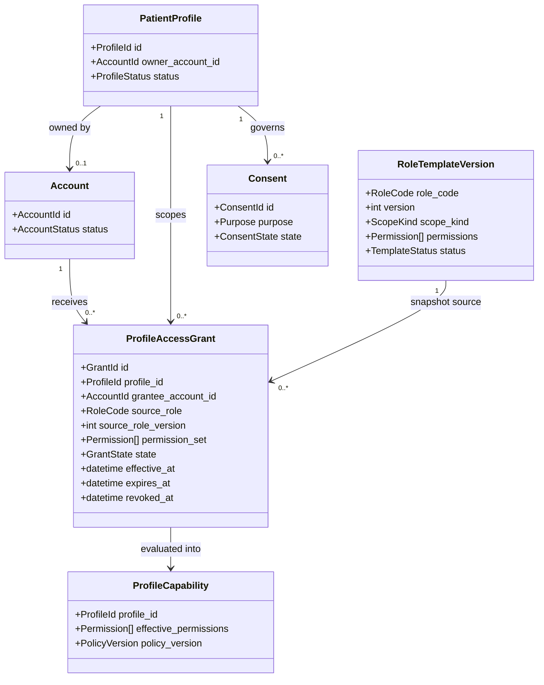
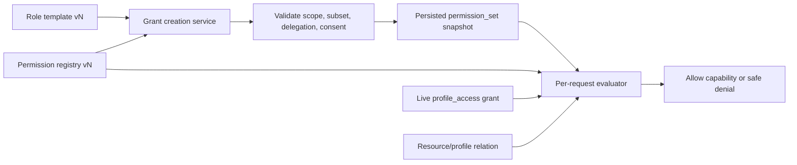
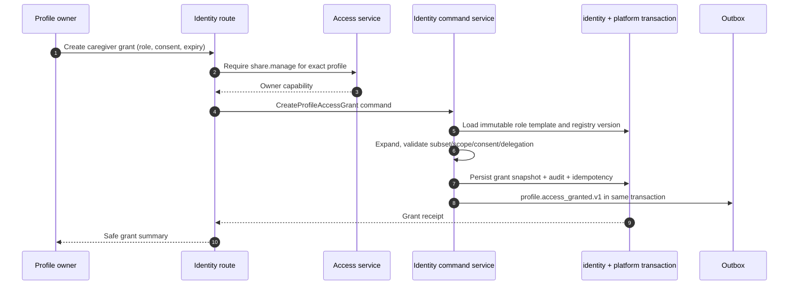

# RBAC Baseline

## 1. Decision model

Nirog uses **role-based access control as the administrative baseline**. A role template is a named, versioned collection of permissions. When an owner or authorized grant administrator creates a caregiver grant, the service expands the selected template and persists the resulting permission snapshot in `identity.profile_access.permission_set`. Runtime authorization evaluates the **persisted permission snapshot**, not the current template definition. This makes past grants reviewable and prevents an administrative edit to a role template from silently expanding historic access.

NIST’s RBAC model distinguishes users, roles, permissions, operations, and objects.[1] Nirog makes the profile-specific relationship explicit beside those elements: an account may have a permission only within an active profile grant; it must still be related to the exact resource it asks to access. This combines a manageable RBAC baseline with the relationship and consent checks required for health-context data.



| Concept | Meaning in Nirog | Runtime authority? |
|---|---|---|
| **Account** | Local identity linked to a validated `(issuer, subject)` OIDC identity. | No; authentication alone proves only who is acting. |
| **Role template** | A governed, versioned convenience definition such as `caregiver.viewer`. | No; it is expanded when a grant is created or explicitly revised. |
| **Permission** | A closed, versioned action vocabulary such as `regimen.read`. | Necessary but not sufficient. |
| **Profile access grant** | The live account-to-profile relationship with its persisted permission snapshot and lifecycle. | Yes, subject to relation, consent, state, and resource checks. |
| **Owner relationship** | The implicit relationship derived from `identity.patient_profiles.owner_account_id`. | Yes, evaluated through the same policy service; it is not a removable grant row. |
| **Profile capability** | A short-lived, request-scoped result of authorization evaluation. | Yes, only for the evaluated request path. |
| **Team membership** | A collaboration/invitation container association. | No; membership alone never grants profile access. |

## 2. Permission registry

Permissions are application-owned, strongly typed values. They are not free-form strings accepted from a mobile client, OIDC claim, seed script, role editor, or database administrator. The permission registry is versioned with the application and validates the JSONB snapshot stored in every profile grant. A registry entry specifies the owning module, resource scope, risk class, whether an explicit consent/purpose gate is required, and whether the action can be delegated.



The initial registry retains the settled permission names and formalizes their scope. `profile.manage` is included as an **owner/delegate-management permission** because profile update operations require an explicit management action; it is not part of ordinary caregiver roles. No wildcard such as `profile.*`, `admin`, or `all` is permitted. A permission communicates an allowed action class, never a reason to skip resource relation, consent/purpose, state/version, audit, or business validation.

| Permission family | Initial permissions | Scope and additional gate |
|---|---|---|
| Profile | `profile.read`, `profile.manage` | Exact profile only. `profile.manage` is owner-only in MVP unless an explicit delegated-administration design is approved. |
| Prescription evidence | `document.read_metadata`, `document.read_image`, `document.create` | Exact profile/document relation. Raw-image access also requires the applicable purpose/consent, restricted asset capability, and audit. |
| Regimen | `regimen.read`, `regimen.write` | Exact profile/regimen relation. A write still requires current review/manual source, version, and regimen-state validation. |
| Adherence | `adherence.read`, `adherence.write` | Exact profile/occurrence relation. A write creates valid dose evidence; notification delivery never creates a dose event. |
| Notification | `notification.manage` | Exact profile/device relation, current device state, and notification preference checks. |
| Sharing | `share.manage` | Exact profile plus current sharing consent. MVP assigns this only to the owner relationship. |
| Catalog operations | `catalog.draft.read`, `catalog.draft.write`, `catalog.release.publish` | Catalog scope, not patient profile scope; uses a separate workforce/system assignment path. |
| Platform operations | `platform.audit.read`, `platform.policy.manage` | Restricted operator scope, MFA/operational controls, and never implied by a patient-profile role. |

The catalog and platform permissions establish a clear namespace for non-profile work but are not added to `identity.profile_access`. A caregiver grant can never grant catalog curation or platform administration, and a catalog role can never grant access to patient records. This prevents “administrator” from becoming an ambient super-role.

## 3. Role catalogue

Roles are intentionally small and describe a stable job or relationship, not every possible contextual combination. Future factors such as consent category, document classification, time window, trusted-device posture, or data-export purpose belong in the policy evaluator seam rather than in multiplying caregiver role names.

| Role code | Assignment path | Permission snapshot at creation | Explicit exclusions |
|---|---|---|---|
| `profile.owner` | Derived from `patient_profiles.owner_account_id`; never stored as a removable profile grant. | Full profile baseline: profile/evidence/regimen/adherence/notification/share management needed by owner workflows. | Catalog and platform privileges; bypass of consent, state, or resource checks. |
| `caregiver.viewer` | Profile access grant created by the owner. | `profile.read`, `document.read_metadata`, `regimen.read`, `adherence.read`. | Raw document image, document creation, any mutation, notification/device management, sharing. |
| `caregiver.participant` | Profile access grant created by the owner. | Viewer permissions plus `document.create` and `document.read_image`. | Regimen/adherence mutation, notification/device management, sharing. Raw image remains purpose/consent-gated. |
| `caregiver.manager` | Profile access grant created by the owner. | Participant permissions plus `regimen.write`, `adherence.write`, `notification.manage`. | Profile ownership/management, grant creation/revocation, sharing, catalog/platform access. |
| `catalog.curator` | Local workforce/system-role assignment, separate from profile grants. | `catalog.draft.read`, `catalog.draft.write`. | Any profile/evidence/regimen/adherence data; immutable-release publication. |
| `catalog.publisher` | Local workforce/system-role assignment with separate approval controls. | `catalog.draft.read`, `catalog.release.publish`. | Patient profile access and unreviewed draft mutation. |
| `platform.operator` | Restricted operational assignment, separated from normal accounts where feasible. | Narrowly approved platform permissions. | Implicit patient-data access and table-owner/BYPASSRLS privileges. |
| `worker.<purpose>` | Workload identity, not a human account role. | Module/purpose-specific service contract only. | End-user token impersonation, generic database access, regimen/adherence creation from ML output. |

`profile.owner` is a relationship label used by the evaluator; it is not a mutable role template that a client can assign. Ownership transfer, if introduced, is a separate high-assurance workflow that performs dual confirmation, aggregate/version checks, audit, outbox, and reevaluation of the prior owner’s status. It must never be implemented as a regular caregiver-grant update.

The default RBAC baseline has no break-glass role, anonymous sharing, blanket “family admin,” hidden superuser, or derived authority through a team. Emergency access, organization-wide care access, clinical delegation, and data exports require separate product, legal, and policy designs before implementation.

## 4. Role-template and grant persistence design

The currently established `identity.profile_access` table remains the canonical caregiver authority record. The following fields make the template-versus-snapshot behavior explicit. Role templates can initially be code-managed immutable artifacts; when administration requires editable templates, the same versioned shape may be persisted in an `identity.role_template_versions` table. A live template must never be edited in place.

| Record | Required fields | Rule |
|---|---|---|
| `identity.profile_access` | `id`, `profile_id`, `grantee_account_id`, `role`, `role_template_version`, `permission_registry_version`, `permission_set`, `consent_id`, `granted_by`, `granted_at`, `effective_at`, `expires_at`, `revoked_at`, `revoked_by`, `revoke_reason_code`, `grant_version` | One live grant per `(profile_id, grantee_account_id)`. `permission_set` is the authoritative runtime snapshot. |
| `identity.role_template_versions` *(when database-managed)* | `role_code`, `version`, `scope_kind`, `permission_set`, `delegation_limit`, `status`, `effective_at`, `retired_at`, `created_by`, `approval_reference`, `checksum` | Immutable published versions. A change creates a successor version. |
| `identity.system_role_assignments` *(for workforce roles)* | `account_id`, `role_code`, `role_template_version`, `permission_set`, `effective_at`, `expires_at`, `revoked_at`, `assigned_by` | Separate from profile grants. It cannot be joined as a substitute for profile authority. |
| `platform.permission_registry_releases` *(optional governed artifact)* | `version`, `checksum`, `status`, `published_at`, `compatibility_note` | Records the vocabulary release used to validate grants and policy bundles. |

The database validates that `permission_set` is a non-empty, deduplicated JSON array of registered permission strings; the application performs the authoritative registry/version/scope check. A check constraint rejects malformed JSON shape, while the application rejects unrecognized values, cross-scope permissions, permission sets not allowed by the source template, or an attempt to grant a permission more powerful than the grantor may delegate. A partial unique index ensures one live profile grant per grantee and profile.



## 5. Grant lifecycle and anti-escalation controls

Every grant has a lifecycle. Creation validates a live owner relationship, current sharing consent, target account state, selected template version, registry compatibility, no conflicting active grant, effective/expiry window, and idempotency key. Acceptance through an invitation creates the team membership, where used, and explicit profile grant atomically. The accepted team membership does not become a second authorization source.

| Lifecycle operation | Required behavior | Prohibited shortcut |
|---|---|---|
| Create | Expand one approved template version; persist snapshot and source metadata; audit/outbox atomically. | Copy client-supplied permissions or infer rights from team membership. |
| Amend | Create a new grant revision or replace snapshot explicitly with version/audit evidence. | Mutate permission JSONB invisibly or apply a new template over every historic grant. |
| Reduce | Explicitly replace with a narrower snapshot, then invalidate capability/read caches. | Assume UI removal alone revokes access. |
| Revoke | Set revocation state/time in the authoritative grant; deny next request; publish revocation event. | Wait for an access-token expiry or delete history without audit. |
| Expire | Treat `expires_at <= now` as not live at every evaluation; issue notification/review workflow separately. | Depend on a background job as the only expiry control. |
| Template change | Publish a successor version; optionally offer reviewed migration/regrant workflow. | Broaden old permission snapshots automatically. |
| Account/profile deactivation | Fail actor/profile lifecycle checks before permission evaluation. | Leave a valid permission snapshot usable after deactivation. |

`share.manage` is deliberately non-delegable in the MVP. The owner relationship may create, revise, or revoke caregiver grants under current sharing consent; a caregiver manager cannot invite another caregiver, increase their own permissions, change ownership, or extend an expiry. If delegated sharing is later approved, it must specify a maximum delegable permission set, a cannot-delegate set, grant-depth limit, consent condition, and full grant-chain audit. It should be expressed through a future policy rule rather than a broad “manager may share” role default.

## 6. Runtime evaluation algorithm

The RBAC result is one gate in a fixed authorization decision. It uses the exact requested action and typed resource reference, never only an endpoint name. The service treats any missing or unusable source as a denial.

```text
1. Validate the token and resolve a current local Account actor.
2. Reject inactive account, inactive profile, or unsupported action/resource kind.
3. Resolve the owner relationship or one live ProfileAccessGrant for actor + profile.
4. Read the persisted permission snapshot (or owner baseline), not the current template.
5. Require the requested permission in the effective snapshot.
6. Prove target resource belongs to the requested profile and resource kind.
7. Apply consent/purpose, resource-class, device/session, and state gates.
8. Return an immutable allow capability or a safe deny decision with internal reason code.
```

Runtime code must not perform a role-name switch such as `if role == "manager"`. It asks whether `Permission.REGIMEN_WRITE` is effective in the evaluated capability, then applies the module’s state and resource checks. This preserves role-template flexibility and gives the future policy evaluator a single stable interface.

## 7. Migration and regression tests

The baseline can be introduced without invalidating existing access records. First define and publish the closed permission registry. Next backfill each existing `permission_set` with its registry version and, where applicable, source-role metadata; records with invalid or unrecognized values are treated as not grantable until corrected through an explicit administrative process. Then add application validation, audit source details, and cache invalidation on every grant/consent state change. Only after route and RLS tests pass should any legacy role-name checks be removed.

| Regression test | Expected result |
|---|---|
| Template expansion | New grant receives exactly the permissions in the selected published template version. |
| Template successor | Publishing `caregiver.viewer` version 2 changes no version 1 grant. |
| Cross-profile request | A valid caregiver permission for profile A never reads or mutates a resource in profile B. |
| Permission absence | `document.read_metadata` does not imply `document.read_image`; `regimen.read` does not imply `regimen.write`. |
| Immediate revocation | The next request and next worker restricted-read check deny after revocation. |
| Delegation attempt | A caregiver manager cannot issue a grant, extend own expiry, or add a permission. |
| Workforce separation | Catalog and platform assignments never produce a `ProfileCapability`. |
| Grant audit | Every create/amend/revoke decision records actor, target, source template/version, snapshot hash, correlation, and safe outcome. |

## References

[1] [NIST — Role-Based Access Control](https://csrc.nist.gov/projects/role-based-access-control)

[2] [NIST — Policy-Based Access Control (PBAC) Glossary](https://csrc.nist.gov/glossary/term/policy_based_access_control)

[3] [OWASP — Authorization Cheat Sheet](https://cheatsheetseries.owasp.org/cheatsheets/Authorization_Cheat_Sheet.html)

[4] [Nirog — User Management Technical Architecture](../technical-analysis/01-user-management.md)
